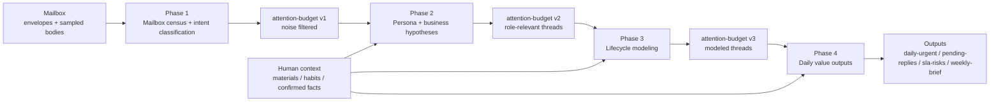

# twinbox 📮

[English](./README.md) | [中文](./README.zh.md)

## What it does

Figure out who you owe a reply, what is stuck, and what is overdue—using thread-level IMAP state, not a one-off summary of the latest message. twinbox reads mail read-only, can fold in materials and habits you keep on disk, and writes queues and digests (`daily-urgent`, `pending-replies`, SLA views, weekly brief) under `runtime/validation/` for scripts or agents.

Self-hosted. Mailbox stays read-only through Phase 1–4; drafts and send stay behind explicit gates later.

## Who it is for

People wiring a mailbox into automation: CLI + JSON first, OpenClaw or any host that can run shell. Not a webmail UI, not bulk auto-reply, not a hosted product.

## Pieces

Mail + optional context go through Phase 1–4. Each phase does deterministic `Loading` then LLM `Thinking`; outputs land under `runtime/validation/` (see [docs/ref/validation.md](docs/ref/validation.md)).

- `twinbox` — preflight, queues, threads, digests, context writes. `twinbox task … --json` forwards to those paths for agents ([cli.md](docs/ref/cli.md)).
- `twinbox-orchestrate` — `run`, `run --phase N`, `contract`, `schedule` / bridge. Same as `bash scripts/twinbox_orchestrate.sh` or [scripts/twinbox-orchestrate](scripts/twinbox-orchestrate) on PATH.
- OpenClaw — [SKILL.md](SKILL.md) metadata; [openclaw-skill/README.md](openclaw-skill/README.md) for install and optional host bridge (`scripts/twinbox_openclaw_bridge*.sh`).
- Phase 1–4 do not send, move, delete, archive, or flag mail.

## Quick start

1. Install from [pyproject.toml](pyproject.toml) (or `bash scripts/twinbox` from repo root).
2. Point code root and state root (see [Code and state roots](#code-and-state-roots)); OpenClaw-style: `bash scripts/install_openclaw_twinbox_init.sh`.
3. `twinbox mailbox preflight --json` until env checks pass.
4. `twinbox-orchestrate run --phase 4` or `twinbox-orchestrate run`.
5. Read [docs/README.md](docs/README.md) and [docs/ref/architecture.md](docs/ref/architecture.md).

More contract: [docs/ref/runtime.md](docs/ref/runtime.md), [docs/ref/scheduling.md](docs/ref/scheduling.md), [config/action-templates/README.md](config/action-templates/README.md).

## Common commands

| Goal | Command | Notes |
|------|---------|--------|
| Mailbox login / env / read-only IMAP check | `twinbox mailbox preflight --json` | Unified JSON for tools and OpenClaw-style hosts |
| Compatibility preflight wrapper | `bash scripts/preflight_mailbox_smoke.sh --json` | Wraps the same preflight |
| Agent-oriented JSON | `twinbox task latest-mail --json`, `twinbox task todo --json`, `twinbox task progress "…" --json`, `twinbox task mailbox-status --json` | See [cli.md](docs/ref/cli.md) |
| Dry-run pipeline plan | `twinbox-orchestrate run --dry-run` or `bash scripts/twinbox_orchestrate.sh run --dry-run` | No phase execution |
| Full pipeline | `twinbox-orchestrate run` | Phase 4 thinking parallelized by default |
| Single phase | `twinbox-orchestrate run --phase 2` | Focused rerun |
| Machine-readable contract | `twinbox-orchestrate contract --format json` | Phase deps and entrypoints |
| Unit tests | `pytest tests/` | Regression for core modules |
| Quick syntax smoke | `python3 -m compileall src` and `bash -n scripts/twinbox_orchestrate.sh scripts/run_pipeline.sh` | Before commit |

## First login troubleshooting

- `missing_env`: set `MAIL_ADDRESS` and IMAP/SMTP host, port, login, password fields.
- `imap_auth_failed`: verify credentials or use an app password if required.
- `imap_tls_failed`: check port/encryption pairs (`993 + tls` or `143 + starttls/plain` are common).
- `imap_network_failed`: DNS, firewall, container networking.
- `mailbox-connected + warn`: read-only IMAP is enough for Phase 1–4; SMTP may warn in read-only mode.

## Why not another mail demo

Typical demos chase single-message UX and quick sends. Here the unit of work is the thread, outputs are files you can diff and gate in CI, and the happy path assumes you self-host (OpenClaw is one target, not the only one).

## Principles

1. Prefer thread context over isolated messages.
2. Read-only outputs before drafts before send.
3. User context (materials, habits, facts) lives in repo-shaped data, not only chat.
4. OpenClaw: manifest + env + optional bridge scripts are documented, not an afterthought.

## Architecture (ASCII)

```text
                                +----------------------+
                                |   User / Operator    |
                                |  (review & approve)  |
                                +----------+-----------+
                                           |
                                           v
+------------------+             +---------+----------+             +----------------------+
| Mailbox (IMAP)   +-----------> | Thread State Layer | <---------- | Context Ingestion     |
| read-only first  | evidence    | (thread lifecycle, |   facts     | (materials/habits)    |
+------------------+             | queue projection)  |             +----------+-----------+
                                 +---------+----------+                        |
                                           |                                   |
                                           v                                   |
                                 +---------+----------+                        |
                                 | Runtime Skeleton   |------------------------+
                                 | listener / action  |     typed context
                                 | template / audit   |
                                 +---------+----------+
                                           |
                                           v
                                 +---------+----------+
                                 | Automation Gates   |
                                 | read -> draft ->   |
                                 | controlled send    |
                                 +--------------------+
```

## Compared to Anthropic `email-agent`


- Threads and queues vs message-in, reply-out demos.
- Explicit read-only → draft → send gates vs one-shot automation.
- Structured context on disk vs session-only prompts.
- Skeleton for listener/action/audit vs a finished app.

## Repository map

```text
twinbox/
├── README.md
├── README.zh.md
├── SKILL.md                    # OpenClaw manifest + shared skill metadata
├── skill-creator-plan.md       # Track A/B skill and host roadmap (detailed)
├── pyproject.toml
├── openclaw-skill/             # OpenClaw deploy notes, bridge unit examples
├── src/twinbox_core/           # Python core (CLI, phases, orchestration)
├── tests/
├── config/
│   ├── action-templates/
│   ├── context/
│   └── profiles/
├── docs/
│   ├── README.md
│   ├── core-refactor.md
│   ├── ref/                    # architecture, cli, orchestration, validation, …
│   ├── guide/
│   │   └── openclaw-compose.md
│   ├── archive/
│   └── validation/
├── scripts/
│   ├── twinbox                 # task CLI wrapper (sets code/state roots)
│   ├── twinbox-orchestrate     # thin wrapper -> twinbox_orchestrate.sh
│   ├── twinbox_orchestrate.sh  # orchestration shell entry
│   ├── twinbox_openclaw_bridge.sh
│   ├── twinbox_openclaw_bridge_poll.sh
│   ├── phase{1-4}_loading.sh
│   ├── phase{1-4}_thinking.sh
│   ├── register_canonical_root.sh
│   ├── run_pipeline.sh         # compatibility
│   └── twinbox_paths.sh
└── runtime/                    # local state (gitignored operational data)
```

## Code and state roots

Code root: checkout with `src/` and `scripts/`. State root: `.env`, `runtime/context/`, `runtime/validation/`, optional `docs/validation/`.

- Set `TWINBOX_CODE_ROOT` and `TWINBOX_STATE_ROOT` ([scripts/twinbox](scripts/twinbox)).
- `bash scripts/install_openclaw_twinbox_init.sh` writes `~/.config/twinbox/code-root` and `state-root` if you use that layout.
- `TWINBOX_CANONICAL_ROOT` is a legacy alias for state root.
- Older flow: `bash scripts/register_canonical_root.sh`.

Checklist: fix roots once; run phases through `twinbox-orchestrate`; use `contract --format json` when you need the dependency graph.

```bash
twinbox-orchestrate run --dry-run
twinbox-orchestrate run --phase 4
twinbox-orchestrate contract --format json
```

Central docs: [docs/README.md](docs/README.md), [docs/core-refactor.md](docs/core-refactor.md).

## Four-phase pipeline (detail)

Stance today: spec-first, shell-first, read-only-first. Diagram below is the same funnel; it sits after Quick start so you can run commands first.



| Phase | Main job | Typical outputs | Why it exists |
|-------|----------|-----------------|---------------|
| 1 | Read the mailbox at distribution level | `phase1-context.json`, `intent-classification.json`, derived census views | Baseline and early noise removal |
| 2 | Infer mailbox owner and what work matters | `persona-hypotheses.yaml`, `business-hypotheses.yaml` | Role- and business-aware filtering |
| 3 | Labels → thread-level workflow state | `lifecycle-model.yaml`, `thread-stage-samples.json` | Lifecycle position per thread |
| 4 | User-visible value surfaces | `daily-urgent.yaml`, `pending-replies.yaml`, `sla-risks.yaml`, `weekly-brief.md` | “What should I look at today?” |

Handoff is still per-phase files; `attention-budget.yaml` is a target shape, not enforced everywhere ([validation.md](docs/ref/validation.md)). Each phase: `Loading` then `Thinking`.

```bash
twinbox-orchestrate run --phase 2
bash scripts/run_pipeline.sh --phase 2   # compat
```

Already in tree: IMAP/SMTP checks, himalaya render, smoke scripts, validation docs, `twinbox-eval-phase4`, context import/write commands.

Not in tree: long-running listener, production action manager, web UI, default auto-send/archive, tenant-specific business rules baked in.

## Near-term direction

Same thread-centric model and gates; grow listener/action split, templates vs instances, audit trail, and extension hooks as needed.

## Current focus & roadmap

> Last updated: 2026-03-25

- [x] 2026-03-25 — `twinbox-orchestrate` + Phase 1–4 Python core (Loading / Thinking).
- [x] 2026-03-25 — `twinbox task … --json`; OpenClaw skill + `scripts/twinbox_openclaw_bridge*.sh` ([openclaw-skill/README.md](openclaw-skill/README.md)).
- [ ] Fixed schedule windows (daytime / Friday / nightly).
- [ ] Subscription registry for multi-channel delivery; selective opt-out (not started).
- [ ] OpenClaw: proof that `preflightCommand` and manifest `schedules` run without a host bridge.
- [ ] Daytime attention view when Phase 4 artifacts are stale.
- [ ] `twinbox context refresh` actually reruns work; clearer stale / retry / fallback.

Full list: [skill-creator-plan.md](skill-creator-plan.md).

## Safety boundaries

- Use app/client passwords only.
- Keep `.env` local and never commit it.
- Treat `runtime/` as local operational data.
- Do not auto-send until draft quality and approval flow are proven.
- Do not let user-supplied context silently overwrite mailbox facts.

## Publishing note

`docs/validation/` may contain instance-specific materials from real mailbox studies. Sanitize before a fully public release. Stable public surface lives outside that directory.
