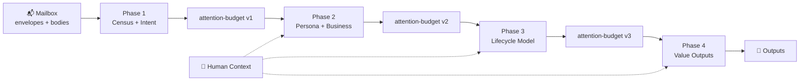

# twinbox 📮

> **Thread-level email intelligence that keeps important things from drowning.**

[](https://www.python.org/downloads/)
[](./LICENSE)
[](./tests/)

[English](./README.md) | [中文](./README.zh.md)

---

## TL;DR

```bash
# 1. Clone & install
git clone https://github.com/caapapx/twinbox.git && cd twinbox
pip install -e .

# 2. Configure (copy and edit)
cp .env.example .env
# Set: MAIL_ADDRESS, IMAP_HOST, IMAP_LOGIN, IMAP_PASS, etc.

# 3. Verify connection
twinbox mailbox preflight --json

# 4. Run pipeline
twinbox-orchestrate run --phase 4

# 5. Check your queues
twinbox task todo --json
```

**What you get**: `daily-urgent.yaml`, `pending-replies.yaml`, `sla-risks.yaml`, `weekly-brief.md` — written to `runtime/validation/` for scripts, agents, or your review.

**Optional (feature branch / larger refactors)**: background JSON-RPC daemon (`twinbox daemon …`), optional Go shim `cmd/twinbox-go/`, and seed scripts for modular testing — see [docs/ref/daemon-and-runtime-slice.md](docs/ref/daemon-and-runtime-slice.md). During active refactors, treat that page + code as the source of truth over older docs.

---

## Choose your setup path

| Path | State & config | Start here |
|------|----------------|------------|
| **Local / dev** (TL;DR above) | `.env` in the repo; outputs under **`runtime/validation/`** in the repo | This README → [Quick Start](#quick-start) |
| **OpenClaw host** | Mail + pipeline data under **`~/.twinbox`**; code/state roots in **`~/.config/twinbox/`**; OpenClaw reads **`~/.openclaw/openclaw.json`** | **[openclaw-skill/DEPLOY.md](openclaw-skill/DEPLOY.md)** (and optional `twinbox deploy openclaw`). Design: [docs/ref/openclaw-deploy-model.md](docs/ref/openclaw-deploy-model.md) |

The two are **not interchangeable**: following only the TL;DR does not configure OpenClaw; running `deploy openclaw` does not replace reading **DEPLOY.md** for mailbox/LLM/env prerequisites.

---

## Table of Contents

- [What it does](#what-it-does)
- [Who it is for](#who-it-is-for)
- [Choose your setup path](#choose-your-setup-path)
- [Quick Start](#quick-start)
- [Daily Commands](#daily-commands)
- [The Four Phases](#the-four-phases)
- [Architecture](#architecture)
- [FAQ](#faq)
- [Roadmap](#current-focus--roadmap)

---

## What it does

Figure out **who you owe a reply**, **what is stuck**, and **what is overdue**—using thread-level IMAP state, not a one-off summary of the latest message.

- 📬 **Read-only first**: Analyzes your mailbox without sending, moving, deleting, or flagging anything (Phase 1–4)
- 🧵 **Thread-centric**: Works with conversation threads, not isolated messages
- 📁 **Files as API**: Outputs structured YAML/JSON to disk for diffing, CI gating, or agent consumption
- 🎯 **Context-aware**: Blends mailbox data with your materials, habits, and confirmed facts

> **Self-hosted by design.** Your mail stays on your infrastructure.

---

## Who it is for

People wiring a mailbox into automation:

- CLI + JSON first
- OpenClaw or any host that can run shell
- **Not** a webmail UI
- **Not** bulk auto-reply
- **Not** a hosted SaaS product

---

## Quick Start

### Prerequisites

- Python 3.11+
- IMAP access to your mailbox
- An [app password](https://docs.github.com/en/authentication/keeping-your-account-and-data-secure/creating-a-personal-access-token) (recommended) or regular password

### Installation

```bash
# Option A: pip install from source
pip install -e .

# Option B: run directly from repo (sets up paths automatically)
bash scripts/twinbox
```

### Configuration

```bash
# Copy template
cp .env.example .env

# Edit .env with your settings
MAIL_ADDRESS=you@example.com
IMAP_HOST=imap.gmail.com
IMAP_PORT=993
IMAP_LOGIN=you@example.com
IMAP_PASS=your-app-password
SMTP_HOST=smtp.gmail.com
SMTP_PORT=587
SMTP_LOGIN=you@example.com
SMTP_PASS=your-app-password
```

> 🔒 **Security**: `.env` is gitignored by default. Never commit credentials.

### Verify & Run

```bash
# Test connection (read-only IMAP check)
twinbox mailbox preflight --json

# Run full pipeline (Phase 1→4)
twinbox-orchestrate run

# Or just refresh today's queues
twinbox-orchestrate run --phase 4
```

### See Results

```bash
# What's urgent right now?
twinbox task todo --json

# What happened today?
twinbox task latest-mail --json

# Check any thread's status
twinbox thread inspect <thread-id> --json
```

Outputs land in **`runtime/validation/`**:
- `phase-4/daily-urgent.yaml`
- `phase-4/pending-replies.yaml`
- `phase-4/sla-risks.yaml`
- `phase-4/weekly-brief.md`

---

## Daily Commands

### 🔍 **Check Status**
| Command | Purpose |
|---------|---------|
| `twinbox task mailbox-status --json` | Is the mailbox connected? |
| `twinbox task latest-mail --json` | What happened today? |
| `twinbox task todo --json` | What needs my attention? |

### 📋 **Manage Queues**
| Command | Purpose |
|---------|---------|
| `twinbox queue list --json` | List all queues (urgent, pending, sla_risk) |
| `twinbox queue show urgent --json` | Details of urgent items |
| `twinbox queue dismiss <id> --reason "..."` | Hide a thread from queues |
| `twinbox queue complete <id> --action-taken "..."` | Mark thread as done |

### 🔧 **Pipeline & Debugging**
| Command | Purpose |
|---------|---------|
| `twinbox-orchestrate run --dry-run` | Preview what would run |
| `twinbox-orchestrate run --phase 4` | Refresh just Phase 4 outputs |
| `twinbox-orchestrate contract --format json` | Show phase dependencies |

See full CLI reference: [docs/ref/cli.md](docs/ref/cli.md)

---

## The Four Phases



| Phase | What it does | Key Outputs |
|-------|--------------|-------------|
| **Phase 1** | Mailbox census + noise filtering | `intent-classification.json`, envelope index |
| **Phase 2** | Infer your role + business context | `persona-hypotheses.yaml`, `business-hypotheses.yaml` |
| **Phase 3** | Model thread lifecycle states | `lifecycle-model.yaml`, thread stages |
| **Phase 4** | Generate user-visible queues | `daily-urgent.yaml`, `pending-replies.yaml`, `weekly-brief.md` |

Each phase: deterministic `Loading` → LLM `Thinking`.

> **Read-only throughout**: No mail is sent, moved, deleted, or flagged in Phases 1–4.

---

## Architecture

### Core Design

```text
┌─────────────────┐      ┌─────────────────────┐      ┌──────────────────┐
│  Mailbox (IMAP) │─────▶│  Thread State Layer │◀─────│  Context Ingest  │
│   read-only     │      │ (lifecycle, queues) │      │ (materials/habits│
└─────────────────┘      └──────────┬──────────┘      └──────────────────┘
                                    │
                                    ▼
                          ┌─────────────────────┐
                          │   Runtime Skeleton  │
                          │ (listener / action  │
                          │  template / audit)  │
                          └──────────┬──────────┘
                                    │
                                    ▼
                          ┌─────────────────────┐
                          │  Automation Gates   │
                          │ read → draft → send │
                          └─────────────────────┘
```

### Compared to Typical Email Agents

| | **twinbox** | Typical demos |
|---|-------------|---------------|
| **Unit of work** | Thread | Single message |
| **Outputs** | Files on disk (diffable, CI-gated) | UI or immediate reply |
| **Safety** | Explicit read-only → draft → send gates | Often one-shot automation |
| **Context** | Structured files + provenance | Session-only prompts |
| **Hosting** | Self-hosted | Often SaaS |

---

## Repository Layout

```
twinbox/
├── 📄 README.md                 # This file
├── 📋 SKILL.md                  # OpenClaw manifest
├── ⚙️  pyproject.toml           # Python package
├── 🐍 src/twinbox_core/         # Core implementation
│   ├── task_cli.py             # Task-facing CLI
│   ├── orchestration.py        # Pipeline orchestrator
│   ├── phase4_value.py         # Phase 4: outputs
│   └── ...
├── 📁 config/
│   ├── action-templates/       # Action templates
│   ├── context/                # Context configs
│   └── profiles/               # User profiles
├── 📖 docs/
│   ├── ref/architecture.md     # Full architecture
│   ├── ref/cli.md              # CLI reference
│   └── ref/validation.md       # Output contracts
├── 🔧 scripts/                 # Shell entry points
│   ├── twinbox                 # CLI wrapper
│   ├── twinbox-orchestrate     # Pipeline runner
│   └── ...
└── 💾 runtime/                 # Operational state (gitignored)
    ├── context/                # User context
    ├── validation/             # Phase outputs
    └── himalaya/               # Mail config
```

### Code vs State Roots

| | **Code Root** | **State Root** |
|---|---------------|----------------|
| **Contains** | `src/`, `scripts/`, `docs/` | `.env`, `runtime/`, configs |
| **Set via** | `TWINBOX_CODE_ROOT` | `TWINBOX_STATE_ROOT` |
| **Default** | Current checkout | `~/.config/twinbox/state-root` or code root |

---

## FAQ

**Q: How is this different from Gmail labels or Outlook rules?**

A: Labels and rules are static filters. twinbox uses LLMs to understand thread *lifecycle*—whether you're waiting on someone, if a deadline is approaching, or if a conversation has gone silent. It also blends mailbox data with your external context (spreadsheets, project docs, habits).

**Q: Does it work with Outlook/Exchange/ProtonMail?**

A: Any provider with IMAP access should work. We've tested Gmail and Fastmail. For Exchange, ensure IMAP is enabled. For ProtonMail, use their IMAP bridge.

**Q: How much does it cost to run?**

A: twinbox is self-hosted and open source. You pay for:
- Your own infrastructure
- LLM API calls (configurable; defaults to OpenAI-compatible endpoints)
- ~1 API call per thread analyzed in Phase 4

**Q: Can it send emails for me?**

A: Not yet by default. Phases 1–4 are strictly read-only. Draft generation and sending are gated behind explicit approval flows (in development). See [Safety boundaries](#safety-boundaries).

**Q: What about privacy?**

A: Your mail never leaves your infrastructure unless you configure an external LLM API. Even then, only thread metadata and sampled bodies are sent—not your entire mailbox. Fully local LLM support is on the roadmap.

**Q: How do I update my context (materials, habits)?**

```bash
# Import a spreadsheet or doc
twinbox context import-material ./project-priorities.csv --intent reference

# Add a confirmed fact
twinbox context upsert-fact --id "customer-tier:acme" --type "tier" --content "enterprise"

# Refresh affected threads
twinbox-orchestrate run --phase 4
```

**Q: Can I run this in CI/CD?**

A: Yes. All outputs are files you can diff. The preflight command returns structured JSON with exit codes suitable for CI gates.

---

## Current Focus & Roadmap

> Last updated: 2026-03-26

### ✅ Shipped

**Core Pipeline**
- [x] `twinbox-orchestrate` + Phase 1–4 Python core (Loading / Thinking)
- [x] Task-facing CLI (`twinbox task … --json`) — 45+ commands
- [x] Incremental daytime sync (UID watermark + fallback)
- [x] Activity pulse / daytime-slice view (`twinbox digest pulse`)

**Mailbox & Onboarding**
- [x] IMAP read-only preflight with structured JSON output
- [x] Mailbox auto-detection (`twinbox mailbox detect`)
- [x] Onboarding flow (`twinbox onboarding start/status/next`)
- [x] Push subscription system (`twinbox push subscribe/unsubscribe`)

**Queue & Context Management**
- [x] Queue dismiss/complete/restore with persistence
- [x] Schedule overrides (`twinbox schedule update/reset`)
- [x] Material import with intent (reference vs template_hint)
- [x] Semantic routing rules (`twinbox rule list/add/remove/test`)
- [x] Recipient role handling (direct/cc_only/group_only/indirect)
- [x] Unread-only filtering (`--unread-only`)

**OpenClaw Integration**
- [x] SKILL.md manifest with `metadata.openclaw`
- [x] OpenClaw schedule tools (sync to platform cron)
- [x] OpenClaw queue tools (complete/dismiss via tools)

### 🚧 In Progress

**Platform Verification**
- [ ] OpenClaw native `preflightCommand` auto-execution verification
- [ ] `metadata.openclaw.schedules` auto-import validation
- [ ] Hosted session isolation for `twinbox` agent

**Reliability & Extensions**
- [ ] Subscription registry for multi-channel delivery
- [ ] Stale artifact fallback with automatic retry
- [ ] Runtime archive snapshots (nightly/weekly/failure)

### 📋 Planned

**Automation Layers**
- [ ] Long-running listener service
- [ ] Draft generation with approval gates
- [ ] Context refresh triggering actual rerun

**Review & Audit**
- [ ] Structured audit trail (`runtime/audit/`)
- [ ] Action template registry
- [ ] Review surface UI/CLI

Full roadmap: [skill-creator-plan.md](skill-creator-plan.md)

---

## Safety Boundaries

1. **App passwords only** — Never use your main account password
2. **`.env` stays local** — Never commit credentials
3. **`runtime/` is operational data** — Backup if needed, don't edit directly
4. **No auto-send until proven** — Draft quality and approval flows come first
5. **Mailbox facts are immutable** — User context supplements but never silently overwrites thread evidence

---

## Publishing Note

`docs/validation/` may contain instance-specific materials from real mailbox studies. Sanitize before a fully public release. Stable public surface lives outside that directory.

---

## License

MIT — see [LICENSE](./LICENSE)

---

**Questions?** Open an issue or check [docs/README.md](docs/README.md) for deep dives.
