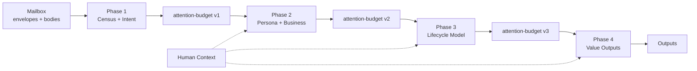

# TWINBOX 📮

> Thread-level email intelligence for people whose inbox is real work.

[](https://www.python.org/downloads/)
[](./LICENSE)
[](./tests/)

[English](./README.md) | [中文](./README.zh.md)

---

## 1. Introduction

twinbox is a self-hosted email intelligence system that reads your mailbox over **read-only IMAP**, models work at the **thread** level, and writes structured outputs to disk.

It is built for people who want answers to practical questions such as:

- What must I act on now?
- What is waiting on me?
- What is stuck or risky?
- What changed this week?

It is a good fit for:

- operators who prefer **CLI + JSON** workflows
- teams running **OpenClaw** or any shell-capable host
- inboxes full of **long-running work threads**, not just notifications
- people who want **reviewable files**, not opaque UI-only automation

It is not:

- a webmail replacement
- a hosted SaaS product
- a bulk auto-reply tool

> Self-hosted by design. Your mail stays on your infrastructure unless you explicitly configure an external LLM API.

---

## 2. Why twinbox is different

**Thread lifecycle instead of keyword triage.** Many email AI tools stop at labels, filters, or one-shot summaries. twinbox models who is waiting on whom, whether a thread is blocked, and what stage the work is in.

**Explainable outputs.** The main Phase 4 artifacts carry scores, reason codes, and short rationales. You can inspect why something ranked high instead of trusting a black-box priority label.

**The outputs are plain files you can inspect.** twinbox writes files such as `daily-urgent.yaml`, `pending-replies.yaml`, `sla-risks.yaml`, and `weekly-brief.md`. They are easy to diff, review, and plug into CI or host automation.

**Value before automation.** Phases 1–4 stay read-only. The project is strongest today at ranking, summarizing, and operational visibility. Drafting and sending stay behind explicit gates.

**OpenClaw works with the same core, not a separate edition.** On an OpenClaw host, `twinbox onboard openclaw` is the guided path: it wires the skill, installs a **vendor-safe** user-level bridge timer (`twinbox host bridge …`, no dependency on repo `scripts/`), and only hands off to chat onboarding when **`phase2_ready`** is true in `--json` output (escape hatch: `--skip-bridge`). The same Twinbox core also runs locally, from a checkout, or through vendor/no-clone delivery.

---

## 3. Architecture

### Four phases



| Phase | What it does | Main outputs |
|-------|--------------|--------------|
| **Phase 1** | Mailbox census and noise filtering | envelope index, intent classification |
| **Phase 2** | Infer role and business context | persona and business hypotheses |
| **Phase 3** | Model thread lifecycle state | lifecycle model and thread stages |
| **Phase 4** | Produce user-visible value surfaces | urgent queue, pending replies, SLA risks, weekly brief |

Each phase is deterministic `Loading` plus LLM `Thinking`.

> Phases 1–4 are read-only. No mail is sent, moved, deleted, or flagged.

### Core model

```text
Mailbox (read-only IMAP)
        |
        v
Phase 1 -> Phase 2 -> Phase 3 -> Phase 4
        ^                |
        |                v
 Human context      Queue / digest artifacts
```

The project treats disk artifacts as the stable contract between the pipeline, operators, and higher-level tools.

---

## 4. Installation & Deployment

### Prerequisites

- Python 3.11+
- IMAP access to your mailbox
- a mail-provider app password if the account uses 2FA

### Install the twinbox CLI and runtime

End users normally only run **`twinbox`**. First, put the `twinbox` binary on your `PATH`:

```bash
# user-local (recommended)
mkdir -p ~/.local/bin
cp twinbox ~/.local/bin/twinbox
chmod 0755 ~/.local/bin/twinbox
export PATH="$HOME/.local/bin:$PATH"
echo 'export PATH="$HOME/.local/bin:$PATH"' >> ~/.bashrc
source ~/.bashrc
```

When you already have `twinbox_core.tar.gz` (or an equivalent runtime archive), install the CLI and import the Email agent runtime (vendor):

```bash
twinbox install --archive twinbox_core.tar.gz
# Versioned bundle from this repo: dist/twinbox_core-<version>.tar.gz (see pyproject.toml)
```

`install --archive` unpacks into `$TWINBOX_STATE_ROOT/vendor/` (Python package, `integrations/openclaw/` including the bundled plugin, `SKILL.md`, bootstrap scripts) and writes **`~/.config/twinbox/code-root`** to that vendor directory so deploy/onboarding resolve the same tree without a git checkout (development override: **`TWINBOX_CODE_ROOT`**). **Maintainers:** build the archive with `scripts/package_vendor_tarball.sh` and the Go CLI with `scripts/build_go_twinbox.sh` (see `cmd/twinbox-go/README.md`).

Do not run `twinbox` with `sudo` in normal use; otherwise state may be written to `/root/.twinbox`.

### Connect to an OpenClaw host

If you mainly use Twinbox together with OpenClaw, start here. The full path has **two stages**: host wiring in a **terminal**, then Twinbox **onboarding inside the OpenClaw `twinbox` agent** (mailbox, LLM, profile, ...). **Finishing stage 1 alone is not enough.**

**Stage 1: host wiring (run in a shell)**

```bash
twinbox onboard openclaw
```

What it does: checks the OpenClaw environment; initializes or reuses `~/.twinbox`; merges `openclaw.json`; syncs `SKILL.md`; restarts the gateway when configured; installs the **OpenClaw cron bridge** user units that call **`twinbox host bridge poll`** (works in vendor/no-clone installs); after the final deploy step, **starts the JSON-RPC daemon** unless you pass **`--no-start-daemon`**. Use `twinbox onboard openclaw --json` and confirm **`"phase2_ready": true`** before treating host wiring as done. See [integrations/openclaw/DEPLOY.md](integrations/openclaw/DEPLOY.md). **It does not complete mailbox login or LLM setup for you.**

**Stage 2: Twinbox onboarding (continue in OpenClaw chat)**

Open the **`twinbox` agent** in OpenClaw, start a **fresh session**, and paste the block below so the agent **actually runs** the CLI (not just says it will). When the **`plugin-twinbox-task`** plugin is enabled, prefer the native tools `twinbox_onboarding_start`, `twinbox_onboarding_status`, `twinbox_onboarding_advance`, and for **push subscription** use **`twinbox_onboarding_confirm_push`** (they wrap `twinbox openclaw …`). After plugin changes, run **`openclaw gateway restart`** so tools reload.

```text
Read ~/.openclaw/skills/twinbox/SKILL.md, then in this same turn run immediately:
twinbox onboarding start --json
Do not stop after "I will run the command". After execution, report current_stage, prompt, and next_action from real stdout; on failure, paste stderr.
```

Then follow the returned `prompt`, and repeat:

```bash
twinbox onboarding next --json
```

until `current_stage` is `completed`. To inspect progress:

```bash
twinbox onboarding status --json
```

Stage 2 is what fills real working config: mailbox login, LLM provider/model/API URL, your role and preferences, and optional materials, routing rules, or push subscription. **Push** supports separate **daily** and **weekly** cadences (`twinbox push subscribe … --daily on|off --weekly on|off`, or `twinbox push configure …`); schedules stay in sync with active subscriptions. Longer bootstrap variants, empty-response workarounds, and the stage order are in [integrations/openclaw/DEPLOY.md](integrations/openclaw/DEPLOY.md) under the onboarding walkthrough.

### Without OpenClaw (Claude Code, Codex, etc.)

Use this only when you want Twinbox locally or in a plain terminal environment. `twinbox onboard openclaw` is for OpenClaw host wiring; local mailbox setup uses `twinbox onboarding ...`.

```bash
twinbox onboarding start --json
twinbox onboarding next --json
twinbox onboarding status --json
```

In a source checkout, outputs land under `runtime/validation/`. In a user install, they usually land under the active state root.

### Non-interactive configuration

```bash
TWINBOX_SETUP_IMAP_PASS=your-app-password \
  twinbox mailbox setup --email you@example.com --json

TWINBOX_SETUP_API_KEY=your-api-key \
  twinbox config set-llm --provider openai --model MODEL --api-url URL --json
```

In a source checkout, config usually lands in `./twinbox.json`. On an OpenClaw host it usually lands in `~/.twinbox/twinbox.json`.

### Daily operations (by scenario)

**Two entrypoints:** **`twinbox`** covers mailbox checks, task views, queues, and the daemon; **`twinbox-orchestrate`** runs the Phase pipeline and host **`schedule` / `bridge`** jobs. Add **`--json`** on supported commands when a script or agent needs structured output (same idea as onboarding above).

#### 1. Mailbox and Phase refresh

| Command | Purpose |
| --- | --- |
| `twinbox mailbox preflight --json` | verify read-only IMAP access |
| `twinbox-orchestrate run` | run Phase 1→4 in order |
| `twinbox-orchestrate run --phase 4` | recompute Phase 4 only (cheaper when earlier artifacts already exist) |

#### 2. Daytime activity (prerequisite for some task/digest views)

**`activity-pulse.json`** is not computed on demand by `digest`; you usually need a daytime sync job first, for example:

| Command | Purpose |
| --- | --- |
| `twinbox-orchestrate schedule --job daytime-sync --format json` | run the bundled host job that feeds the daytime activity view |

On a real host, OpenClaw `cron` completions are usually consumed by the **user systemd timer** running **`twinbox host bridge poll`** (manual: `twinbox-orchestrate bridge-poll`). See [docs/ref/cli.md](docs/ref/cli.md) and [docs/ref/orchestration.md](docs/ref/orchestration.md).

#### 3. Boards and single-thread drill-down

| Command | Purpose |
| --- | --- |
| `twinbox task todo --json` | urgent + pending overview |
| `twinbox task latest-mail --json` | today's latest-mail style view |
| `twinbox task weekly --json` | weekly-style output (depends on generated Phase 4 artifacts) |
| `twinbox thread inspect <thread-id> --json` | inspect one thread |

See the CLI doc for more (`task progress`, `task mailbox-status`, ...).

#### 4. Queues (local visibility only; mailbox unchanged)

`dismiss` / `complete` update **`user-queue-state.yaml`** and do **not** delete or relabel mail over IMAP.

| Command | Purpose |
| --- | --- |
| `twinbox queue list --json` | list queue entries |
| `twinbox queue show urgent --json` | inspect one queue type (`pending`, `sla_risk`, ... same pattern) |
| `twinbox queue explain` | explain queue rules (mostly for debugging) |
| `twinbox queue dismiss <thread-id> --reason "..." --json` | stop surfacing a thread until it changes materially |
| `twinbox queue complete <thread-id> --action-taken "..." --json` | mark handled; stays hidden until restored |
| `twinbox queue restore <thread-id> --json` | undo dismiss/complete for sorting again |

#### 5. Local daemon (JSON-RPC)

| Command | Purpose |
| --- | --- |
| `twinbox daemon start` | start daemon |
| `twinbox daemon stop` | stop |
| `twinbox daemon restart` | restart |
| `twinbox daemon status --json` | machine-readable status (includes `cache_stats` when running) |

#### 6. Delivery and vendor sync

| Command | Purpose |
| --- | --- |
| `twinbox install --archive <path-or-url>` | install or update from a runtime archive |
| `twinbox vendor install` | sync the Python runtime into `vendor/` under the state root |

Full command trees and flags live in [docs/ref/cli.md](docs/ref/cli.md).

### Example: ask twinbox

After the host is connected and onboarding is complete, the normal OpenClaw experience is just talking to the `twinbox` agent in real work.

**1. Morning triage**

```text
You: What do I need to act on before noon?
Twinbox: Start with these 3 threads. One is customer-blocking, one is already at SLA risk, and one is waiting on a reply you promised yesterday.
```

**2. Waiting-on-me review**

```text
You: Who is waiting on me right now, and what can wait until tomorrow?
Twinbox: 5 active threads are waiting on you. 2 should be answered today, 2 can slip to tomorrow, and 1 is low-signal CC traffic.
```

**3. Single-thread catch-up**

```text
You: Inspect the Acme renewal thread. What was the last commitment, who owns the next move, and what is the risk?
Twinbox: The last commitment was pricing feedback by Friday. Sales owns the next move. Risk is medium because legal is still blocking signature terms.
```

**4. Weekly brief**

```text
You: Draft my weekly mailbox brief: wins, risks, blocked threads, and anything I should escalate.
Twinbox: This week closed 4 threads, 3 threads are blocked on external parties, 2 need escalation, and the main risk cluster is vendor response delay.
```

These four patterns map closely to Twinbox's core value surfaces: urgent action, pending replies, thread inspection, and weekly summary.

### Layout under `~/.twinbox`

On a typical OpenClaw host, the state root looks roughly like this (`#` comments are hints):

```text
~/.twinbox/
├── twinbox.json                    # mailbox, LLM, integration settings
├── runtime/
│   ├── validation/
│   │   └── phase-4/                # main user-visible Phase 4 outputs
│   │       ├── daily-urgent.yaml
│   │       ├── pending-replies.yaml
│   │       ├── sla-risks.yaml
│   │       ├── weekly-brief.md
│   │       └── activity-pulse.json # daytime view for task / digest commands
│   └── himalaya/
│       └── config.toml             # rendered Himalaya mailbox config
├── run/
│   ├── daemon.sock                 # local JSON-RPC daemon
│   ├── daemon.pid
│   └── daemon-supervisor.pid       # legacy; removed after `daemon stop` if left from older installs
├── logs/
│   └── daemon.log
└── vendor/                         # runtime from install --archive / vendor install
```

See [docs/ref/cli.md](docs/ref/cli.md), [docs/ref/artifact-contract.md](docs/ref/artifact-contract.md), and [docs/ref/code-root-developer.md](docs/ref/code-root-developer.md) for the fuller contract.

---

## 5. FAQ & Roadmap

**Q: How is this different from Gmail labels or Outlook rules?**

A: Labels and rules are static filters. twinbox tries to understand thread lifecycle, ownership, waiting state, and urgency at the conversation level.

**Q: Does it work with Outlook, Exchange, or ProtonMail?**

A: Any provider with IMAP access should work. Exchange needs IMAP enabled. ProtonMail typically needs its IMAP Bridge.

**Q: Can it send emails for me?**

A: Not by default. The project is currently strongest at read-only value surfaces. Drafting and outbound actions are future gated work.

**Q: Can I use it in CI or host automation?**

A: Yes. The project is CLI-first, JSON-friendly, and file-output-oriented.

**Q: How do I deploy it on an OpenClaw host?**

A: Run `twinbox onboard openclaw` (use `--json` and check `phase2_ready`), then continue in the `twinbox` agent with onboarding—prefer plugin tools `twinbox_onboarding_*` when `plugin-twinbox-task` is enabled, or `twinbox onboarding start` / `next` from a shell. Details: [integrations/openclaw/DEPLOY.md](integrations/openclaw/DEPLOY.md).

**Q: What should I treat as the canonical backlog?**

A: Use [ROADMAP.md](ROADMAP.md). The short summary below is only for quick scanning.

### Roadmap snapshot

**Current release gate** — runtime / deploy / onboard implementation is largely complete; focus now is on manual verification and release prep.

- [ ] clean-host OpenClaw run through `twinbox onboard openclaw` + chat onboarding
- [ ] vendor / no-clone host path: `twinbox install --archive ...` on a clean machine
- [ ] real-host daemon + `twinbox task todo --json` / `weekly --json` smoke
- [ ] weekly refresh end-to-end success on a real host

**Next backlog themes**

- [ ] context updates should trigger real Phase 1 reruns, not only hints
- [ ] review / action apply flows with explicit confirmation
- [ ] one shared LLM boundary across phase thinking paths
- [ ] multi-mailbox support and IMAP module refactor (replace Himalaya CLI)
- [ ] heartbeat mechanism for improved push stability
- [ ] draft approval gates, audit trail, and future automation layers

Canonical source: [ROADMAP.md](ROADMAP.md)

---

## GitHub Releases

Tagged releases (e.g. `v0.1.0`) are built by [`.github/workflows/release.yml`](.github/workflows/release.yml): **CLI** binaries for **Linux x86_64**, **Linux arm64**, and **Windows x86_64** (`.exe`), plus one **`twinbox_core-<version>.tar.gz`** (vendor/core bundle) and **`SHA256SUMS.txt`**. Push tag `v*` to trigger, or run the workflow manually with an existing tag.

---

## License

Apache License 2.0 — see [LICENSE](./LICENSE) and [NOTICE](./NOTICE).
