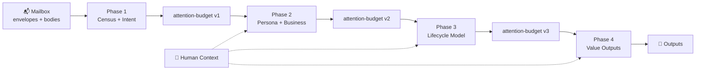

# twinbox 📮

> **Thread-level email intelligence that keeps important things from drowning.**

[](https://www.python.org/downloads/)
[](./LICENSE)
[](./tests/)

[English](./README.md) | [中文](./README.zh.md)

---

## Start here

### Recommended: guided onboarding

**Option A — OpenClaw host** (state under `~/.twinbox`, Twinbox wired into OpenClaw):

```bash
git clone https://github.com/caapapx/twinbox.git && cd twinbox
python3 -m venv .venv && source .venv/bin/activate
pip install -e .
twinbox onboard openclaw --json
```

`twinbox onboard openclaw` checks prerequisites, merges host config, syncs **SKILL.md**, restarts the Gateway when needed, and hands off to **conversation onboarding** (`twinbox onboarding start|status|next`). Details and troubleshooting: **[openclaw-skill/DEPLOY.md](openclaw-skill/DEPLOY.md)**.

**Option B — Local / terminal only** (default: `twinbox.json` in the repo root, outputs under **`runtime/validation/`**):

```bash
git clone https://github.com/caapapx/twinbox.git && cd twinbox
pip install -e .
twinbox onboarding start --json
```

Follow the printed `prompt`; advance with `twinbox onboarding next --json` until `current_stage` is `completed`. Check progress anytime with `twinbox onboarding status --json`.

### After onboarding

```bash
twinbox-orchestrate run --phase 4
twinbox task todo --json
```

**What you get**: `daily-urgent.yaml`, `pending-replies.yaml`, `sla-risks.yaml`, `weekly-brief.md` — paths depend on [Choose your setup path](#choose-your-setup-path) (repo `runtime/validation/` vs `~/.twinbox/runtime/validation/`).

**Advanced (non-interactive / CI)**: skip the wizard and set mailbox + LLM in one shot — [Quick Start → Non-interactive configuration](#non-interactive-configuration).

**Optional**: background JSON-RPC daemon (`twinbox daemon …`), optional Go shim `cmd/twinbox-go/`, and seed scripts for modular testing — see [docs/ref/daemon-and-runtime-slice.md](docs/ref/daemon-and-runtime-slice.md). When older docs disagree, prefer that page plus the code in this repo.

---

## Choose your setup path

| Path | State & config | Start here |
|------|----------------|------------|
| **Local / dev** | `twinbox.json` in the repo root; outputs under **`runtime/validation/`** in the repo | [Start here](#start-here) (Option B) → [Quick Start](#quick-start) for install detail and non-interactive setup |
| **OpenClaw host** | Mail + pipeline data under **`~/.twinbox`**; code/state roots in **`~/.config/twinbox/`**; OpenClaw reads **`~/.openclaw/openclaw.json`** | [Start here](#start-here) (Option A) + **[openclaw-skill/DEPLOY.md](openclaw-skill/DEPLOY.md)**; **advanced / CI**: `twinbox deploy openclaw --json`. Design: [docs/ref/openclaw-deploy-model.md](docs/ref/openclaw-deploy-model.md) |

The two are **not interchangeable**: Option B alone does not configure OpenClaw. See the [OpenClaw host deployment summary](#openclaw-host-deployment-summary) or read **DEPLOY.md** end-to-end for mailbox/LLM/env and verification — `onboard openclaw` and `deploy openclaw` automate wiring but do not remove the need to understand those prerequisites.

---

## Table of Contents

- [Start here](#start-here)
- [Choose your setup path](#choose-your-setup-path)
- [What it does](#what-it-does)
- [OpenClaw host deployment summary](#openclaw-host-deployment-summary)
- [Why twinbox (value)](#why-twinbox-value)
- [Who it is for](#who-it-is-for)
- [Quick Start](#quick-start)
- [Daily Commands](#daily-commands)
- [The Four Phases](#the-four-phases)
- [Architecture](#architecture)
- [FAQ](#faq)
- [Roadmap](#current-focus--roadmap)

---

## What it does

twinbox syncs your mailbox over **read-only IMAP**, runs a multi-phase pipeline, and writes **value-surface artifacts** to disk. It answers **what to act on now**, **what is waiting on you**, **what is stuck or SLA-risky**, and **what changed this week**—always at **thread** granularity, not a one-shot summary of the latest message.

- 📬 **Read-only first (Phases 1–4)**: No send, move, delete, or flag; stabilize daily/weekly outputs before drafts or automation ([Safety boundaries](#safety-boundaries)).
- 🧵 **Thread-level pipeline**: Intent / noise → persona & business context → lifecycle modeling → Phase 4 urgent, pending, risk queues and a structured weekly brief.
- 📁 **Files as API**: `daily-urgent.yaml`, `pending-replies.yaml`, `sla-risks.yaml`, `weekly-brief.md`, etc., under your state / `runtime/validation/` (exact path depends on [Choose your setup path](#choose-your-setup-path))—diffable, CI-gatable, human- or agent-reviewable.
- 🎯 **Human context**: Materials, habits, and **user-confirmed facts** can merge with mailbox-side inference with provenance; mailbox facts are not silently overwritten.

> **Self-hosted by design.** Your mail stays on your infrastructure.

**Next steps** — OpenClaw host: [OpenClaw host deployment summary](#openclaw-host-deployment-summary). Value and positioning: [Why twinbox (value)](#why-twinbox-value).

## OpenClaw host deployment summary

Full procedure, options, rollback, and uninstall: **[openclaw-skill/DEPLOY.md](openclaw-skill/DEPLOY.md)**. Troubleshooting: **[openclaw-skill/TROUBLESHOOT.md](openclaw-skill/TROUBLESHOOT.md)**. Plugin tools and fragments: **[openclaw-skill/DEPLOY-APPENDIX.md](openclaw-skill/DEPLOY-APPENDIX.md)**.

**Why `scripts/install_openclaw_twinbox_init.sh` still exists** — It is **not** legacy. `twinbox deploy openclaw` (and `twinbox onboard openclaw` when you choose **Apply setup**) runs it as the **`bootstrap_roots`** step: create **`~/.twinbox`**, write **`~/.config/twinbox/code-root`** and **`state-root`**. You do **not** need to run it by hand before `onboard` unless you follow DEPLOY §3.3 linearly or want pointers without a full deploy.

**Go (`cmd/twinbox-go`) and `vendor/twinbox_core`** — Optional thin RPC client and **`twinbox-go install --archive …`** (local path or HTTPS) to unpack Python **`twinbox_core`** under the state root. The usual OpenClaw flow resolves **`code_root`** from your checkout (or `TWINBOX_CODE_ROOT`) so **SKILL.md**, **`openclaw-skill/`**, and `onboard`/`deploy` can find the tree; a **vendor-only** host without a full git clone is also supported via **`twinbox vendor install`** / **`twinbox-go install`** — see **[docs/ref/code-root-developer.md](docs/ref/code-root-developer.md)** and **[docs/ref/daemon-and-runtime-slice.md](docs/ref/daemon-and-runtime-slice.md)**.

**Recommended order** (matches DEPLOY §2):

1. **OpenClaw available** — `openclaw` on PATH; `openclaw config validate` (and start Gateway when needed).
2. **Twinbox CLI** — In the repo: `python3 -m venv .venv`, `source .venv/bin/activate`, `pip install -e .`; confirm `twinbox` / `twinbox-orchestrate` work.
3. **Roots** — Happens inside **`twinbox onboard openclaw`** / **`twinbox deploy openclaw`** via **`bootstrap_roots`** (the script above). Or run `bash scripts/install_openclaw_twinbox_init.sh` manually first if you prefer DEPLOY §3.3 before onboarding.
4. **Mailbox + LLM** — Prefer completing these inside **`twinbox onboard openclaw`** or **`twinbox onboarding …`**. If you need one-shot flags, use [Non-interactive configuration](#non-interactive-configuration); config lands in **`~/.twinbox/twinbox.json`**. See DEPLOY §3.4.
5. **Wire skill + OpenClaw config** — **Preferred**: `twinbox onboard openclaw --json` (runs checks, host wiring, then points you at conversational onboarding). **Scripted alternative**: `twinbox deploy openclaw --json` (merges `skills.entries.twinbox`, syncs **SKILL.md** to state root with a symlink under `~/.openclaw/skills/twinbox/` when possible, optional himalaya check, `openclaw gateway restart`). Optional JSON fragment: `openclaw-skill/openclaw.fragment.json` (see DEPLOY §3.5).
6. **Verify** — `openclaw skills info twinbox`; optional smoke: `openclaw agent --agent twinbox --message "Acknowledge if twinbox skill is available." --json --timeout 120` (see DEPLOY §3.6).
7. **Onboarding in chat** — Use a **dedicated `twinbox` agent** and a **new session**; follow DEPLOY §3.8 (`twinbox onboarding start|status|next --json`). For reliable JSON, you can run those commands in the host shell.

**Upgrade / skill-only refresh**: `git pull`, `pip install -e .`, then `twinbox deploy openclaw --json` (or copy **SKILL.md** + restart Gateway per DEPLOY §4).

**Undo host wiring only** (keeps `~/.twinbox` mail data): `twinbox deploy openclaw --rollback --json` (see DEPLOY §3.5).

---

## Why twinbox (value)

These are the **outcomes** the system is optimized for — the same questions a strong human assistant would help you answer without rereading every thread:

| Question | What twinbox aims to surface |
|----------|------------------------------|
| **What must I act on now?** | Urgent / time-sensitive threads with scored priorities and next-step hints |
| **What is waiting on me?** | Pending-reply and “ball in your court” style work |
| **What is stuck or risky?** | SLA-style risks, silence, or stalled conversations |
| **What changed this week?** | A structured weekly brief — not a dump of new subjects |

**Thread lifecycle, not keyword triage.** Many “email AI” setups stop at filters and templates. twinbox works at **thread** granularity: who is waiting on whom, lifecycle stage, and workflow-shaped mail — closer to how coordination-heavy inboxes actually behave.

**Explainable, not a black box.** Phase 4 artifacts carry **reason codes**, **scores**, short **rationales**, and **evidence-style hints** (e.g. mail-derived vs. a rule you confirmed). You can inspect *why* something ranked high instead of trusting a single “important” flag.

**Weekly brief = structure + narrative.** `weekly-brief.md` is designed as sections (overview, flow summary, **action now**, backlog, important weekly changes, rhythm notes) so you can steer the week — not only read a paragraph summary.

**Value before automation.** Phases 1–4 stay **read-only**; daily/weekly surfaces are meant to earn trust first. Drafts and send stay behind explicit gates ([Safety boundaries](#safety-boundaries)).

**Pain people already name.** Inbox triage fatigue, missed follow-ups, and weekly write-up cost are widely felt. twinbox targets those outcomes directly rather than selling abstract “AI for email.”

**When lightweight rules are enough vs. when twinbox shines:** keyword rules and template digests are quick to wire but weaken on **long threads**, **ambiguous ownership**, and **workflow mail**. twinbox trades more setup for **deeper, evidence-oriented** judgments — a better fit when your mailbox is mostly **conversation-shaped work**, not one-off notifications.

For the full design story, see [docs/ref/architecture.md](docs/ref/architecture.md) (value surfaces, attention gates, human context).

---

## Who it is for

People wiring a mailbox into automation:

- CLI + JSON first
- OpenClaw or any host that can run shell
- **Not** a webmail UI
- **Not** bulk auto-reply
- **Not** a hosted SaaS product

---

## Quick Start

### Prerequisites

- Python 3.11+
- IMAP access to your mailbox
- A mail-provider **app password** when the account uses 2FA (e.g. [Google](https://support.google.com/accounts/answer/185833)), or a regular password if your provider allows it — not a GitHub/Git PAT

### Installation

```bash
# Option A: pip install from source
pip install -e .

# Option B: run directly from repo (sets up paths automatically)
bash scripts/twinbox
```

### Configuration

#### Guided setup (recommended)

Same as [Start here](#start-here) Option B — the CLI walks mailbox, LLM, profile, materials, rules, and optional push:

```bash
twinbox onboarding start --json
twinbox onboarding next --json   # after each stage, until completed
twinbox onboarding status --json
```

On an OpenClaw host, prefer **`twinbox onboard openclaw --json`** so wiring and onboarding stay in one guided flow ([openclaw-skill/DEPLOY.md](openclaw-skill/DEPLOY.md)).

#### Non-interactive configuration

For scripts, CI, or experts who already know the flags — writes **`./twinbox.json`** when state root is the repo (OpenClaw host: use the same commands after `install_openclaw_twinbox_init.sh`; config goes to **`~/.twinbox/twinbox.json`**).

```bash
# Mailbox → twinbox.json
TWINBOX_SETUP_IMAP_PASS=your-app-password \
  twinbox mailbox setup --email you@example.com --json

# LLM → twinbox.json
TWINBOX_SETUP_API_KEY=your-api-key \
  twinbox config set-llm --provider openai --model MODEL --api-url URL --json
```

> 🔒 **Security**: `twinbox.json` is gitignored by default for local/dev use. Never commit credentials.

### Verify & Run

```bash
# Test connection (read-only IMAP check); skip if onboarding already validated IMAP
twinbox mailbox preflight --json

# Run full pipeline (Phase 1→4)
twinbox-orchestrate run

# Or just refresh today's queues
twinbox-orchestrate run --phase 4
```

### See Results

```bash
# What's urgent right now?
twinbox task todo --json

# What happened today?
twinbox task latest-mail --json

# Check any thread's status
twinbox thread inspect <thread-id> --json
```

Outputs land in **`runtime/validation/`**:
- `phase-4/daily-urgent.yaml`
- `phase-4/pending-replies.yaml`
- `phase-4/sla-risks.yaml`
- `phase-4/weekly-brief.md`

---

## Daily Commands

### 🔍 **Check Status**
| Command | Purpose |
|---------|---------|
| `twinbox task mailbox-status --json` | Is the mailbox connected? |
| `twinbox task latest-mail --json` | What happened today? |
| `twinbox task todo --json` | What needs my attention? |

### 📋 **Manage Queues**
| Command | Purpose |
|---------|---------|
| `twinbox queue list --json` | List all queues (urgent, pending, sla_risk) |
| `twinbox queue show urgent --json` | Details of urgent items |
| `twinbox queue dismiss <id> --reason "..."` | Hide a thread from queues |
| `twinbox queue complete <id> --action-taken "..."` | Mark thread as done |

### 🔧 **Pipeline & Debugging**
| Command | Purpose |
|---------|---------|
| `twinbox-orchestrate run --dry-run` | Preview what would run |
| `twinbox-orchestrate run --phase 4` | Refresh just Phase 4 outputs |
| `twinbox-orchestrate contract --format json` | Show phase dependencies |

See full CLI reference: [docs/ref/cli.md](docs/ref/cli.md)

---

## The Four Phases



| Phase | What it does | Key Outputs |
|-------|--------------|-------------|
| **Phase 1** | Mailbox census + noise filtering | `intent-classification.json`, envelope index |
| **Phase 2** | Infer your role + business context | `persona-hypotheses.yaml`, `business-hypotheses.yaml` |
| **Phase 3** | Model thread lifecycle states | `lifecycle-model.yaml`, thread stages |
| **Phase 4** | Generate user-visible queues | `daily-urgent.yaml`, `pending-replies.yaml`, `sla-risks.yaml`, `weekly-brief.md` |

Each phase: deterministic `Loading` → LLM `Thinking`.

> **Read-only throughout**: No mail is sent, moved, deleted, or flagged in Phases 1–4.

---

## Architecture

### Core Design

```text
┌─────────────────┐      ┌─────────────────────┐      ┌──────────────────┐
│  Mailbox (IMAP) │─────▶│  Thread State Layer │◀─────│  Context Ingest  │
│   read-only     │      │ (lifecycle, queues) │      │ (materials/habits│
└─────────────────┘      └──────────┬──────────┘      └──────────────────┘
                                    │
                                    ▼
                          ┌─────────────────────┐
                          │   Runtime Skeleton  │
                          │ (listener / action  │
                          │  template / audit)  │
                          └──────────┬──────────┘
                                    │
                                    ▼
                          ┌─────────────────────┐
                          │  Automation Gates   │
                          │ read → draft → send │
                          └─────────────────────┘
```

### Compared to Typical Email Agents

| | **twinbox** | Typical demos |
|---|-------------|---------------|
| **Unit of work** | Thread | Single message |
| **Outputs** | Files on disk (diffable, CI-gated) | UI or immediate reply |
| **Safety** | Explicit read-only → draft → send gates | Often one-shot automation |
| **Context** | Structured files + provenance | Session-only prompts |
| **Hosting** | Self-hosted | Often SaaS |

---

## Repository Layout

```
twinbox/
├── 📄 README.md                 # This file
├── 📋 SKILL.md                  # OpenClaw manifest
├── ⚙️  pyproject.toml           # Python package
├── 🐍 src/twinbox_core/         # Core implementation
│   ├── task_cli.py             # Task-facing CLI
│   ├── orchestration.py        # Pipeline orchestrator
│   ├── phase4_value.py         # Phase 4: outputs
│   └── ...
├── 📁 config/
│   ├── action-templates/       # Action templates
│   ├── context/                # Context configs
│   └── profiles/               # User profiles
├── 📖 docs/
│   ├── ref/architecture.md     # Full architecture
│   ├── ref/cli.md              # CLI reference
│   └── ref/validation.md       # Output contracts
├── 🔧 scripts/                 # Shell entry points
│   ├── twinbox                 # CLI wrapper
│   ├── twinbox-orchestrate     # Pipeline runner
│   └── install_openclaw_twinbox_init.sh  # OpenClaw host: code/state roots
├── 🦞 openclaw-skill/          # OpenClaw deploy runbook, plugin, systemd samples
│   ├── DEPLOY.md               # Host install main path
│   └── plugin-twinbox-task/    # Optional Gateway tools for twinbox CLI
└── 💾 runtime/                 # Operational state (gitignored; local dev default)
    ├── context/                # User context
    ├── validation/             # Phase outputs
    └── himalaya/               # Mail config
```

### Code vs State Roots

| | **Code Root** | **State Root** |
|---|---------------|----------------|
| **Contains** | `src/`, `scripts/`, `docs/` | `.env`, `runtime/`, configs |
| **Set via** | `TWINBOX_CODE_ROOT` | `TWINBOX_STATE_ROOT` |
| **Default** | Current checkout (or `TWINBOX_CODE_ROOT`) | **`TWINBOX_STATE_ROOT`**, else line 1 of **`~/.config/twinbox/state-root`**, else **cwd** (`twinbox`) / **code root** (`twinbox-orchestrate`). OpenClaw **`bootstrap_roots`** usually points at **`~/.twinbox`**. See **[docs/ref/code-root-developer.md](docs/ref/code-root-developer.md)**. |

---

## FAQ

**Q: How is this different from Gmail labels or Outlook rules?**

A: Labels and rules are static filters. twinbox uses LLMs to understand thread *lifecycle*—whether you're waiting on someone, if a deadline is approaching, or if a conversation has gone silent. It also blends mailbox data with your external context (spreadsheets, project docs, habits).

**Q: Does it work with Outlook/Exchange/ProtonMail?**

A: Any provider with IMAP access should work. We've tested Gmail and Fastmail. For Exchange, ensure IMAP is enabled. For ProtonMail, use their IMAP bridge.

**Q: How much does it cost to run?**

A: twinbox is self-hosted and open source. You pay for:
- Your own infrastructure
- LLM API calls (configurable; defaults to OpenAI-compatible endpoints)
- ~1 API call per thread analyzed in Phase 4

**Q: Can it send emails for me?**

A: Not yet by default. Phases 1–4 are strictly read-only. Draft generation and sending are gated behind explicit approval flows (in development). See [Safety boundaries](#safety-boundaries).

**Q: What about privacy?**

A: Your mail never leaves your infrastructure unless you configure an external LLM API. Even then, only thread metadata and sampled bodies are sent—not your entire mailbox. Fully local LLM support is on the roadmap.

**Q: How do I update my context (materials, habits)?**

```bash
# Import a spreadsheet or doc
twinbox context import-material ./project-priorities.csv --intent reference

# Add a confirmed fact
twinbox context upsert-fact --id "customer-tier:acme" --type "tier" --content "enterprise"

# Refresh affected threads
twinbox-orchestrate run --phase 4
```

**Q: Can I run this in CI/CD?**

A: Yes. All outputs are files you can diff. The preflight command returns structured JSON with exit codes suitable for CI gates.

**Q: How do I deploy twinbox on an OpenClaw host?**

A: Use [Start here](#start-here) **Option A**, then **[openclaw-skill/DEPLOY.md](openclaw-skill/DEPLOY.md)** for verification and chat onboarding. **`twinbox onboard openclaw --json`** is the guided path; **`twinbox deploy openclaw --json`** is the scripted alternative. Mailbox/LLM can be completed inside the wizard or via [Non-interactive configuration](#non-interactive-configuration).

---

## Current Focus & Roadmap

> Last updated: 2026-03-29

### ✅ Shipped

**Core Pipeline**
- [x] `twinbox-orchestrate` + Phase 1–4 Python core (Loading / Thinking)
- [x] Task-facing CLI (`twinbox task … --json`) — 45+ commands
- [x] JSON-RPC daemon (`twinbox daemon …`) — Unix socket, `cli_invoke`, logs — see [daemon-and-runtime-slice.md](docs/ref/daemon-and-runtime-slice.md)
- [x] Incremental daytime sync (UID watermark + fallback)
- [x] Activity pulse / daytime-slice view (`twinbox digest pulse`)

**Mailbox & Onboarding**
- [x] IMAP read-only preflight with structured JSON output
- [x] Mailbox auto-detection (`twinbox mailbox detect`)
- [x] Onboarding flow (`twinbox onboarding start/status/next`)
- [x] Push subscription system (`twinbox push subscribe/unsubscribe`)

**Queue & Context Management**
- [x] Queue dismiss/complete/restore with persistence
- [x] Schedule overrides (`twinbox schedule update/reset`)
- [x] Material import with intent (reference vs template_hint)
- [x] Semantic routing rules (`twinbox rule list/add/remove/test`)
- [x] Recipient role handling (direct/cc_only/group_only/indirect)
- [x] Unread-only filtering (`--unread-only`)

**OpenClaw Integration**
- [x] SKILL.md manifest with `metadata.openclaw`
- [x] Guided host path: `twinbox onboard openclaw` + scripted `twinbox deploy openclaw` (rollback, fragment merge, SKILL symlink to state root)
- [x] OpenClaw schedule tools (sync to platform cron)
- [x] OpenClaw queue tools (complete/dismiss via tools)
- [x] Optional plugin (`openclaw-skill/plugin-twinbox-task`) for deterministic `twinbox task …` from Gateway

### 🚧 In Progress

**Platform Verification**
- [ ] OpenClaw native `preflightCommand` auto-execution verification
- [ ] `metadata.openclaw.schedules` auto-import validation
- [ ] Hosted session isolation for `twinbox` agent

**Reliability & Extensions**
- [ ] Subscription registry for multi-channel delivery
- [ ] Stale artifact fallback with automatic retry
- [ ] Runtime archive snapshots (nightly/weekly/failure)

### 📋 Planned

**Automation Layers**
- [ ] Draft generation with approval gates
- [ ] Context refresh triggering actual rerun

**Review & Audit**
- [ ] Structured audit trail (`runtime/audit/`)
- [ ] Action template registry
- [ ] Review surface UI/CLI

Consolidated backlog and shipped history: [ROADMAP.md](ROADMAP.md)

---

## Safety Boundaries

1. **App passwords only** — Never use your main account password
2. **`.env` stays local** — Never commit credentials
3. **`runtime/` is operational data** — Backup if needed, don't edit directly
4. **No auto-send until proven** — Draft quality and approval flows come first
5. **Mailbox facts are immutable** — User context supplements but never silently overwrites thread evidence

---

## Publishing Note

`docs/validation/` may contain instance-specific materials from real mailbox studies. Sanitize before a fully public release. Stable public surface lives outside that directory.

---

## License

MIT — see [LICENSE](./LICENSE)

---

**Questions?** Open an issue or check [docs/README.md](docs/README.md) for deep dives.
