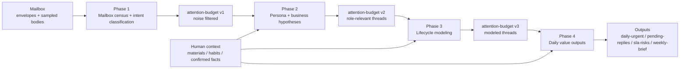

# twinbox 📮

[English](./README.md) | [中文](./README.zh.md)

A thread-centric email copilot infrastructure: reconstructs workflow state from threads instead of single messages; understand state first, then unlock automation step by step.

Status as of `2026-03-23`: this repository is in an implementation-heavy, read-only-first stage. It already has a shared Python core for Phase 1-4, a stable orchestration contract CLI, and an initial Phase 4 evaluation gate (`twinbox-eval-phase4`). It is not yet a full production runtime with listener/action services.

## What This Is

`twinbox` is not a generic auto-send mail bot and not a polished inbox client demo.

It is a self-hostable foundation for building an email copilot with these traits:

- starts with read-only mailbox onboarding
- reconstructs workflow state from threads instead of single messages
- ingests user-supplied context such as work materials and recurring habits
- turns mailbox state into visible queues like `daily-urgent` and `pending-replies`
- only promotes actions gradually: read-only -> draft -> controlled send

What's already here:

- shell-based mailbox validation and sampling scripts
- a shared Python core for Phase 1-4 loading/thinking and rendering
- a shared orchestration contract (`scripts/twinbox_orchestrate.sh`)
- a Phase 4 accuracy/regression evaluation entrypoint (`twinbox-eval-phase4`)
- context-ingestion support for user-provided materials, habits, and confirmed facts

## Why This Exists

Most email-agent demos optimize for message events, fast automation, and UI interaction.

This project is tuned for a different set of goals:

- enterprise-safe rollout
- thread-centric workflow understanding
- human-in-the-loop decision making
- OpenClaw-native self-hosting and scheduling
- gradual adaptation from one real mailbox into a reusable agent workflow

The result should feel less like "AI reads one email" and more like "AI becomes a usable mailbox copilot for how this person actually works".

## Current Progress

Current release posture: `spec-first`, `shell-first`, `read-only-first`.

What is already in the repository:

- IMAP/SMTP environment checks and local `himalaya` config rendering
- read-only mailbox smoke test and early validation scripts
- progressive validation docs for persona, lifecycle, and daily value outputs
- architecture docs for thread-centric workflow and human context ingestion
- runtime skeleton for future `listener`, `action`, `template`, and `audit` layers
- Phase 1-4 Loading/Thinking separation (LLM replaces hardcoded inference)
- Phase 4 evaluation gate with baseline regression checks

### Progressive Validation Pipeline

The repository currently implements a four-phase, read-only-first funnel.
Each phase narrows the attention window and hands structured output to the next one.



| Phase | Main job | Typical outputs | Why it exists |
|-------|----------|-----------------|---------------|
| 1 | Read the mailbox at distribution level | `phase1-context.json`, `intent-classification.json`, derived census views | Establish the baseline and remove obvious noise early |
| 2 | Infer who this mailbox belongs to and what work matters | `persona-hypotheses.yaml`, `business-hypotheses.yaml` | Filter threads through role, business, and context relevance |
| 3 | Upgrade from labels to thread-level workflow state | `lifecycle-model.yaml`, `thread-stage-samples.json` | Understand where each thread is in a recurring lifecycle |
| 4 | Produce user-visible value surfaces | `daily-urgent.yaml`, `pending-replies.yaml`, `sla-risks.yaml`, `weekly-brief.md` | Answer the operational question: "what should I look at today?" |

Current contract note:

- the implemented runtime handoff still relies on phase-specific structured artifacts, not a fully wired `attention-budget.yaml`
- treat `attention-budget` as the planned convergence contract, not as an already-enforced runtime dependency
- see [Validation Artifact Contract](docs/ref/validation.md)

Each phase still follows the same internal split:

- `Loading`: deterministic I/O, sampling, and context-pack building
- `Thinking`: LLM inference with evidence and confidence

```bash
# Single phase
bash scripts/phase1_loading.sh && bash scripts/phase1_thinking.sh

# Shared orchestration CLI
bash scripts/twinbox_orchestrate.sh run

# Inspect the contract a skill or adapter can consume
bash scripts/twinbox_orchestrate.sh contract --format json

# Single phase via orchestration CLI
bash scripts/twinbox_orchestrate.sh run --phase 2

# Backward-compatible wrapper
bash scripts/run_pipeline.sh --phase 2
```

### Common Run/Test Paths

If you just want one concrete path to start with, pick from this table instead of scanning every script first.

| Goal | Recommended command | What it gives you |
|------|---------------------|-------------------|
| Validate mailbox login/access first | `twinbox mailbox preflight --json` | Unified env checks, defaults, himalaya config render, and read-only IMAP preflight for OpenClaw or local use |
| Run the compatibility preflight wrapper | `bash scripts/preflight_mailbox_smoke.sh --json` | Wrapper around `twinbox mailbox preflight`, useful during script migration |
| See the full pipeline shape | `bash scripts/twinbox_orchestrate.sh run --dry-run` | Prints the Phase 1-4 execution plan without running it |
| Run the full pipeline locally | `bash scripts/twinbox_orchestrate.sh run` | Shared orchestration CLI; Phase 4 uses parallel thinking by default |
| Re-run one phase locally | `bash scripts/twinbox_orchestrate.sh run --phase 2` | Useful for focused debugging or partial reruns |
| Inspect the orchestration contract | `bash scripts/twinbox_orchestrate.sh contract --format json` | Machine-readable phase dependencies and entrypoints for operators or skills |
| Run Python unit tests | `pytest tests/` | Regression coverage for contracts, phase cores, paths, and rendering |
| Run lightweight smoke checks | `python3 -m compileall src` and `bash -n scripts/twinbox_orchestrate.sh scripts/run_pipeline.sh` | Fast syntax and import checks before a commit |

### Shared State Root

Phase 1-4 separate `code root` from `state root` so all scripts write to the same canonical location.

- `code root`: the current checkout that provides tracked scripts
- `state root`: the canonical checkout that provides `.env`, `runtime/context/`, `runtime/validation/`, and `docs/validation/`
- Resolution order: `TWINBOX_CANONICAL_ROOT` -> `~/.config/twinbox/canonical-root` -> current checkout

```bash
# Register the canonical state root once from the main checkout
bash scripts/register_canonical_root.sh
```

### Pipeline Checklist

1. Register the canonical root from the main checkout with `bash scripts/register_canonical_root.sh`.
2. Run any phase through its normal script entrypoint; all Phase 1-4 scripts resolve the same canonical state root.
3. Use `bash scripts/twinbox_orchestrate.sh contract --format json` when a skill or operator needs the explicit pipeline contract.

```bash
# Inspect the shared orchestration contract or run the local CLI
bash scripts/twinbox_orchestrate.sh contract
bash scripts/twinbox_orchestrate.sh run

# Run the backward-compatible wrapper
bash scripts/run_pipeline.sh
```

See the central [Docs Index](docs/README.md) and [Core Refactor Plan](docs/core-refactor.md).

Not implemented yet:

- a long-running listener manager
- a production action manager
- WebSocket/frontend interaction surfaces
- auto-send or archive automation by default
- tenant-specific hardcoded business logic

## Key Tradeoffs

1. `Thread over message`  
   Decisions are made on thread context, workflow stage, and evidence, not on isolated message snapshots.
2. `Value before automation`  
   The system must prove read-only value before drafting, and prove draft value before sending.
3. `Context is first-class`  
   User-uploaded materials, recurring habits, and confirmed facts are normalized instead of buried in chat history.
4. `OpenClaw-native operation`  
   The repo is designed to work in OpenClaw-style self-hosted environments and also in manual chat-driven initialization.

## Architecture Diagram (ASCII) 🧭

```text
                                +----------------------+
                                |   User / Operator    |
                                |  (review & approve)  |
                                +----------+-----------+
                                           |
                                           v
+------------------+             +---------+----------+             +----------------------+
| Mailbox (IMAP)   +-----------> | Thread State Layer | <---------- | Context Ingestion     |
| read-only first  | evidence    | (thread lifecycle, |   facts     | (materials/habits)    |
+------------------+             | queue projection)  |             +----------+-----------+
                                 +---------+----------+                        |
                                           |                                   |
                                           v                                   |
                                 +---------+----------+                        |
                                 | Runtime Skeleton   |------------------------+
                                 | listener / action  |     typed context
                                 | template / audit   |
                                 +---------+----------+
                                           |
                                           v
                                 +---------+----------+
                                 | Automation Gates   |
                                 | read -> draft ->   |
                                 | controlled send    |
                                 +--------------------+
```

## Comparison: Anthropic `email-agent` Diagram

Anthropic project README architecture diagram:


Main differences (this repo vs Anthropic demo):

- `Thread-first` vs `message/UI-event-first`: this repo models thread lifecycle and queue projection as core state.
- `Progressive automation` vs `direct demo flow`: this repo enforces `read-only -> draft -> controlled send`.
- `Context as structured plane` vs `ad-hoc session context`: user materials/habits are normalized for reuse.
- `Self-hostable runtime skeleton` vs `local demo app`: this repo emphasizes listener/action/template/audit evolution.

## Repository Map

```text
twinbox/
├── README.md
├── README.zh.md
├── SKILL.md
├── pyproject.toml
├── config/
│   ├── action-templates/
│   ├── context/
│   └── profiles/
├── docs/
│   ├── README.md
│   ├── core-refactor.md
│   ├── ref/
│   │   ├── architecture.md
│   │   └── runtime.md
│   ├── guide/
│   │   └── openclaw-docker-compose.md
│   ├── archive/
│   └── validation/
│       └── phase-<n>-report.md
├── scripts/
│   ├── phase{1-4}_loading.sh       # deterministic I/O
│   ├── phase{1-4}_thinking.sh      # LLM inference
│   ├── register_canonical_root.sh  # register shared state root
│   ├── twinbox_orchestrate.sh      # shared orchestration CLI
│   ├── run_pipeline.sh             # backward-compatible wrapper
│   └── twinbox_paths.sh            # shared code-root/state-root resolution
└── runtime/
```

## Quick Start 🚀

1. Read [docs/README.md](docs/README.md).
2. Read [architecture.md](docs/ref/architecture.md).
3. Read [core-refactor.md](docs/core-refactor.md).
4. If you want to validate mailbox access locally, run:
   - `twinbox mailbox preflight --json`
   - or the compatibility wrapper: `bash scripts/preflight_mailbox_smoke.sh --json`
5. If you want to extend the runtime contract, start from:
   - [runtime.md](docs/ref/runtime.md)
   - [scheduling.md](docs/ref/scheduling.md)
   - [Action Templates README](config/action-templates/README.md)

### First Login Troubleshooting

- `missing_env`: provide `MAIL_ADDRESS` plus the IMAP/SMTP host, port, login, and password fields.
- `imap_auth_failed`: check username/password or whether your provider requires an app password.
- `imap_tls_failed`: verify the port and encryption pairing; common pairs are `993 + tls` or `143 + starttls/plain`.
- `imap_network_failed`: check hostname, DNS, container networking, and firewall reachability.
- `mailbox-connected + warn`: read-only IMAP is good enough for Phase 1-4; SMTP is reported as a warning only in read-only mode.

## Runtime Direction Next

The next runtime layer will not clone Anthropic's `email-agent` directly.

It will keep this repository's strengths:

- progressive validation
- thread-centric workflow state
- human context plane
- controlled automation gates

And absorb the engineering pieces that matter:

- `listener` / `action` separation
- `template` / `instance` separation
- typed execution context
- execution audit trail
- enable/disable friendly extension surface

## Safety Boundaries

- Use app/client passwords only.
- Keep `.env` local and never commit it.
- Treat `runtime/` as local operational data.
- Do not auto-send until draft quality and approval flow are proven.
- Do not let user-supplied context silently overwrite mailbox facts.

## Publishing Note

This repository still contains locally generated validation materials under `docs/validation/` from a real mailbox study. Before a fully public release, you should review and sanitize any instance-specific files and history.

The open-source-facing architecture and template docs live outside `docs/validation/` and should remain the stable public surface.
