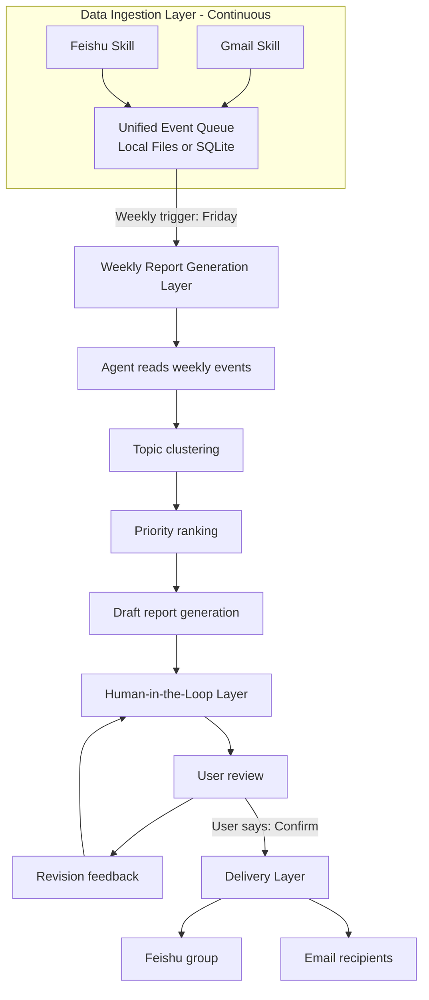

# email-bot

IMAP/SMTP mailbox skill scaffold for OpenClaw, designed around a `himalaya`-style mail backend.

## Goal

This repository gives us a practical baseline to:

1. Store verified mailbox settings in `.env`
2. Render a local `himalaya` account config from `.env`
3. Define a safe OpenClaw `SKILL.md` contract for email read/classify/draft workflows

## Files

- `.env`: local credentials and behavior settings (git-ignored)
- `.env.example`: shareable template
- `SKILL.md`: OpenClaw skill definition draft
- `docs/architecture.md`: universal-core and customizable-policy design
- `docs/claude-value-skill-evaluation.md`: Claude-value style skill assessment
- `config/policy.default.yaml`: global default rules
- `config/profiles/`: role/persona profile overrides
- `scripts/render_himalaya_config.sh`: generate `config.toml` from `.env`
- `scripts/check_env.sh`: quick required-var check

## Quick Start

1. Update `.env` with your verified mailbox values.
2. Run `bash scripts/check_env.sh`.
3. Run `bash scripts/render_himalaya_config.sh`.
4. Generated file will be at `runtime/himalaya/config.toml`.
5. Install/attach the corresponding OpenClaw skill workflow (read/classify/draft only by default).

## Safety Defaults

- Use app/client password only.
- Keep `.env` local and never commit.
- Default behavior is read/classify/draft, not auto-send.
- Escalate high-risk emails to human review before sending.

## Integration Notes (OpenClaw + ClawHub himalaya idea)

Recommended architecture:

1. Mail transport layer
   Backed by `himalaya` account config generated from `.env`.
2. Skill action layer
   `fetch_unread`, `classify_priority`, `draft_reply`, `build_digest`.
3. Policy layer
   `SOUL.md` + `AGENTS.md` enforce no-auto-send and privacy boundaries.
4. Schedule layer
   `HEARTBEAT.md` triggers periodic sync and digest generation.

This keeps mailbox credentials and transport concerns separated from LLM prompt logic.

## Architecture Overview

The system is designed as a four-stage pipeline with a human-in-the-loop approval loop before any outbound delivery.



Event queue schema:

```json
{ "source": "...", "author": "...", "title": "...", "content": "...", "ts": "...", "tags": ["..."] }
```

Key behavior:

- Ingestion runs continuously.
- Weekly report generation runs on schedule.
- Draft quality is improved through iterative human feedback.
- Outbound delivery is triggered only after explicit confirmation.

## Why This Structure Fits Real Email Work

Email automation should not be rewritten per company or per person.

Instead:

1. The mailbox transport, parsing, sync, retries, and review gates stay universal.
2. Company and role differences live in `config/policy.default.yaml` and `config/profiles/`.
3. Personal style and approval thresholds become profile data, not code forks.

This gives us a stable core with controlled extension points.
