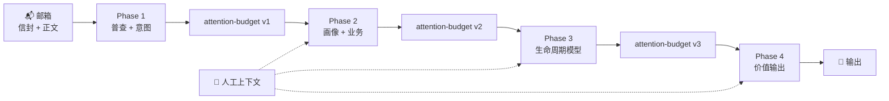

# twinbox 📮

> **线程级邮件智能，让重要的事情不被淹没。**

[](https://www.python.org/downloads/)
[](./LICENSE)
[](./tests/)

[English](./README.md) | [中文](./README.zh.md)

---

## 从这里开始

### 推荐：引导式 onboard

**方案 A — OpenClaw 宿主**（状态在 `~/.twinbox`，Twinbox 接入 OpenClaw）：

```bash
git clone https://github.com/caapapx/twinbox.git && cd twinbox
python3 -m venv .venv && source .venv/bin/activate
pip install -e .
twinbox onboard openclaw --json
```

`twinbox onboard openclaw` 会检查门槛、合并宿主配置、同步 **SKILL.md**、按需重启 Gateway，并交接到**对话引导**（`twinbox onboarding start|status|next`）。细节与排障：**[openclaw-skill/DEPLOY.md](openclaw-skill/DEPLOY.md)**。

**方案 B — 仅本机 / 终端**（默认：仓库根 `twinbox.json`，产物在 **`runtime/validation/`**）：

```bash
git clone https://github.com/caapapx/twinbox.git && cd twinbox
pip install -e .
twinbox onboarding start --json
```

按输出里的 `prompt` 操作；用 `twinbox onboarding next --json` 推进，直到 `current_stage` 为 `completed`。随时可用 `twinbox onboarding status --json` 查看进度。

### 引导完成后

```bash
twinbox-orchestrate run --phase 4
twinbox task todo --json
```

**你将获得**：`daily-urgent.yaml`、`pending-replies.yaml`、`sla-risks.yaml`、`weekly-brief.md` — 具体路径见 [安装路径](#选择安装路径)（仓库 `runtime/validation/` 与 OpenClaw 宿主 `~/.twinbox/runtime/validation/` 不同）。

**高级（非交互 / CI）**：跳过向导、一次性写入邮箱与 LLM — 见 [快速开始 → 非交互配置](#非交互配置)。

**可选**：后台 JSON-RPC daemon（`twinbox daemon …`）、可选 Go 薄入口 `cmd/twinbox-go/`、模组化模拟邮箱种子脚本 — 见 [docs/ref/daemon-and-runtime-slice.md](docs/ref/daemon-and-runtime-slice.md)。与旧文档冲突时以该页与本仓库代码为准。

---

## 选择安装路径

| 路径 | 状态与配置落点 | 从这里开始 |
|------|----------------|------------|
| **本地 / 开发** | 仓库根的 `twinbox.json`；产物在仓库 **`runtime/validation/`** | [从这里开始](#从这里开始)（方案 B）→ [快速开始](#快速开始)（安装细节与非交互配置） |
| **OpenClaw 宿主** | 邮件与流水线数据在 **`~/.twinbox`**；roots 在 **`~/.config/twinbox/`**；OpenClaw 读 **`~/.openclaw/openclaw.json`** | [从这里开始](#从这里开始)（方案 A）+ **[openclaw-skill/DEPLOY.md](openclaw-skill/DEPLOY.md)**；**高级 / 脚本化**：`twinbox deploy openclaw --json`。设计说明：[docs/ref/openclaw-deploy-model.md](docs/ref/openclaw-deploy-model.md) |

两条路径**不能混为一谈**：只做方案 B **不会**自动接好 OpenClaw。详见 [OpenClaw 宿主部署摘要](#openclaw-宿主部署摘要) 或通读 **DEPLOY.md** 完成邮箱 / LLM / 环境与验证 — `onboard openclaw` 与 `deploy openclaw` 负责接线自动化，**不**替代对前置条件的理解。

---

## 目录

- [从这里开始](#从这里开始)
- [选择安装路径](#选择安装路径)
- [它是做什么的](#它是做什么的)
- [OpenClaw 宿主部署摘要](#openclaw-宿主部署摘要)
- [为什么选择 twinbox（价值亮点）](#为什么选择-twinbox价值亮点)
- [适合谁用](#适合谁用)
- [快速开始](#快速开始)
- [日常命令](#日常命令)
- [四个阶段](#四个阶段)
- [架构](#架构)
- [常见问题](#常见问题)
- [路线图](#当前聚焦与路线图)

---

## 它是做什么的

twinbox 通过**只读 IMAP** 拉取邮箱，经多阶段流水线分析后，把结论写成磁盘上的**价值面产物**：回答**我现在该先处理什么**、**谁在等我**、**什么卡住或有 SLA 风险**、**这周相对上周变在哪**——一律以**线程**为单元，而不是对「最新一封邮件」做一次性摘要。

- 📬 **只读优先（Phase 1–4）**：不发送、不移动、不删除、不打标；先稳定产出日/周视图，再谈草稿与自动发送（见 [安全边界](#安全边界)）。
- 🧵 **线程级流水线**：意图与噪声收敛 → 画像与业务上下文 → 生命周期建模 → Phase 4 生成紧急队列、待回复、风险与结构化周报。
- 📁 **文件即 API**：`daily-urgent.yaml`、`pending-replies.yaml`、`sla-risks.yaml`、`weekly-brief.md` 等写入 state / `runtime/validation/`（路径随 [安装路径](#选择安装路径) 而变），可 diff、可 CI、可被 Agent 或人工复核。
- 🎯 **人类上下文**：材料、习惯与**你确认过的事实**可与邮箱侧推断合并；设计原则是补充与可审计，**不静默覆盖**原始邮件事实。

> **设计上就是自托管的。** 你的邮件留在你的基础设施上。

**接下来** — OpenClaw 宿主：[OpenClaw 宿主部署摘要](#openclaw-宿主部署摘要)。价值与定位：[为什么选择 twinbox（价值亮点）](#为什么选择-twinbox价值亮点)。

## OpenClaw 宿主部署摘要

完整步骤、可选项、回滚与卸载：**[openclaw-skill/DEPLOY.md](openclaw-skill/DEPLOY.md)**。排障：**[openclaw-skill/TROUBLESHOOT.md](openclaw-skill/TROUBLESHOOT.md)**。插件与 JSON 片段：**[openclaw-skill/DEPLOY-APPENDIX.md](openclaw-skill/DEPLOY-APPENDIX.md)**。

**为什么还有 `scripts/install_openclaw_twinbox_init.sh`** — **不是**过时脚本。`twinbox deploy openclaw` 与 `twinbox onboard openclaw`（你选择 **Apply setup** 应用宿主配置时）会把它当作 **`bootstrap_roots`** 执行：创建 **`~/.twinbox`**，写入 **`~/.config/twinbox/code-root`**、**`state-root`**。在跑 `onboard` 之前**不必**手敲这条 bash，除非你按 DEPLOY §3.3 顺序先初始化、或只想写指针还不要完整 deploy。

**Go（`cmd/twinbox-go`）与 `vendor/twinbox_core`** — 可选薄 RPC 客户端；**`twinbox-go install --archive …`**（本地或 HTTPS）把 Python **`twinbox_core`** 解到 state 下。常见 OpenClaw 流程会从你的 checkout（或 `TWINBOX_CODE_ROOT`）解析 **`code_root`**，以便 **SKILL.md**、**`openclaw-skill/`**、`onboard`/`deploy` 找到树形布局；无完整 git clone 时也可用 **`twinbox vendor install`** / **`twinbox-go install`** 走 **仅 vendor** 宿主 —— 见 **[docs/ref/code-root-developer.md](docs/ref/code-root-developer.md)** 与 **[docs/ref/daemon-and-runtime-slice.md](docs/ref/daemon-and-runtime-slice.md)**。

**推荐顺序**（与 DEPLOY §2 一致）：

1. **OpenClaw 可用** — 已安装 `openclaw`；`openclaw config validate`（按需启动 Gateway）。
2. **Twinbox CLI** — 在仓库内：`python3 -m venv .venv`、`source .venv/bin/activate`、`pip install -e .`；确认 `twinbox` / `twinbox-orchestrate` 可执行。
3. **Roots** — 由 **`twinbox onboard openclaw`** / **`twinbox deploy openclaw`** 内的 **`bootstrap_roots`** 完成（即上述脚本）。若你更习惯 DEPLOY §3.3，也可先在仓库根手动执行 `bash scripts/install_openclaw_twinbox_init.sh`。
4. **邮箱 + LLM** — 优先在 **`twinbox onboard openclaw`** 或 **`twinbox onboarding …`** 里完成。若需一次性命令行写入，用 [非交互配置](#非交互配置)；配置落在 **`~/.twinbox/twinbox.json`**。详见 DEPLOY §3.4。
5. **接入 skill 与 OpenClaw 配置** — **首选**：`twinbox onboard openclaw --json`（检查、宿主接线，再引导对话 onboarding）。**脚本化替代**：`twinbox deploy openclaw --json`（合并 `skills.entries.twinbox`、将 **SKILL.md** 同步到 state root，并在 `~/.openclaw/skills/twinbox/` 下尽量用**符号链接**指向该文件、可选 himalaya 检查、`openclaw gateway restart`）。可选 JSON 片段：`openclaw-skill/openclaw.fragment.json`（见 DEPLOY §3.5）。
6. **验证** — `openclaw skills info twinbox`；可选冒烟：`openclaw agent --agent twinbox --message "Acknowledge if twinbox skill is available." --json --timeout 120`（见 DEPLOY §3.6）。
7. **对话内引导** — 使用**专用 `twinbox` agent** 与**新会话**；按 DEPLOY §3.8 执行 `twinbox onboarding start|status|next --json`。需要可靠 JSON 时可在宿主 shell 直接跑上述命令。

**升级 / 仅刷新 skill**：`git pull`、`pip install -e .` 后执行 `twinbox deploy openclaw --json`（或按 DEPLOY §4 仅复制 **SKILL.md** + 重启 Gateway）。

**仅撤销宿主接线**（保留 `~/.twinbox` 邮件数据）：`twinbox deploy openclaw --rollback --json`（见 DEPLOY §3.5）。

---

## 为什么选择 twinbox（价值亮点）

下面这些**结果导向**的问题，是 twinbox 持续优化的方向 —— 也是「强人类助理」在不重读整箱邮件时帮你回答的问题：

| 你想搞清楚的事 | twinbox 试图给你的 |
|----------------|-------------------|
| **我现在必须处理什么？** | 带优先级与下一步提示的紧急 / 时效线程 |
| **谁在等我？** | 待回复、「球在你这边」类工作 |
| **什么卡住了或有风险？** | SLA 式风险、沉默或过久的线程 |
| **这周相对上周变在哪？** | 结构化周报 —— 而不只是新主题列表 |

**线程生命周期，而不只是关键词分拣。** 很多「邮件 AI」停在过滤词与模板。twinbox 以**线程**为单元：谁在等谁、生命周期阶段、工作流形态的往来 —— 更接近协调密集型邮箱的真实结构。

**可解释，而不是黑盒。** Phase 4 产物带有**原因码**、**分数**、简短**理由**与**证据向提示**（例如来自邮件 vs. 你确认过的规则）。你能看到「为什么这条被标高」，而不是只信一个「重要」标记。

**周报 = 结构 + 叙事。** `weekly-brief.md` 按区块组织（总览、工作流摘要、**立即行动**、积压、本周重要变化、节奏观察等），便于你**安排一周**，而不止读完一段摘要。

**先证明价值，再谈自动化。** Phase 1–4 严格**只读**；先稳定产出日/周价值面，再谈草稿与发送（见下文 [安全边界](#安全边界)）。

**痛点已被广泛感知。** 分拣疲劳、跟进遗漏、周报汇总成本 —— 许多人已经能说清这些痛。twinbox 直接对准这些**结果**，而不是抽象推销「AI 邮箱」。

**轻量规则够用 vs. twinbox 更合适的场景：** 关键词规则 + 模板摘要上手快，但在**长线程**、**责任边界模糊**、**工作流邮件**上容易失真。twinbox 用更多搭建成本，换**更深、带证据取向**的判断 —— 更适合邮箱里大量是**对话型工作**、而非零散通知的人。

完整设计叙事见 [docs/ref/architecture.md](docs/ref/architecture.md)（价值面、注意力闸门、人类上下文）。

---

## 适合谁用

想把邮箱接入自动化的人：

- CLI + JSON 优先
- OpenClaw 或任何能跑 shell 的宿主
- **不是**网页邮箱
- **不是**群发自动回复
- **不是**托管 SaaS 产品

---

## 快速开始

### 前置要求

- Python 3.11+
- 邮箱 IMAP 访问权限
- 邮箱服务商的**应用专用密码**（账户开启 2FA 时，如 [Google](https://support.google.com/accounts/answer/185833)），或服务商允许的常规密码 —— **不是** GitHub / Git 的 PAT

### 安装

```bash
# 方式 A：从源码 pip 安装
pip install -e .

# 方式 B：直接从仓库运行（自动设置路径）
bash scripts/twinbox
```

### 配置

#### 引导式配置（推荐）

与 [从这里开始](#从这里开始) 方案 B 相同 — CLI 分阶段引导邮箱、LLM、画像、材料、规则与可选推送：

```bash
twinbox onboarding start --json
twinbox onboarding next --json   # 每完成一阶段后执行，直到 completed
twinbox onboarding status --json
```

在 OpenClaw 宿主上，更推荐 **`twinbox onboard openclaw --json`**，宿主接线与对话引导在同一条向导里完成（[openclaw-skill/DEPLOY.md](openclaw-skill/DEPLOY.md)）。

#### 非交互配置

适用于脚本、CI，或已熟悉参数 —— 当 state root 为仓库时写入 **`./twinbox.json`**；OpenClaw 宿主在跑过 `install_openclaw_twinbox_init.sh` 后使用相同命令，配置写入 **`~/.twinbox/twinbox.json`**。

```bash
# 邮箱 → twinbox.json
TWINBOX_SETUP_IMAP_PASS=your-app-password \
  twinbox mailbox setup --email you@example.com --json

# LLM → twinbox.json
TWINBOX_SETUP_API_KEY=your-api-key \
  twinbox config set-llm --provider openai --model MODEL --api-url URL --json
```

> 🔒 **安全提示**：本地 / 开发使用的 `twinbox.json` 已加入 gitignore。永远不要提交凭证。

### 验证与运行

```bash
# 测试连接（只读 IMAP）；若引导里已做过预检可跳过
twinbox mailbox preflight --json

# 运行完整流水线（Phase 1→4）
twinbox-orchestrate run

# 或仅刷新今日队列
twinbox-orchestrate run --phase 4
```

### 查看结果

```bash
# 当前有什么紧急事项？
twinbox task todo --json

# 今天发生了什么？
twinbox task latest-mail --json

# 查看某个线程状态
twinbox thread inspect <thread-id> --json
```

输出位于 **`runtime/validation/`**：
- `phase-4/daily-urgent.yaml`
- `phase-4/pending-replies.yaml`
- `phase-4/sla-risks.yaml`
- `phase-4/weekly-brief.md`

---

## 日常命令

### 🔍 **查看状态**
| 命令 | 用途 |
|------|------|
| `twinbox task mailbox-status --json` | 邮箱是否已连接？ |
| `twinbox task latest-mail --json` | 今天发生了什么？ |
| `twinbox task todo --json` | 有什么需要我关注？ |

### 📋 **管理队列**
| 命令 | 用途 |
|------|------|
| `twinbox queue list --json` | 列出所有队列（urgent、pending、sla_risk） |
| `twinbox queue show urgent --json` | urgent 队列详情 |
| `twinbox queue dismiss <id> --reason "..."` | 隐藏某线程 |
| `twinbox queue complete <id> --action-taken "..."` | 标记线程为已完成 |

### 🔧 **流水线与调试**
| 命令 | 用途 |
|------|------|
| `twinbox-orchestrate run --dry-run` | 预览将要执行的内容 |
| `twinbox-orchestrate run --phase 4` | 仅刷新 Phase 4 输出 |
| `twinbox-orchestrate contract --format json` | 显示阶段依赖关系 |

完整 CLI 参考：[docs/ref/cli.md](docs/ref/cli.md)

---

## 四个阶段



| 阶段 | 做什么 | 关键输出 |
|------|--------|----------|
| **Phase 1** | 邮箱普查 + 降噪 | `intent-classification.json`、信封索引 |
| **Phase 2** | 推断你的角色 + 业务背景 | `persona-hypotheses.yaml`、`business-hypotheses.yaml` |
| **Phase 3** | 建模线程生命周期状态 | `lifecycle-model.yaml`、线程阶段 |
| **Phase 4** | 生成用户可见队列 | `daily-urgent.yaml`、`pending-replies.yaml`、`sla-risks.yaml`、`weekly-brief.md` |

每个阶段：确定性 `Loading` → LLM `Thinking`。

> **全程只读**：Phase 1–4 不发送、不移动、不删除、不打标任何邮件。

---

## 架构

### 核心设计

```text
┌─────────────────┐      ┌─────────────────────┐      ┌──────────────────┐
│   邮箱 (IMAP)   │─────▶│    线程状态层       │◀─────│   上下文导入     │
│     只读        │      │  (生命周期、队列)   │      │ (材料/习惯)      │
└─────────────────┘      └──────────┬──────────┘      └──────────────────┘
                                    │
                                    ▼
                          ┌─────────────────────┐
                          │    运行时骨架       │
                          │ (listener / action  │
                          │  模板 / 审计)       │
                          └──────────┬──────────┘
                                    │
                                    ▼
                          ┌─────────────────────┐
                          │     自动化闸门      │
                          │ 只读 → 草稿 → 发送  │
                          └─────────────────────┘
```

### 与典型邮件 Agent 对比

| | **twinbox** | 典型演示 |
|---|-------------|----------|
| **工作单元** | 线程 | 单封邮件 |
| **输出** | 磁盘上的文件（可 diff、可 CI 门禁） | UI 或即时回复 |
| **安全** | 显式只读 → 草稿 → 发送闸门 | 往往是一次性自动化 |
| **上下文** | 结构化文件 + 来源追溯 | 仅会话级 prompt |
| **托管** | 自托管 | 往往是 SaaS |

---

## 仓库结构

```
twinbox/
├── 📄 README.md / README.zh.md  # 中英主文档
├── 📋 SKILL.md                  # OpenClaw 清单
├── ⚙️  pyproject.toml           # Python 包配置
├── 🐍 src/twinbox_core/         # 核心实现
│   ├── task_cli.py             # 面向任务的 CLI
│   ├── orchestration.py        # 流水线编排器
│   ├── phase4_value.py         # Phase 4：输出
│   └── ...
├── 📁 config/
│   ├── action-templates/       # 动作模板
│   ├── context/                # 上下文配置
│   └── profiles/               # 用户画像
├── 📖 docs/
│   ├── ref/architecture.md     # 完整架构文档
│   ├── ref/cli.md              # CLI 参考
│   └── ref/validation.md       # 输出契约
├── 🔧 scripts/                 # Shell 入口
│   ├── twinbox                 # CLI 包装器
│   ├── twinbox-orchestrate     # 流水线运行器
│   └── install_openclaw_twinbox_init.sh  # OpenClaw 宿主：code/state roots
├── 🦞 openclaw-skill/          # OpenClaw 部署手册、插件、systemd 样例
│   ├── DEPLOY.md               # 宿主安装主路径
│   └── plugin-twinbox-task/    # 可选：Gateway 侧确定性 twinbox 工具
└── 💾 runtime/                 # 运行状态 (gitignored；本地开发默认)
    ├── context/                # 用户上下文
    ├── validation/             # 阶段输出
    └── himalaya/               # 邮件配置
```

### 代码根 vs 状态根

| | **代码根 (Code Root)** | **状态根 (State Root)** |
|---|------------------------|------------------------|
| **包含** | `src/`、`scripts/`、`docs/` | `.env`、`runtime/`、配置 |
| **设置方式** | `TWINBOX_CODE_ROOT` | `TWINBOX_STATE_ROOT` |
| **默认** | 当前 checkout（或 `TWINBOX_CODE_ROOT`） | **`TWINBOX_STATE_ROOT`**，否则 **`~/.config/twinbox/state-root`** 首行路径，否则 **`cwd`（`twinbox`）/ 代码根（`twinbox-orchestrate`）**。OpenClaw **`bootstrap_roots`** 一般指向 **`~/.twinbox`**。详见 **[docs/ref/code-root-developer.md](docs/ref/code-root-developer.md)**。 |

---

## 常见问题

**Q: 这和 Gmail 标签或 Outlook 规则有什么区别？**

A: 标签和规则是静态过滤器。twinbox 用 LLM 理解线程的*生命周期*——你是否在等某人回复、截止日期是否临近、对话是否已沉寂。它还将邮箱数据与外部上下文（表格、项目文档、习惯）融合。

**Q: 支持 Outlook/Exchange/ProtonMail 吗？**

A: 任何支持 IMAP 的提供商都应该能用。我们测试过 Gmail 和 Fastmail。Exchange 需要开启 IMAP。ProtonMail 需要使用其 IMAP Bridge。

**Q: 运行成本是多少？**

A: twinbox 是自托管开源软件。你需要支付：
- 自己的基础设施
- LLM API 调用（可配置；默认使用 OpenAI 兼容端点）
- Phase 4 每分析一个线程约 1 次 API 调用

**Q: 它能帮我发邮件吗？**

A: 默认还不能。Phase 1–4 严格只读。草稿生成和发送被显式审批流程的门闸控制（开发中）。参见[安全边界](#安全边界)。

**Q: 隐私如何保障？**

A: 除非你配置了外部 LLM API，否则你的邮件不会离开你的基础设施。即使如此，也只发送线程元数据和抽样正文——不是整个邮箱。完全本地 LLM 支持已在路线图中。

**Q: 如何更新上下文（材料、习惯）？**

```bash
# 导入表格或文档
twinbox context import-material ./project-priorities.csv --intent reference

# 添加确认事实
twinbox context upsert-fact --id "customer-tier:acme" --type "tier" --content "enterprise"

# 刷新受影响线程
twinbox-orchestrate run --phase 4
```

**Q: 能在 CI/CD 中运行吗？**

A: 可以。所有输出都是可 diff 的文件。preflight 命令返回适合 CI 门禁的结构化 JSON 和退出码。

**Q: 在 OpenClaw 宿主上怎么部署 twinbox？**

A: 先看 [从这里开始](#从这里开始) **方案 A**，再按 **[openclaw-skill/DEPLOY.md](openclaw-skill/DEPLOY.md)** 做验证与对话引导。**`twinbox onboard openclaw --json`** 是引导式主路径；**`twinbox deploy openclaw --json`** 是脚本化替代。邮箱/LLM 可在向导内完成，也可用 [非交互配置](#非交互配置)。

---

## 当前聚焦与路线图

> 最后更新：2026-03-29

### ✅ 已交付

**核心流水线**
- [x] `twinbox-orchestrate` + Phase 1–4 Python 核心（Loading / Thinking）
- [x] 面向任务的 CLI（`twinbox task … --json`）— 45+ 命令
- [x] JSON-RPC daemon（`twinbox daemon …`）— Unix 套接字、`cli_invoke`、日志 — 见 [daemon-and-runtime-slice.md](docs/ref/daemon-and-runtime-slice.md)
- [x] 增量日内同步（UID 水位线 + 自动回退）
- [x] 活动脉冲 / 日内切片视图（`twinbox digest pulse`）

**邮箱与引导**
- [x] IMAP 只读预检，结构化 JSON 输出
- [x] 邮箱自动探测（`twinbox mailbox detect`）
- [x] 引导流程（`twinbox onboarding start/status/next`）
- [x] 推送订阅系统（`twinbox push subscribe/unsubscribe`）

**队列与上下文管理**
- [x] 队列 dismiss/complete/restore 带持久化
- [x] 调度时间覆盖（`twinbox schedule update/reset`）
- [x] 材料导入支持 intent（reference vs template_hint）
- [x] 语义路由规则（`twinbox rule list/add/remove/test`）
- [x] 收件人角色处理（direct/cc_only/group_only/indirect）
- [x] 仅未读过滤（`--unread-only`）

**OpenClaw 集成**
- [x] SKILL.md 清单含 `metadata.openclaw`
- [x] 宿主引导：`twinbox onboard openclaw` + 脚本化 `twinbox deploy openclaw`（回滚、片段合并、SKILL 链到 state root）
- [x] OpenClaw 调度工具（同步到平台 cron）
- [x] OpenClaw 队列工具（通过工具完成/dismiss）
- [x] 可选插件（`openclaw-skill/plugin-twinbox-task`）：Gateway 侧确定性调用 `twinbox task …`

### 🚧 进行中

**平台验证**
- [ ] OpenClaw 原生 `preflightCommand` 自动执行验证
- [ ] `metadata.openclaw.schedules` 自动导入验证
- [ ] `twinbox` Agent 的托管会话隔离

**可靠性与扩展**
- [ ] 多渠道投递订阅注册表
- [ ] 过期产物自动回退与重试
- [ ] 运行时归档快照（夜间/每周/失败）

### 📋 计划中

**自动化层**
- [ ] 草稿生成与审批闸门
- [ ] 上下文刷新触发真实重跑

**审阅与审计**
- [ ] 结构化审计轨迹（`runtime/audit/`）
- [ ] 动作模板注册表
- [ ] 审阅面 UI/CLI

合并后的路线与待办：[ROADMAP.md](ROADMAP.md)

---

## 安全边界

1. **仅使用应用专用密码** — 永远不要用主账户密码
2. **`.env` 留在本地** — 永远不要提交凭证
3. **`runtime/` 是运行数据** — 如需备份请手动操作，不要直接编辑
4. **在验证前不自动发送** — 草稿质量和审批流程优先
5. **邮箱事实不可变** — 用户上下文补充但不静默覆盖线程证据

---

## 发布说明

`docs/validation/` 可能包含真实邮箱研究产生的实例材料；完全公开前请清理。稳定对外叙述以该目录之外为准。

---

## 许可证

MIT — 见 [LICENSE](./LICENSE)

---

**有问题？** 提 Issue 或查看 [docs/README.md](docs/README.md) 深度文档。
