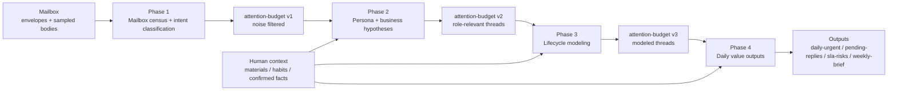
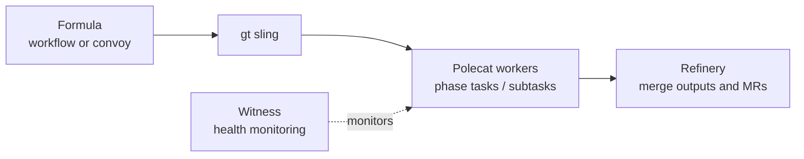

# twinbox 📮

[English](./README.md) | [中文](./README.zh.md)

`twinbox` 是一个以线程为中心的邮件 Copilot 基础设施：从线程重建工作流状态，而非处理单条消息；先理解状态，再逐步解锁自动化。

截至 `2026-03-23` 的实际状态：仓库处于实现收敛阶段，以只读能力优先。当前已经具备 Phase 1-4 的共享 Python Core、稳定的编排契约 CLI，以及 Phase 4 的准确率/回归门禁入口（`twinbox-eval-phase4`）；还不是包含 listener/action 常驻服务的完整生产运行时。

## 它是什么

`twinbox` 不是一个通用的自动发邮件机器人，也不是一个完善的收件箱客户端演示。

它是一个可自托管的基础框架，用于构建具有以下特性的邮件 Copilot：

- 从只读邮箱引导开始
- 从 Thread 中重建工作流状态，而不是简单的单一消息
- 摄取用户提供的 Context，如工作材料和习惯
- 将邮箱状态转化为可见队列，如 `daily-urgent` 和 `pending-replies`
- 仅逐步提升操作权限：只读 -> 草稿 -> 受控发送

目前已实现：

- 基于 shell 的邮箱验证和采样脚本
- Phase 1-4 loading/thinking 与渲染的共享 Python Core
- 共享编排契约入口（`scripts/twinbox_orchestrate.sh`）
- Phase 4 准确率/回归评测入口（`twinbox-eval-phase4`）
- 用于用户材料、习惯、确认事实的 Context Ingestion 能力

## 为什么存在这个仓库

大多数邮件 Agent 演示往往优化消息事件、快速自动化和 UI 交互。

本项目针对一套不同的目标进行了调整：

- 企业安全部署
- 以 Thread 为中心的工作流理解
- 人机协作决策
- OpenClaw 原生自托管和调度
- 从一个真实邮箱逐步适配为可重用的 Agent 工作流

结果应该感觉不像是"AI 读取一封邮件"，而更像是"AI 成为一个人真实工作方式的可用邮箱 Copilot"。

## 当前进度

当前发布基调：`spec-first`, `shell-first`, `read-only-first`。

仓库现有内容：

- IMAP/SMTP 环境检查和本地 `himalaya` 配置渲染
- 只读邮箱冒烟测试和早期验证脚本
- 关于 Persona、Lifecycle 和日常价值输出的渐进式验证文档
- 关于以 Thread 为中心的工作流和人工 Context Ingestion 的架构文档
- 未来 `Listener`、`Action`、`Template` 和 `Audit` 层的 Runtime Skeleton
- Phase 1-4 的 Loading/Thinking 分离（LLM 替代硬编码推断）
- Gastown 多 Agent 编排集成（formula + sling + witness）
- Phase 4 baseline 回退门禁评测

### 渐进式验证流水线

当前仓库实现的是一个 `4` 阶段、`read-only-first` 的分析漏斗。
每个阶段都会收窄注意力范围，并把结构化产物交给下一阶段继续处理。



| Phase | 核心工作 | 典型产物 | 这一阶段的意义 |
|-------|----------|----------|----------------|
| 1 | 在分布层面读懂邮箱 | `phase1-context.json`、`intent-classification.json`、派生普查视图 | 先建立全局基线，并尽早过滤明显噪声 |
| 2 | 推断这个邮箱对应的人和业务 | `persona-hypotheses.yaml`、`business-hypotheses.yaml` | 用角色、业务和上下文相关性继续缩小范围 |
| 3 | 从标签升级到 thread 级工作流状态 | `lifecycle-model.yaml`、`thread-stage-samples.json` | 理解每条线程在重复流程中的当前位置 |
| 4 | 产出用户真正会看的价值面板 | `daily-urgent.yaml`、`pending-replies.yaml`、`sla-risks.yaml`、`weekly-brief.md` | 直接回答“今天我该看什么” |

当前契约说明：

- 当前实现里的运行时 handoff 仍主要依赖各 phase 的结构化状态文件，而不是一条已经打通的 `attention-budget.yaml`
- `attention-budget` 目前应视为目标收敛契约，而不是已经被脚本强制执行的运行时依赖
- 详见 [Validation Artifact Contract](docs/specs/validation-artifact-contract.md)

每个阶段内部仍保持同一套结构：

- `Loading`：确定性 I/O、采样和 context-pack 构建
- `Thinking`：带证据与置信度的 LLM 推断

```bash
# 单 Phase 执行
bash scripts/phase1_loading.sh && bash scripts/phase1_thinking.sh

# 共享编排 CLI
bash scripts/twinbox_orchestrate.sh run

# 查看可被 skill / adapter 消费的 contract
bash scripts/twinbox_orchestrate.sh contract --format json

# 通过编排 CLI 单跑某个 Phase
bash scripts/twinbox_orchestrate.sh run --phase 2

# 向后兼容 wrapper
bash scripts/run_pipeline.sh --phase 2
```

### 几种常用运行/测试方式

如果你只是想先选一条能直接执行的路径，按下面这张表挑就够了。

| 目标 | 推荐命令 | 说明 |
|------|----------|------|
| 先验证邮箱连通性 | `bash scripts/preflight_mailbox_smoke.sh --headless` | 只做环境检查、配置渲染和只读拉取，适合进入 Phase 1 前的 preflight |
| 看整条 pipeline 会跑什么 | `bash scripts/twinbox_orchestrate.sh run --dry-run` | 不执行真实 phase，只打印 Phase 1-4 的执行顺序 |
| 本地跑完整流程 | `bash scripts/twinbox_orchestrate.sh run` | 共享编排 CLI，默认 Phase 4 走并行 thinking |
| 本地只跑单个 Phase | `bash scripts/twinbox_orchestrate.sh run --phase 2` | 适合局部调试、单阶段重跑 |
| 查看编排 contract | `bash scripts/twinbox_orchestrate.sh contract --format json` | 适合 operator、skill 或脚本读取 phase 依赖与入口 |
| 手动验证 Phase 4 fan-out / merge | `bash scripts/phase4_gastown.sh loading`，再依次运行 `think-urgent` / `think-sla` / `think-brief` / `merge` | 适合排查 Phase 4 的并行子任务 |
| 通过 Gastown 分发执行 | `gt sling twinbox-phase1 twinbox --create` | 验证 polecat / refinery / witness 链路 |
| 跑 Python 单测 | `PYTHONPATH=python/src python3 -m unittest discover -s python/tests -v` | 覆盖 contract、paths、LLM、renderer 和 phase core |
| 跑轻量 smoke | `python3 -m compileall python/src` 和 `bash -n scripts/twinbox_orchestrate.sh scripts/run_pipeline.sh scripts/phase4_gastown.sh` | 适合提交前做快速语法检查 |

更细的 Gastown / fallback 命令清单见 [gastown-operations.md](docs/guides/gastown-operations.md)。

### Gastown 在哪里起作用

Gastown 是这条流水线外侧的编排 adapter。它不决定邮件语义本身，而是围绕共享 orchestration contract 去打包、分发、监控和合并。



| Gastown 概念 | 在 twinbox 里的角色 |
|--------------|---------------------|
| `Formula` | 把每个 phase 封装成 `loading -> thinking` workflow，把全流程封装成 convoy |
| `Sling` | 将某个 phase formula 分发给 worker |
| `Polecat` | 真正执行阶段任务或子任务 |
| `Refinery` | 串行化合并，并汇总子任务输出 |
| `Witness` | 监控卡死或失联 worker，保证执行健康 |
| `Convoy` | 把多阶段流程作为一个更高层级的执行单元追踪 |

当前执行模型有三个关键点：

- Phase 依赖仍然是顺序的：`1 -> 2 -> 3 -> 4`
- 并发主要发生在阶段内部，而不是依赖链之间
- `Phase 4` 是最典型的例子：`urgent/pending`、`sla-risks`、`weekly-brief` 可以并行跑，最后再 merge
- 对本地执行或未来 skill 化来说，稳定真相源是 `scripts/twinbox_orchestrate.sh`，不是 formula 文件本身

### 共享状态根目录

Phase 1-4 现在都显式区分 `code root` 和 `state root`，避免 Gastown linked worktree 把产物写进各自隔离目录。

- `code root`：当前 checkout，提供受版本控制的脚本和 formula
- `state root`：canonical checkout，提供 `.env`、`runtime/context/`、`runtime/validation/` 和 `docs/validation/`
- 解析顺序：`TWINBOX_CANONICAL_ROOT` -> `~/.config/twinbox/canonical-root` -> 当前 checkout
- 安全规则：如果在 linked worktree 里没有配置 canonical root，Phase 1-4 都会直接失败，不再静默回退

```bash
# 在主 checkout 中执行一次，注册 canonical state root
bash scripts/register_canonical_root.sh

# 查看 worker 实际会使用的根目录
bash scripts/phase4_gastown.sh roots
```

### 流水线 Checklist

1. 在主 checkout 里执行 `bash scripts/register_canonical_root.sh` 注册 canonical root。
2. 用 `bash scripts/phase4_gastown.sh roots` 验证解析结果。
3. 在 `gt sling` 前先把 `master` 推到远端，确保 polecat worktree 能看到最新脚本和 formula。
4. 任意 Phase 都继续走原有脚本入口，但 Phase 1-4 现在都会解析同一份 canonical state root。
5. 当 skill 或 operator 需要显式读取 pipeline contract 时，用 `bash scripts/twinbox_orchestrate.sh contract --format json`。
6. 需要 fan-out / merge 编排时，再通过 `bash scripts/phase4_gastown.sh <step>` 或对应的 `twinbox-phase4-*` formula 运行 Phase 4。

```bash
# 先把本地 master 推到 origin，确保 polecat worktree 能看到最新脚本
git checkout master
git pull --ff-only origin master
git push origin master

# 通过 gastown 分发单个 phase
gt sling twinbox-phase1 twinbox --create

# 查看共享 orchestration contract，或直接跑本地 CLI
bash scripts/twinbox_orchestrate.sh contract
bash scripts/twinbox_orchestrate.sh run

# 查看 formula，或直接跑兼容 wrapper
gt formula show twinbox-phase4
bash scripts/run_pipeline.sh
```

详见 [Gastown 操作指南](docs/guides/gastown-operations.md) 和 [Gastown 集成方案](docs/plans/gastown-integration.md)。
实现层与运行时收敛的下一步方向，见 [核心重构计划](docs/plans/core-refactor-plan.md)。

后续补充项通过 `bd` 跟踪，不再追加 markdown TODO：

- `twinbox-d9j`：把完整的 Phase 4 fan-out / merge 固化成一条可复现的 Gastown 入口
- `twinbox-5zk`：把 Gastown formula 和后续 skill adapter 继续收敛到共享 orchestration contract

尚未实现：

- 长时间运行的 Listener Manager
- 生产环境 Action Manager
- WebSocket/前端交互界面
- 默认自动发送或归档自动化
- 特定于租户的硬编码业务逻辑

## 关键权衡

1. `Thread over Message`
   决策基于 Thread Context、工作流阶段和证据，而不是孤立的消息快照。
2. `Value before Automation`
   系统必须在起草之前证明只读价值，并在发送之前证明草稿价值。
3. `Context is First-class`
   用户上传的材料、反复出现的习惯和已确认的事实会被规范化，不会埋没在聊天记录中。
4. `OpenClaw-native Operation`
   仓库设计为在 OpenClaw 风格的自托管环境中运行，也支持手动聊天驱动的初始化。

## 架构图 (ASCII) 🧭

```text
                                +----------------------+
                                |   用户 / Operator     |
                                |  (审查并批准)         |
                                +----------+-----------+
                                           |
                                           v
+------------------+             +---------+----------+             +----------------------+
| 邮箱 (IMAP)       +-----------> | Thread State Layer | <---------- | Context Ingestion    |
| 首先只读          | 证据         | (Thread Lifecycle, |   事实      | (Materials/Habits)   |
+------------------+             | Queue Projection)  |             +----------+-----------+
                                 +---------+----------+                        |
                                           |                                   |
                                           v                                   |
                                 +---------+----------+                        |
                                 | Runtime Skeleton   |------------------------+
                                 | Listener / Action  |     Typed Context
                                 | Template / Audit   |
                                 +---------+----------+
                                           |
                                           v
                                 +---------+----------+
                                 | Automation Gates   |
                                 | 只读 -> 草稿 ->    |
                                 | 受控发送           |
                                 +--------------------+
```

## 比较：Anthropic `email-agent` 架构图

Anthropic 项目 README 架构图：


此仓库与 Anthropic 演示的主要区别：

- `Thread-first` vs `Message/UI-event-first`：本仓库将 Thread Lifecycle 和 Queue Projection 作为核心状态建模。
- `Progressive Automation` vs `Direct Demo Flow`：本仓库强制执行 `只读 -> 草稿 -> 受控发送`。
- `Context as Structured Plane` vs `Ad-hoc Session Context`：用户 Materials/Habits 被规范化以供重用。
- `Self-hostable Runtime Skeleton` vs `Local Demo App`：本仓库强调 Listener/Action/Template/Audit 层的演进。

## 仓库地图

```text
twinbox/
├── README.md
├── README.zh.md
├── SKILL.md
├── .beads/formulas/          # gastown formula 定义
│   ├── twinbox-phase{1-4}.formula.toml
│   └── twinbox-full-pipeline.formula.toml
├── agent/
│   ├── README.md
│   └── custom_scripts/
│       ├── types.ts
│       ├── listeners/
│       └── actions/
├── config/
│   ├── action-templates/
│   ├── context/
│   └── profiles/
├── docs/
│   ├── architecture.md
│   ├── guides/
│   │   └── gastown-operations.md   # gt 操作指南
│   ├── plans/
│   │   ├── validation-framework.md
│   │   ├── gastown-integration.md
│   │   ├── oss-v1-plan.md
│   │   └── development-progress.md  # 周期性开发进度快照
│   └── specs/thread-state-runtime.md
├── scripts/
│   ├── phase{1-4}_loading.sh       # 确定性 I/O
│   ├── phase{1-4}_thinking.sh      # LLM 推断
│   ├── phase4_gastown.sh           # Phase 4 统一 gastown 入口
│   ├── register_canonical_root.sh  # 给 worktree 注册共享状态根目录
│   ├── twinbox_orchestrate.sh      # 共享编排 CLI
│   ├── run_pipeline.sh             # 向后兼容 wrapper
│   └── twinbox_paths.sh            # 统一解析 code root / state root
└── runtime/
```

## 快速开始 🚀

1. 阅读 [architecture.md](docs/architecture.md)。
2. 阅读 [validation-framework.md](docs/plans/validation-framework.md)。
3. 阅读 [oss-v1-plan.md](docs/plans/oss-v1-plan.md)。
4. 如果你想在本地验证邮箱访问权限，运行：
   - `bash scripts/check_env.sh`
   - `bash scripts/render_himalaya_config.sh`
   - `bash scripts/preflight_mailbox_smoke.sh --headless`
5. 如果你想扩展 Runtime Skeleton，从以下文件开始：
   - [agent/README.md](agent/README.md)
   - [thread-state-runtime.md](docs/specs/thread-state-runtime.md)
   - [types.ts](agent/custom_scripts/types.ts)

## 运行时未来方向

下一个 Runtime 层不会直接克隆 Anthropic 的 `email-agent`。

它将保持本仓库的优势：

- 渐进式验证
- 以 Thread 为中心的工作流状态
- 人工 Context Plane
- 受控 Automation Gates

并将吸收重要的工程组件：

- `Listener` / `Action` 分离
- `Template` / `Instance` 分离
- Typed Execution Context
- Execution Audit Trail
- 易于扩展的 Enable/Disable 接口

## 安全边界

- 仅使用应用/客户端专用密码。
- 保持 `.env` 本地化，绝对不要提交它。
- 将 `runtime/` 视为本地运行数据。
- 在证明草稿质量和审批流程有效之前，不要自动发送。
- 不要让用户提供的 Context 静默覆盖邮箱事实。

## 发布说明

该仓库的 `docs/validation/` 下仍包含从真实邮箱研究中生成的本地验证材料。在完全开放之前，你应该审查并清理任何特定于实例的文件和历史记录。

面向开源的架构和模板文档位于 `docs/validation/` 之外，应保持为稳定的公共接口。
