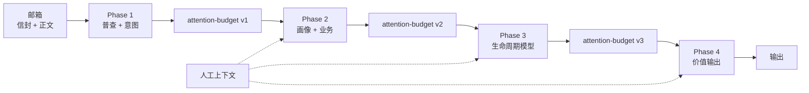

# TWINBOX 📮

> 面向真实工作邮箱的线程级邮件智能。

[Python 3.11+](https://www.python.org/downloads/)
[License: MIT](./LICENSE)
[Tests](./tests/)

[English](./README.md) | [中文](./README.zh.md)

---

## 1. 介绍

twinbox 是一个自托管的邮件智能系统。它通过 **只读 IMAP** 读取邮箱，以 **线程** 为基本单位建模工作，再把结果写成磁盘上的结构化产物。

它主要解决四类实际问题：

- 我现在必须处理什么？
- 谁在等我？
- 什么卡住了或有风险？
- 这周相对上周变在哪？

它适合：

- 偏好 **CLI + JSON** 工作流的操作者
- 运行在 **OpenClaw** 或其他可执行 shell 的宿主上的团队
- 邮箱里大量是 **长线程工作流邮件**，而不是零散通知的人
- 更看重 **可审查文件产物**，而不是黑盒 UI 自动化的人

它不是：

- 网页邮箱替代品
- 托管 SaaS 产品
- 群发自动回复工具

> 默认是自托管。除非你显式配置外部 LLM API，否则邮件不会离开你的基础设施。

---

## 2. twinbox 的独特优势

**不是关键词分拣，而是线程生命周期。** 很多邮件 AI 只停在标签、过滤器或一次性摘要。twinbox 更关注线程层面的责任归属、等待关系、阻塞状态和时效优先级。

**结果可解释。** 主要的 Phase 4 产物会带分数、原因码和简短理由。你能看到为什么某条线程被排高，而不是只收到一个黑盒“重要”标签。

**结果就是几份看得见、能检查的文件。** twinbox 会直接落盘 `daily-urgent.yaml`、`pending-replies.yaml`、`sla-risks.yaml`、`weekly-brief.md` 这类结果，方便 diff、复核，也方便接到 CI 或宿主自动化里。

**先证明价值，再谈自动化。** 当前最强的是只读价值面：排序、解释、周报和运行态可见性。草稿与发送仍然放在显式门闸之后。

**和 OpenClaw 联动，但不是一套分叉产品。** 在 OpenClaw 宿主上，`twinbox onboard openclaw` 是引导式主路径：除 SKILL / `openclaw.json` 外，会默认安装 **vendor-safe** 的用户级 bridge 定时器（`twinbox host bridge …`，**不依赖** 仓库里 `scripts/`），并在 `--json` 里给出 **`phase2_ready`**，为真时才应进入对话引导（逃生口：`--skip-bridge`）。本地、仓库 checkout、vendor/no-clone 交付仍然共用同一套 Twinbox 核心。

---

## 3. 架构

### 四个阶段




| 阶段          | 做什么        | 主要输出               |
| ----------- | ---------- | ------------------ |
| **Phase 1** | 邮箱普查与降噪    | 信封索引、意图分类          |
| **Phase 2** | 推断角色与业务上下文 | 画像与业务假设            |
| **Phase 3** | 建模线程生命周期状态 | 生命周期模型、线程阶段        |
| **Phase 4** | 生成用户可见价值面  | 紧急队列、待回复、SLA 风险、周报 |


每个阶段都由确定性 `Loading` 加上 LLM `Thinking` 组成。

> Phase 1–4 全程只读，不会发送、移动、删除或打标邮件。

### 核心模型

```text
邮箱（只读 IMAP）
      |
      v
Phase 1 -> Phase 2 -> Phase 3 -> Phase 4
      ^               |
      |               v
 人工上下文       队列 / 摘要产物
```

项目把磁盘上的产物当作稳定契约，让流水线、操作者和上层工具都围绕同一份事实工作。

---

## 4. 安装与部署

### 前置要求

- Python 3.11+
- 邮箱的 IMAP 访问权限
- 如果邮箱启用了 2FA，需要服务商的应用专用密码

### 安装 twinbox CLI 及运行时

面向最终用户时，日常只接触命令 **`twinbox`**。先把 `twinbox` 二进制放进 `PATH`：

```bash
# 当前用户安装（推荐）
mkdir -p ~/.local/bin
cp twinbox ~/.local/bin/twinbox
chmod 0755 ~/.local/bin/twinbox
export PATH="$HOME/.local/bin:$PATH"
echo 'export PATH="$HOME/.local/bin:$PATH"' >> ~/.bashrc
source ~/.bashrc
```

已拿到 `twinbox_core.tar.gz`（或等价运行时归档）时，安装 CLI 并导入 Email agent runtime（vendor）：

```bash
twinbox install --archive twinbox_core.tar.gz
```

日常使用不要用 `sudo` 执行 `twinbox`，否则状态目录可能会写到 `/root/.twinbox`。

### 接入 OpenClaw 宿主

如果你主要是把 Twinbox 和 OpenClaw 一起使用，就从这里开始。整条路径分 **两段**：先在**宿主 shell** 接线，再在 **OpenClaw 的 `twinbox` agent 对话里**做完 Twinbox 自己的引导（邮箱、LLM、画像等）。**只跑完第一段是不够的。**

**阶段一：宿主接线（在终端执行）**

```bash
twinbox onboard openclaw
```

作用概览：检查 OpenClaw 环境；初始化或复用 `~/.twinbox`；合并 `openclaw.json`；同步 `SKILL.md`；按配置重启 Gateway；安装调用 **`twinbox host bridge poll`** 的 **systemd user** 单元（vendor/no-clone 也可用）。请用 `twinbox onboard openclaw --json` 核对 **`phase2_ready` 为 true** 后再认为宿主接线完成。细节见 [integrations/openclaw/DEPLOY.md](integrations/openclaw/DEPLOY.md)。**这一阶段不会替你完成邮箱登录或 LLM 配置。**

**阶段二：Twinbox 引导（在 OpenClaw 对话里继续）**

在 OpenClaw 中打开 **`twinbox` agent**，建议**新开一轮对话**。若已启用 **`plugin-twinbox-task`**，优先用原生工具 `twinbox_onboarding_start` / `twinbox_onboarding_status` / `twinbox_onboarding_advance`，**推送订阅阶段**用 **`twinbox_onboarding_confirm_push`**（底层对应 `twinbox openclaw …`）。插件变更后需 **`openclaw gateway restart`** 才能加载新工具。也可把下面整段复制进去，推动 agent **真的执行** CLI（不要停在「我去执行」而没有任何输出）：

```text
请先读取 ~/.openclaw/skills/twinbox/SKILL.md，然后在本轮内立即直接运行：
twinbox onboarding start --json
不要只说「让我执行命令：」。执行后只基于真实 stdout 汇报 current_stage、prompt、next_action；若失败，贴 stderr。
```

之后按返回的 `prompt` 在对话里补全信息，并反复执行：

```bash
twinbox onboarding next --json
```

直到 `current_stage` 为 `completed`。中途可查：

```bash
twinbox onboarding status --json
```

阶段二才会真正补齐：邮箱登录、LLM provider / model / API URL、角色与偏好，以及可选的材料导入、路由规则和推送订阅。**推送**支持 **daily / weekly** 分别开关（`twinbox push subscribe … --daily on|off --weekly on|off` 或 `twinbox push configure …`），并与 `daily-refresh` / `weekly-refresh` 调度联动。更长的 bootstrap 变体、空响应排障与阶段顺序说明见 [integrations/openclaw/DEPLOY.md](integrations/openclaw/DEPLOY.md) 中的「引导流程」。

### 不接入 OpenClaw 时（使用Claude Code、Codex等平台）

只有在你想把 Twinbox 作为本地工具或纯终端工具使用时，才走这里。`twinbox onboard openclaw` 是给 OpenClaw 宿主接线用的；本地邮箱初始化用的是 `twinbox onboarding ...`。

```bash
twinbox onboarding start --json
twinbox onboarding next --json
twinbox onboarding status --json
```

若在源码 checkout 中运行，输出默认写到 `runtime/validation/`；若按发布形态安装，通常写到当前 state root 下。

### 非交互配置

```bash
TWINBOX_SETUP_IMAP_PASS=your-app-password \
  twinbox mailbox setup --email you@example.com --json

TWINBOX_SETUP_API_KEY=your-api-key \
  twinbox config set-llm --provider openai --model MODEL --api-url URL --json
```

在源码 checkout 中，本地通常写入 `./twinbox.json`。在 OpenClaw 宿主上通常写入 `~/.twinbox/twinbox.json`。

### 日常运维（按场景）

**两个入口不要混：** **`twinbox`** 管邮箱检查、任务看板、队列、daemon 等；**`twinbox-orchestrate`** 管 Phase 流水线、宿主 **`schedule` / `bridge`** 等编排。需要脚本或 agent 解析输出时，在支持的命令上加 **`--json`**（与上文 onboarding 一致）。

#### 1. 邮箱与 Phase 刷新

| 命令 | 说明 |
| --- | --- |
| `twinbox mailbox preflight --json` | 只读 IMAP 是否可用 |
| `twinbox-orchestrate run` | Phase 1→4 按序全跑 |
| `twinbox-orchestrate run --phase 4` | 仅重算 Phase 4（前置产物已在时可省时间与模型调用） |

#### 2. 日间活动（task / digest 的前置）

**`activity-pulse.json`** 不会随 `digest` 现算；通常要先跑日间同步类作业，例如：

| 命令 | 说明 |
| --- | --- |
| `twinbox-orchestrate schedule --job daytime-sync --format json` | 执行预置宿主作业，供今日活动视图消费 |

宿主上通常由 **user systemd 定时器** 跑 **`twinbox host bridge poll`** 消费 OpenClaw `cron` 完成事件（手工可对齐 `twinbox-orchestrate bridge-poll`）。见 [docs/ref/cli.md](docs/ref/cli.md) 与 [docs/ref/orchestration.md](docs/ref/orchestration.md)。

#### 3. 看板与单线程

| 命令 | 说明 |
| --- | --- |
| `twinbox task todo --json` | 紧急与待办总览 |
| `twinbox task latest-mail --json` | 今日最新邮件视图 |
| `twinbox task weekly --json` | 周报类输出（依赖已生成的 Phase 4 产物） |
| `twinbox thread inspect <thread-id> --json` | 单线程详情 |

另有 `task progress`、`task mailbox-status` 等，以 CLI 文档为准。

#### 4. 队列（只改本机可见性，不改邮箱）

dismiss / complete 写入 **`user-queue-state.yaml`**，**不会**在 IMAP 里删信或改标签。

| 命令 | 说明 |
| --- | --- |
| `twinbox queue list --json` | 各队列条目一览 |
| `twinbox queue show urgent --json` | 查看某一队列（`pending`、`sla_risk` 等类型同理） |
| `twinbox queue explain` | 队列规则说明（偏排查） |
| `twinbox queue dismiss <thread-id> --reason "..." --json` | 暂时不再提醒该线程（线程有新变化时可能重新出现） |
| `twinbox queue complete <thread-id> --action-taken "..." --json` | 标记已处理，在恢复前保持隐藏 |
| `twinbox queue restore <thread-id> --json` | 撤销 dismiss/complete，重新参与排序 |

#### 5. 本地 daemon（JSON-RPC）

| 命令 | 说明 |
| --- | --- |
| `twinbox daemon start` | 启动 daemon（**默认不带** `--supervise`） |
| `twinbox daemon start --supervise` | 可选：带轻量监督进程，异常退出后自动再起 |
| `twinbox daemon stop` | 停止 |
| `twinbox daemon restart` | 重启（默认不带 supervise，除非显式加 `--supervise`） |
| `twinbox daemon restart --supervise` | 重启并带监督 |
| `twinbox daemon status --json` | 状态（若曾用 supervise 会显示相关字段） |

#### 6. 交付与 vendor 同步

| 命令 | 说明 |
| --- | --- |
| `twinbox install --archive <path-or-url>` | 从运行时归档安装或更新 |
| `twinbox vendor install` | 将 Python runtime 同步到 state root 下 `vendor/` |

更全的子命令与参数见 [docs/ref/cli.md](docs/ref/cli.md)。


### 示例：向 twinbox 提问

宿主接好、引导完成之后，OpenClaw 里的日常使用其实就是直接和 `twinbox` agent 对话。

**1. 早晨排优先级**

```text
你：今天中午前我必须处理什么？
Twinbox：先看这 3 个线程。1 个已经卡住客户，1 个今天会碰到 SLA 风险，1 个是你昨天承诺要回的事项。
```

**2. 谁在等我**

```text
你：现在谁在等我回复？哪些可以明天再处理？
Twinbox：目前有 5 个活跃线程在等你。2 个今天该回，2 个可以顺延到明天，另 1 个只是低信号 CC 线程。
```

**3. 单线程补课**

```text
你：帮我看一下 Acme 续约这条线程，上次承诺了什么，下一步该谁动，风险点在哪？
Twinbox：上次承诺是周五前给出价格反馈。下一步由销售推进。当前风险中等，因为法务还卡在签约条款上。
```

**4. 周报 / 汇报准备**

```text
你：给我出一版本周邮箱简报，分成进展、风险、卡点、需要我升级处理的事项。
Twinbox：本周已推进完成 4 条线程，3 条卡在外部方，2 条需要升级处理，主要风险集中在供应商响应延迟。
```

这四类提问基本就覆盖了 Twinbox 当前最核心的价值面：紧急处理、待我回复、线程补课、周报总结。

### `~/.twinbox` 下常见布局

OpenClaw 宿主上典型 state root 大致如下（`#` 后为简要说明）：

```text
~/.twinbox/
├── twinbox.json                    # 主配置：邮箱、LLM、集成
├── runtime/
│   ├── validation/
│   │   └── phase-4/                # 最常打开的 Phase 4 产物目录
│   │       ├── daily-urgent.yaml
│   │       ├── pending-replies.yaml
│   │       ├── sla-risks.yaml
│   │       ├── weekly-brief.md
│   │       └── activity-pulse.json # task / digest 等用的日间活动视图
│   └── himalaya/
│       └── config.toml             # 渲染后的 Himalaya 邮箱配置
├── run/
│   ├── daemon.sock                 # 本地 JSON-RPC daemon
│   ├── daemon.pid
│   └── daemon-supervisor.pid       # --supervise 时的监督进程
├── logs/
│   └── daemon.log
└── vendor/                         # twinbox install --archive … / twinbox vendor install
```

更完整的契约说明见 [docs/ref/cli.md](docs/ref/cli.md)、[docs/ref/artifact-contract.md](docs/ref/artifact-contract.md)、[docs/ref/code-root-developer.md](docs/ref/code-root-developer.md)。

---

## 5. 常见问题（FAQ）

**Q: 这和邮箱标签、文件夹或「规则」有什么本质区别？**

A: 标签和规则大多是**按单封邮件或静态条件**分拣。twinbox 把 **整段线程** 当作工作单元：谁在等你、谁在等对方、是否卡住、相对优先级如何，并把这些结论写成带理由的产物（如紧急队列、待回复、SLA 风险、周报），便于人审阅和脚本消费。

**Q: Outlook / Exchange / ProtonMail 能用吗？**

A: 只要提供商暴露 **只读 IMAP** 即可。Exchange 需开启 IMAP；ProtonMail 通常要通过官方 **IMAP Bridge**。具体以各服务商文档为准。

**Q: Phase 1–4 会改我的邮箱吗（发送、移动、删信、打标）？**

A: **不会。** 当前流水线在 Phase 1–4 内是只读的。出站、草稿落地等能力若以后出现，也会走显式门闸，而不是静默改箱内状态。

**Q: OpenClaw 宿主接线和「本地 onboarding」是不是一回事？**

A: **不是。** `twinbox onboard openclaw` 负责把 Skill、`openclaw.json`、**bridge 定时器**等宿主条件接到 OpenClaw；用 `--json` 时应看到 **`"phase2_ready": true`** 才表示可进入对话引导。接完后在 agent 里继续 onboarding——有插件时优先 `twinbox_onboarding_*` 工具，否则仍可用 `twinbox onboarding start` / `next`。纯本地 CLI 使用则直接从 `twinbox onboarding start --json` 开始即可。

**Q: `twinbox onboard openclaw` 跑完就算装好了吗？**

A: 宿主侧除 Skill 外还包括 **OpenClaw cron bridge**；JSON 里 **`phase2_ready`** 为真才表示插件/bridge 前置就绪。之后还要在 agent 里完成 **Phase 2**（邮箱、LLM、画像、推送等），可用原生 onboarding 工具或 `twinbox onboarding start` / `next` 直至完成。

**Q: 不克隆整个仓库、只在目标机上放一个包，能跑吗？**

A: 可以。交付路径包括 `**twinbox install --archive <本地路径或 HTTP URL>`** 以及 `**twinbox vendor install**`，把 Python 运行时同步到 state root 下的 `vendor/`，与仓库 checkout 共用同一套核心行为（详见 [docs/ref/daemon-and-runtime-slice.md](docs/ref/daemon-and-runtime-slice.md)）。

**Q: `twinbox-orchestrate run` 和 `twinbox daemon` 是什么关系？**

A: `**twinbox-orchestrate run`** 适合一次性或 cron 式跑完整/指定 phase 流水线。**daemon** 在本地提供 JSON-RPC 入口，便于宿主或工具按需触发子任务；`**twinbox daemon start --supervise`** 会在进程退出时由监督进程自动拉起。日常「刷新 Phase 4」等仍可按需直接 orchestrate。

**Q: 周报、摘要类输出能按我们团队口径改吗？**

A: 可以逐步定制。近期实现里已有 **周报 digest 模板可配置**、**日间 ledger 回放到周报**、以及 **抄送（CC）降权等策略可调**（具体键名与契约见 [docs/ref/cli.md](docs/ref/cli.md)、产物说明见 [docs/ref/artifact-contract.md](docs/ref/artifact-contract.md)）。

**Q: 邮件内容和配置会离开我的环境吗？**

A: **默认自托管**：邮箱经 IMAP 在你指定的机器上读取，产物落在磁盘。只有在你配置了 **外部 LLM API** 时，相关片段才会按该提供商的策略发往其服务；不配置则不会为了「智能」把邮件交给第三方 SaaS。

**Q: 能接 CI、定时任务或自己的脚本吗？**

A: 可以。CLI 支持 `**--json`**，产物是 **YAML/Markdown/JSON 文件**，适合 diff、门禁和自动化。仓库内也有 `**scripts/verify_runtime_slice.sh`** 一类运行时切片回归脚本，可作集成参考。

**Q: 产品路线、发布门槛和 backlog 以哪里为准？**

A: 以仓库根目录 **[ROADMAP.md](ROADMAP.md)** 为准；与实现细节冲突时配合 **[docs/ref/daemon-and-runtime-slice.md](docs/ref/daemon-and-runtime-slice.md)** 看当前事实。

---

## License

MIT
