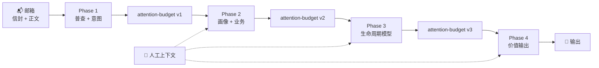

# twinbox 📮

> **线程级邮件智能，让重要的事情不被淹没。**

[](https://www.python.org/downloads/)
[](./LICENSE)
[](./tests/)

[English](./README.md) | [中文](./README.zh.md)

---

## TL;DR

```bash
# 1. 克隆并安装
git clone https://github.com/caapapx/twinbox.git && cd twinbox
pip install -e .

# 2. 配置（复制并编辑）
cp .env.example .env
# 设置：MAIL_ADDRESS, IMAP_HOST, IMAP_LOGIN, IMAP_PASS 等

# 3. 验证连接
twinbox mailbox preflight --json

# 4. 运行流水线
twinbox-orchestrate run --phase 4

# 5. 查看待办
twinbox task todo --json
```

**你将获得**：`daily-urgent.yaml`、`pending-replies.yaml`、`sla-risks.yaml`、`weekly-brief.md` — 写入 `runtime/validation/`，供脚本、Agent 或人工审阅。

**可选（大重构 / feature 分支）**：后台 JSON-RPC daemon（`twinbox daemon …`）、可选 Go 薄入口 `cmd/twinbox-go/`、模组化模拟邮箱种子脚本 — 见 [docs/ref/daemon-and-runtime-slice.md](docs/ref/daemon-and-runtime-slice.md)。重构进行期间请以该页与代码为准，旧文档未同步处不作反证。

---

## 选择安装路径

| 路径 | 状态与配置落点 | 从这里开始 |
|------|----------------|------------|
| **本地 / 开发**（上文 TL;DR） | 仓库内 `.env`；产物在仓库 **`runtime/validation/`** | 本文 → [快速开始](#快速开始) |
| **OpenClaw 宿主** | 邮件与流水线数据在 **`~/.twinbox`**；roots 在 **`~/.config/twinbox/`**；OpenClaw 读 **`~/.openclaw/openclaw.json`** | **[openclaw-skill/DEPLOY.md](openclaw-skill/DEPLOY.md)**（可选用 `twinbox deploy openclaw`）。设计说明：[docs/ref/openclaw-deploy-model.md](docs/ref/openclaw-deploy-model.md) |

两条路径**不能混为一谈**：只按 TL;DR 做**不会**自动接好 OpenClaw；只跑 `deploy openclaw` 也**不能**代替阅读 **DEPLOY.md** 里的邮箱 / LLM / 环境前置步骤。

---

## 目录

- [它是做什么的](#它是做什么的)
- [适合谁用](#适合谁用)
- [选择安装路径](#选择安装路径)
- [快速开始](#快速开始)
- [日常命令](#日常命令)
- [四个阶段](#四个阶段)
- [架构](#架构)
- [常见问题](#常见问题)
- [路线图](#当前聚焦与路线图)

---

## 它是做什么的

帮你搞清楚**谁在等你回复**、**什么事卡住了**、**什么快超期了**——基于线程级 IMAP 状态，而不是把最新一封邮件总结一下就完事。

- 📬 **只读优先**：分析邮箱，不发送、不移动、不删除、不打标（Phase 1–4）
- 🧵 **线程视角**：处理对话线程，而非孤立邮件
- 📁 **文件即 API**：输出结构化 YAML/JSON 到磁盘，可 diff、可 CI 门禁、可被 Agent 消费
- 🎯 **上下文感知**：将邮箱数据与你的材料、习惯、确认事实融合

> **设计上就是自托管的。** 你的邮件留在你的基础设施上。

---

## 适合谁用

想把邮箱接入自动化的人：

- CLI + JSON 优先
- OpenClaw 或任何能跑 shell 的宿主
- **不是**网页邮箱
- **不是**群发自动回复
- **不是**托管 SaaS 产品

---

## 快速开始

### 前置要求

- Python 3.11+
- 邮箱 IMAP 访问权限
- [应用专用密码](https://docs.github.com/en/authentication/keeping-your-account-and-data-secure/creating-a-personal-access-token)（推荐）或常规密码

### 安装

```bash
# 方式 A：从源码 pip 安装
pip install -e .

# 方式 B：直接从仓库运行（自动设置路径）
bash scripts/twinbox
```

### 配置

```bash
# 复制模板
cp .env.example .env

# 编辑 .env 填入你的设置
MAIL_ADDRESS=you@example.com
IMAP_HOST=imap.gmail.com
IMAP_PORT=993
IMAP_LOGIN=you@example.com
IMAP_PASS=your-app-password
SMTP_HOST=smtp.gmail.com
SMTP_PORT=587
SMTP_LOGIN=you@example.com
SMTP_PASS=your-app-password
```

> 🔒 **安全提示**：`.env` 默认已被 gitignore。永远不要提交凭证。

### 验证与运行

```bash
# 测试连接（只读 IMAP 检查）
twinbox mailbox preflight --json

# 运行完整流水线（Phase 1→4）
twinbox-orchestrate run

# 或仅刷新今日队列
twinbox-orchestrate run --phase 4
```

### 查看结果

```bash
# 当前有什么紧急事项？
twinbox task todo --json

# 今天发生了什么？
twinbox task latest-mail --json

# 查看某个线程状态
twinbox thread inspect <thread-id> --json
```

输出位于 **`runtime/validation/`**：
- `phase-4/daily-urgent.yaml`
- `phase-4/pending-replies.yaml`
- `phase-4/sla-risks.yaml`
- `phase-4/weekly-brief.md`

---

## 日常命令

### 🔍 **查看状态**
| 命令 | 用途 |
|------|------|
| `twinbox task mailbox-status --json` | 邮箱是否已连接？ |
| `twinbox task latest-mail --json` | 今天发生了什么？ |
| `twinbox task todo --json` | 有什么需要我关注？ |

### 📋 **管理队列**
| 命令 | 用途 |
|------|------|
| `twinbox queue list --json` | 列出所有队列（urgent、pending、sla_risk） |
| `twinbox queue show urgent --json` | urgent 队列详情 |
| `twinbox queue dismiss <id> --reason "..."` | 隐藏某线程 |
| `twinbox queue complete <id> --action-taken "..."` | 标记线程为已完成 |

### 🔧 **流水线与调试**
| 命令 | 用途 |
|------|------|
| `twinbox-orchestrate run --dry-run` | 预览将要执行的内容 |
| `twinbox-orchestrate run --phase 4` | 仅刷新 Phase 4 输出 |
| `twinbox-orchestrate contract --format json` | 显示阶段依赖关系 |

完整 CLI 参考：[docs/ref/cli.md](docs/ref/cli.md)

---

## 四个阶段



| 阶段 | 做什么 | 关键输出 |
|------|--------|----------|
| **Phase 1** | 邮箱普查 + 降噪 | `intent-classification.json`、信封索引 |
| **Phase 2** | 推断你的角色 + 业务背景 | `persona-hypotheses.yaml`、`business-hypotheses.yaml` |
| **Phase 3** | 建模线程生命周期状态 | `lifecycle-model.yaml`、线程阶段 |
| **Phase 4** | 生成用户可见队列 | `daily-urgent.yaml`、`pending-replies.yaml`、`weekly-brief.md` |

每个阶段：确定性 `Loading` → LLM `Thinking`。

> **全程只读**：Phase 1–4 不发送、不移动、不删除、不打标任何邮件。

---

## 架构

### 核心设计

```text
┌─────────────────┐      ┌─────────────────────┐      ┌──────────────────┐
│   邮箱 (IMAP)   │─────▶│    线程状态层       │◀─────│   上下文导入     │
│     只读        │      │  (生命周期、队列)   │      │ (材料/习惯)      │
└─────────────────┘      └──────────┬──────────┘      └──────────────────┘
                                    │
                                    ▼
                          ┌─────────────────────┐
                          │    运行时骨架       │
                          │ (listener / action  │
                          │  模板 / 审计)       │
                          └──────────┬──────────┘
                                    │
                                    ▼
                          ┌─────────────────────┐
                          │     自动化闸门      │
                          │ 只读 → 草稿 → 发送  │
                          └─────────────────────┘
```

### 与典型邮件 Agent 对比

| | **twinbox** | 典型演示 |
|---|-------------|----------|
| **工作单元** | 线程 | 单封邮件 |
| **输出** | 磁盘上的文件（可 diff、可 CI 门禁） | UI 或即时回复 |
| **安全** | 显式只读 → 草稿 → 发送闸门 | 往往是一次性自动化 |
| **上下文** | 结构化文件 + 来源追溯 | 仅会话级 prompt |
| **托管** | 自托管 | 往往是 SaaS |

---

## 仓库结构

```
twinbox/
├── 📄 README.md                 # 本文件
├── 📋 SKILL.md                  # OpenClaw 清单
├── ⚙️  pyproject.toml           # Python 包配置
├── 🐍 src/twinbox_core/         # 核心实现
│   ├── task_cli.py             # 面向任务的 CLI
│   ├── orchestration.py        # 流水线编排器
│   ├── phase4_value.py         # Phase 4：输出
│   └── ...
├── 📁 config/
│   ├── action-templates/       # 动作模板
│   ├── context/                # 上下文配置
│   └── profiles/               # 用户画像
├── 📖 docs/
│   ├── ref/architecture.md     # 完整架构文档
│   ├── ref/cli.md              # CLI 参考
│   └── ref/validation.md       # 输出契约
├── 🔧 scripts/                 # Shell 入口
│   ├── twinbox                 # CLI 包装器
│   ├── twinbox-orchestrate     # 流水线运行器
│   └── ...
└── 💾 runtime/                 # 运行状态 (gitignored)
    ├── context/                # 用户上下文
    ├── validation/             # 阶段输出
    └── himalaya/               # 邮件配置
```

### 代码根 vs 状态根

| | **代码根 (Code Root)** | **状态根 (State Root)** |
|---|------------------------|------------------------|
| **包含** | `src/`、`scripts/`、`docs/` | `.env`、`runtime/`、配置 |
| **设置方式** | `TWINBOX_CODE_ROOT` | `TWINBOX_STATE_ROOT` |
| **默认** | 当前 checkout | `~/.config/twinbox/state-root` 或代码根 |

---

## 常见问题

**Q: 这和 Gmail 标签或 Outlook 规则有什么区别？**

A: 标签和规则是静态过滤器。twinbox 用 LLM 理解线程的*生命周期*——你是否在等某人回复、截止日期是否临近、对话是否已沉寂。它还将邮箱数据与外部上下文（表格、项目文档、习惯）融合。

**Q: 支持 Outlook/Exchange/ProtonMail 吗？**

A: 任何支持 IMAP 的提供商都应该能用。我们测试过 Gmail 和 Fastmail。Exchange 需要开启 IMAP。ProtonMail 需要使用其 IMAP Bridge。

**Q: 运行成本是多少？**

A: twinbox 是自托管开源软件。你需要支付：
- 自己的基础设施
- LLM API 调用（可配置；默认使用 OpenAI 兼容端点）
- Phase 4 每分析一个线程约 1 次 API 调用

**Q: 它能帮我发邮件吗？**

A: 默认还不能。Phase 1–4 严格只读。草稿生成和发送被显式审批流程的门闸控制（开发中）。参见[安全边界](#安全边界)。

**Q: 隐私如何保障？**

A: 除非你配置了外部 LLM API，否则你的邮件不会离开你的基础设施。即使如此，也只发送线程元数据和抽样正文——不是整个邮箱。完全本地 LLM 支持已在路线图中。

**Q: 如何更新上下文（材料、习惯）？**

```bash
# 导入表格或文档
twinbox context import-material ./project-priorities.csv --intent reference

# 添加确认事实
twinbox context upsert-fact --id "customer-tier:acme" --type "tier" --content "enterprise"

# 刷新受影响线程
twinbox-orchestrate run --phase 4
```

**Q: 能在 CI/CD 中运行吗？**

A: 可以。所有输出都是可 diff 的文件。preflight 命令返回适合 CI 门禁的结构化 JSON 和退出码。

---

## 当前聚焦与路线图

> 最后更新：2026-03-26

### ✅ 已交付

**核心流水线**
- [x] `twinbox-orchestrate` + Phase 1–4 Python 核心（Loading / Thinking）
- [x] 面向任务的 CLI（`twinbox task … --json`）— 45+ 命令
- [x] 增量日内同步（UID 水位线 + 自动回退）
- [x] 活动脉冲 / 日内切片视图（`twinbox digest pulse`）

**邮箱与引导**
- [x] IMAP 只读预检，结构化 JSON 输出
- [x] 邮箱自动探测（`twinbox mailbox detect`）
- [x] 引导流程（`twinbox onboarding start/status/next`）
- [x] 推送订阅系统（`twinbox push subscribe/unsubscribe`）

**队列与上下文管理**
- [x] 队列 dismiss/complete/restore 带持久化
- [x] 调度时间覆盖（`twinbox schedule update/reset`）
- [x] 材料导入支持 intent（reference vs template_hint）
- [x] 语义路由规则（`twinbox rule list/add/remove/test`）
- [x] 收件人角色处理（direct/cc_only/group_only/indirect）
- [x] 仅未读过滤（`--unread-only`）

**OpenClaw 集成**
- [x] SKILL.md 清单含 `metadata.openclaw`
- [x] OpenClaw 调度工具（同步到平台 cron）
- [x] OpenClaw 队列工具（通过工具完成/dismiss）

### 🚧 进行中

**平台验证**
- [ ] OpenClaw 原生 `preflightCommand` 自动执行验证
- [ ] `metadata.openclaw.schedules` 自动导入验证
- [ ] `twinbox` Agent 的托管会话隔离

**可靠性与扩展**
- [ ] 多渠道投递订阅注册表
- [ ] 过期产物自动回退与重试
- [ ] 运行时归档快照（夜间/每周/失败）

### 📋 计划中

**自动化层**
- [ ] 常驻监听器服务
- [ ] 草稿生成与审批闸门
- [ ] 上下文刷新触发真实重跑

**审阅与审计**
- [ ] 结构化审计轨迹（`runtime/audit/`）
- [ ] 动作模板注册表
- [ ] 审阅面 UI/CLI

完整路线图：[skill-creator-plan.md](skill-creator-plan.md)

---

## 安全边界

1. **仅使用应用专用密码** — 永远不要用主账户密码
2. **`.env` 留在本地** — 永远不要提交凭证
3. **`runtime/` 是运行数据** — 如需备份请手动操作，不要直接编辑
4. **在验证前不自动发送** — 草稿质量和审批流程优先
5. **邮箱事实不可变** — 用户上下文补充但不静默覆盖线程证据

---

## 发布说明

`docs/validation/` 可能包含真实邮箱研究产生的实例材料；完全公开前请清理。稳定对外叙述以该目录之外为准。

---

## 许可证

MIT — 见 [LICENSE](./LICENSE)

---

**有问题？** 提 Issue 或查看 [docs/README.md](docs/README.md) 深度文档。
