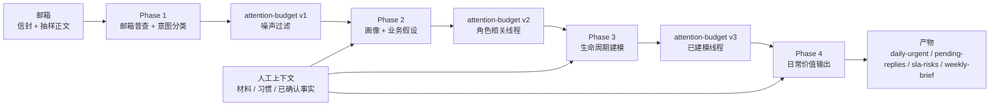

# twinbox 📮

[English](./README.md) | [中文](./README.zh.md)

## What it does

典型问题：谁还在等你回、什么事卡住、有没有超期——按**线程**看，而不是把最新一封邮件总结一下就完事。twinbox 只读拉 IMAP，可混入你提供的材料/习惯，写出 `daily-urgent`、`pending-replies`、SLA 视图、周报等文件（主要在 `runtime/validation/`），给脚本或 Agent 读。

自托管。Phase 1～4 对邮箱只读；草稿和发送后面单独设闸门。

## Who it is for

要把邮箱接进自动化的人：优先 CLI + JSON；OpenClaw 或任何能跑 shell 的宿主都行。不是网页邮箱、不是群发自动回复、也不是托管产品。

## Pieces

邮件 + 可选人工上下文，走 Phase 1～4；每段先确定性 `Loading` 再 LLM `Thinking`，产物进 `runtime/validation/`（契约见 [docs/ref/validation.md](docs/ref/validation.md)）。

- `twinbox`：预检、队列、线程、摘要、context 写入。`twinbox task … --json` 转给上述能力，给 Agent 用（[docs/ref/cli.md](docs/ref/cli.md)）。
- `twinbox-orchestrate`：`run`、`run --phase N`、`contract`、`schedule`/bridge。与 `bash scripts/twinbox_orchestrate.sh` 或 [scripts/twinbox-orchestrate](scripts/twinbox-orchestrate) 一致。
- OpenClaw：[SKILL.md](SKILL.md) 元数据；安装与宿主桥接见 [openclaw-skill/README.md](openclaw-skill/README.md)（`scripts/twinbox_openclaw_bridge*.sh`）。
- Phase 1～4 不发信、不移动/删除/归档/打标邮件。

## Quick start

1. 按 [pyproject.toml](pyproject.toml) 安装（或仓库根执行 `bash scripts/twinbox`）。
2. 设好代码根、状态根（见 [Code and state roots](#code-and-state-roots)）；OpenClaw 常用布局可跑 `bash scripts/install_openclaw_twinbox_init.sh`。
3. `twinbox mailbox preflight --json` 直到检查通过。
4. `twinbox-orchestrate run --phase 4` 或 `twinbox-orchestrate run`。
5. 再读 [docs/README.md](docs/README.md)、[docs/ref/architecture.md](docs/ref/architecture.md)。

更多契约：[docs/ref/runtime.md](docs/ref/runtime.md)、[docs/ref/scheduling.md](docs/ref/scheduling.md)、[config/action-templates/README.md](config/action-templates/README.md)。

## Common commands

| Goal | Command | Notes |
|------|------|------|
| 邮箱登录 / 环境 / 只读 IMAP 预检 | `twinbox mailbox preflight --json` | 统一 JSON，适合工具链与 OpenClaw 宿主 |
| 兼容 wrapper | `bash scripts/preflight_mailbox_smoke.sh --json` | 同上预检的包装 |
| 给 Agent 的 JSON | `twinbox task latest-mail --json`、`twinbox task todo --json`、`twinbox task progress "…" --json`、`twinbox task mailbox-status --json` | 见 [docs/ref/cli.md](docs/ref/cli.md) |
| 只看流水线计划 | `twinbox-orchestrate run --dry-run` 或 `bash scripts/twinbox_orchestrate.sh run --dry-run` | 不执行 phase |
| 跑全流程 | `twinbox-orchestrate run` | Phase 4 默认并行 thinking |
| 单 phase | `twinbox-orchestrate run --phase 2` | 局部重跑 |
| 机器可读契约 | `twinbox-orchestrate contract --format json` | phase 依赖与入口 |
| 单元测试 | `pytest tests/` | 核心模块回归 |
| 轻量语法检查 | `python3 -m compileall src` 与 `bash -n scripts/twinbox_orchestrate.sh scripts/run_pipeline.sh` | 提交前 |

## First login troubleshooting

- `missing_env`：补齐 `MAIL_ADDRESS` 与 IMAP/SMTP 的 host/port/login/pass。
- `imap_auth_failed`：核对账号密码或应用专用密码。
- `imap_tls_failed`：核对端口与加密，常见 `993 + tls` 或 `143 + starttls/plain`。
- `imap_network_failed`：DNS、防火墙、容器网络。
- `mailbox-connected + warn`：只读 IMAP 已够 Phase 1～4；只读模式下 SMTP 可能仅警告。

## Why not another mail demo

Demo 往往围绕单封邮件和界面快路径。这里工作单元是线程，产出是文件（方便 diff、门禁、脚本），默认你自己部署；OpenClaw 是一种集成方式，不是唯一。

## Principles

1. 优先用线程上下文，而不是孤立的一封邮件。
2. 先只读产物，再草稿，再发送。
3. 用户材料、习惯、事实进仓库形态的数据，不只停在对话里。
4. OpenClaw：manifest、环境变量、宿主桥接在文档里写清楚。

## Architecture (ASCII)

```text
                                +----------------------+
                                |   用户 / Operator     |
                                |  (审查并批准)         |
                                +----------+-----------+
                                           |
                                           v
+------------------+             +---------+----------+             +----------------------+
| 邮箱 (IMAP)       +-----------> | Thread State Layer | <---------- | Context Ingestion    |
| 首先只读          | 证据         | (线程生命周期、    |   事实      | (材料/习惯)          |
+------------------+             | 队列投影)          |             +----------+-----------+
                                 +---------+----------+                        |
                                           |                                   |
                                           v                                   |
                                 +---------+----------+                        |
                                 | Runtime Skeleton   |------------------------+
                                 | Listener / Action  |     类型化上下文
                                 | Template / Audit   |
                                 +---------+----------+
                                           |
                                           v
                                 +---------+----------+
                                 | Automation Gates   |
                                 | 只读 -> 草稿 ->    |
                                 | 受控发送           |
                                 +--------------------+
```

## Compared to Anthropic `email-agent`


- 线程与队列 vs 单封进出、偏 UI 的演示。
- 只读 → 草稿 → 发送分闸 vs 一条自动化演示到底。
- 上下文落盘 vs 只在会话里随口描述。
- listener/action 等骨架 vs 成品小应用。

## Repository map

```text
twinbox/
├── README.md
├── README.zh.md
├── SKILL.md                    # OpenClaw manifest + 共享 skill 元数据
├── skill-creator-plan.md       # Track A/B 与宿主路线（细表）
├── pyproject.toml
├── openclaw-skill/             # OpenClaw 部署说明、bridge 样例
├── src/twinbox_core/           # Python 核心（CLI、phase、编排）
├── tests/
├── config/
│   ├── action-templates/
│   ├── context/
│   └── profiles/
├── docs/
│   ├── README.md
│   ├── core-refactor.md
│   ├── ref/
│   ├── guide/
│   │   └── openclaw-compose.md
│   ├── archive/
│   └── validation/
├── scripts/
│   ├── twinbox
│   ├── twinbox-orchestrate
│   ├── twinbox_orchestrate.sh
│   ├── twinbox_openclaw_bridge.sh
│   ├── twinbox_openclaw_bridge_poll.sh
│   ├── phase{1-4}_loading.sh
│   ├── phase{1-4}_thinking.sh
│   ├── register_canonical_root.sh
│   ├── run_pipeline.sh
│   └── twinbox_paths.sh
└── runtime/                    # 本地运行数据（通常不入库）
```

## Code and state roots

代码根：带 `src/`、`scripts/` 的 checkout。状态根：`.env`、`runtime/context/`、`runtime/validation/`、可选 `docs/validation/`。

- `TWINBOX_CODE_ROOT`、`TWINBOX_STATE_ROOT`（[scripts/twinbox](scripts/twinbox)）。
- `bash scripts/install_openclaw_twinbox_init.sh` 可写 `~/.config/twinbox/code-root`、`state-root`。
- `TWINBOX_CANONICAL_ROOT` 为状态根的旧别名。
- 更老流程：`bash scripts/register_canonical_root.sh`。

核对一次根路径；用 `twinbox-orchestrate` 跑 phase；要看依赖图用 `contract --format json`。

```bash
twinbox-orchestrate run --dry-run
twinbox-orchestrate run --phase 4
twinbox-orchestrate contract --format json
```

文档入口：[docs/README.md](docs/README.md)、[docs/core-refactor.md](docs/core-refactor.md)。

## Four-phase pipeline (detail)

当前取向：spec-first、shell-first、read-only-first。图在下面；放在快速开始之后，先能跑命令再看漏斗。



| Phase | Main job | Typical outputs | Why it exists |
|-------|----------|----------|------|
| 1 | 分布层面读懂邮箱 | `phase1-context.json`、`intent-classification.json`、派生 census | 基线与早期降噪 |
| 2 | 推断邮箱主人与业务重点 | `persona-hypotheses.yaml`、`business-hypotheses.yaml` | 角色与业务过滤 |
| 3 | 标签 → 线程级流程状态 | `lifecycle-model.yaml`、`thread-stage-samples.json` | 每条线程在流程中的位置 |
| 4 | 用户可见价值面 | `daily-urgent.yaml`、`pending-replies.yaml`、`sla-risks.yaml`、`weekly-brief.md` | 回答「今天我该看什么」 |

阶段之间仍靠各 phase 文件交接；`attention-budget.yaml` 是目标形态，未处处强制（[validation.md](docs/ref/validation.md)）。每段：`Loading` 再 `Thinking`。

```bash
twinbox-orchestrate run --phase 2
bash scripts/run_pipeline.sh --phase 2   # 兼容
```

已有：IMAP/SMTP 检查、himalaya 渲染、冒烟脚本、验证文档、`twinbox-eval-phase4`、context 导入/写入。

没有：常驻 listener、生产级 action 管理器、Web 前端、默认自动发信/归档、写死的租户业务规则。

## Near-term direction

线程模型和闸门不变；listener/action、模板与实例、审计、扩展点按需加长。

## Current focus & roadmap

> Last updated: 2026-03-25

- [x] 2026-03-25 — `twinbox-orchestrate` + Phase 1～4 Python（Loading / Thinking）。
- [x] 2026-03-25 — `twinbox task … --json`；OpenClaw skill、`scripts/twinbox_openclaw_bridge*.sh`（[openclaw-skill/README.md](openclaw-skill/README.md)）。
- [ ] 固定调度窗口：白天 / 周五 / 夜间。
- [ ] 多渠道投递的订阅 registry、选择性停推（未做）。
- [ ] OpenClaw 是否在无宿主桥时自动跑 `preflightCommand` 与 manifest `schedules`（待证）。
- [ ] Phase 4 快照偏旧时，日内注意力怎么补。
- [ ] `twinbox context refresh` 真正触发重算；stale / 重试 / 降级说明白。

其余见 [skill-creator-plan.md](skill-creator-plan.md)。

## Safety boundaries

- 仅使用应用/客户端专用密码。
- `.env` 留在本地，切勿提交。
- 将 `runtime/` 视为本地运行数据。
- 在草稿质量与审批流未验证前不要自动发送。
- 勿让用户上下文静默覆盖邮箱事实。

## Publishing note

`docs/validation/` 可能含真实邮箱研究产生的实例材料；完全公开前请清理。稳定对外叙述以该目录 **之外** 的文档为准。
