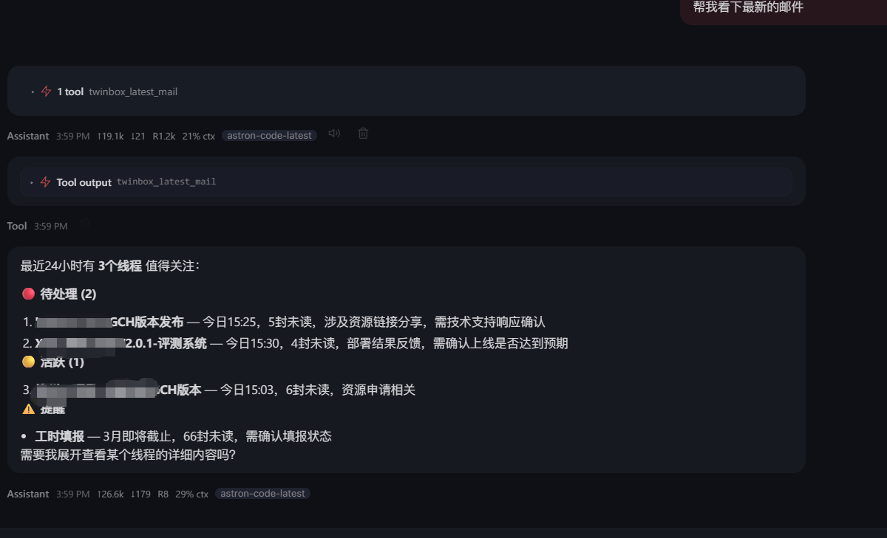
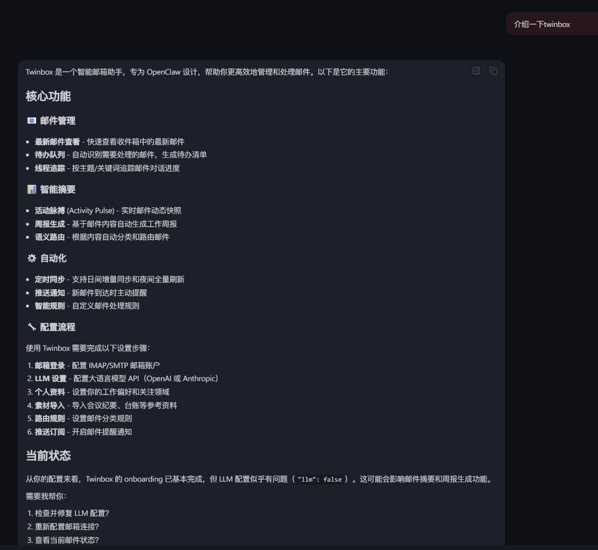
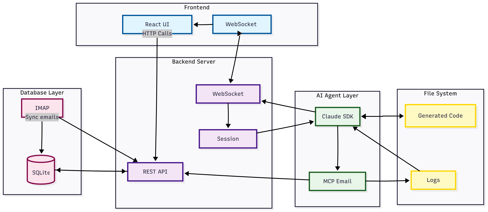
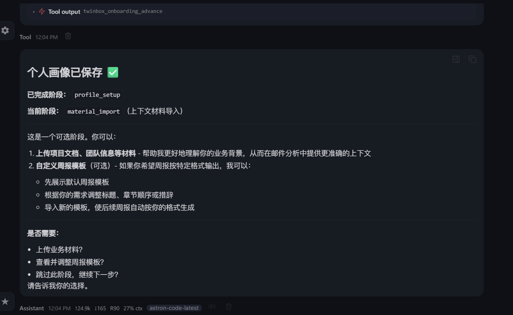
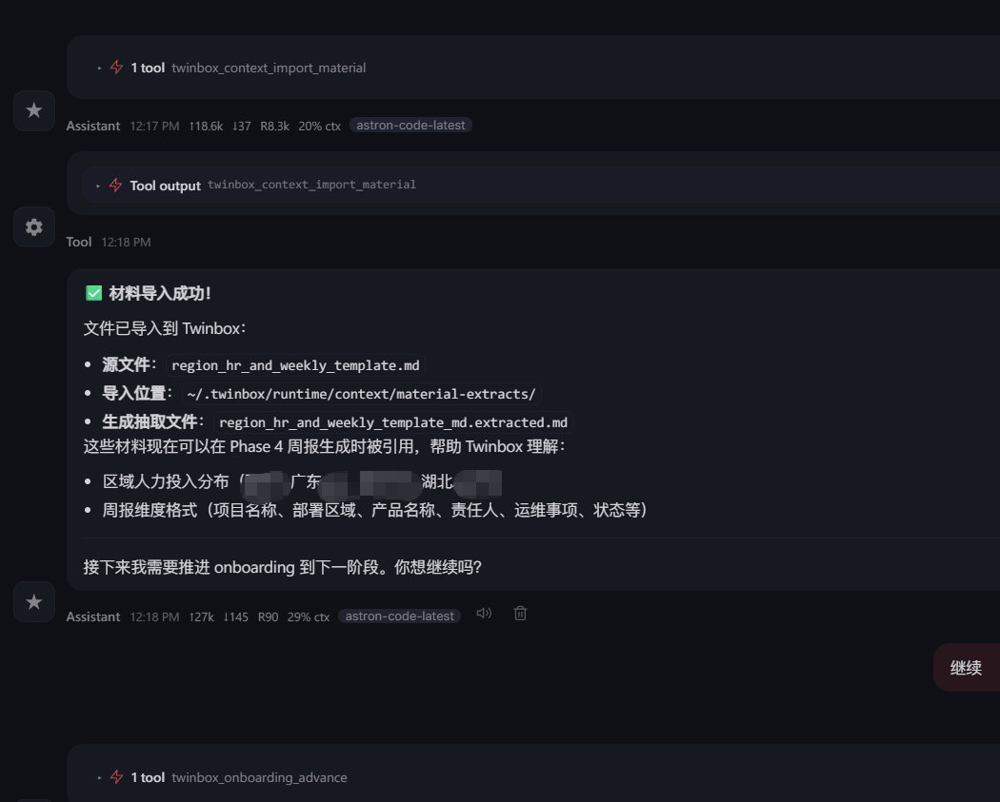
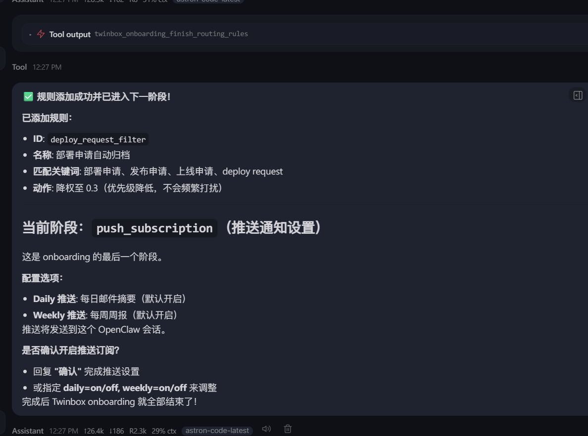
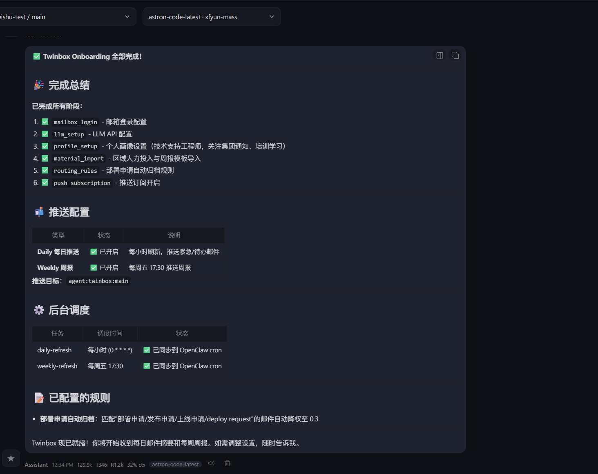
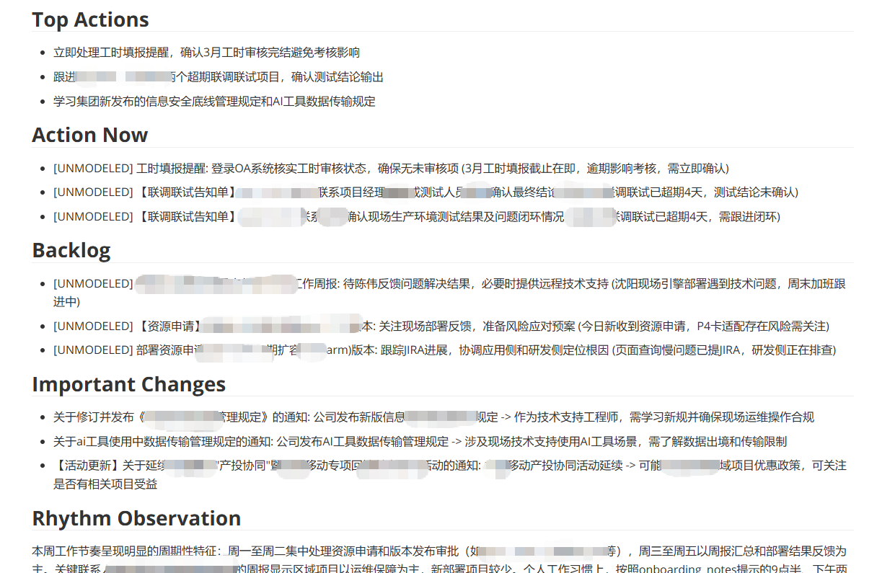
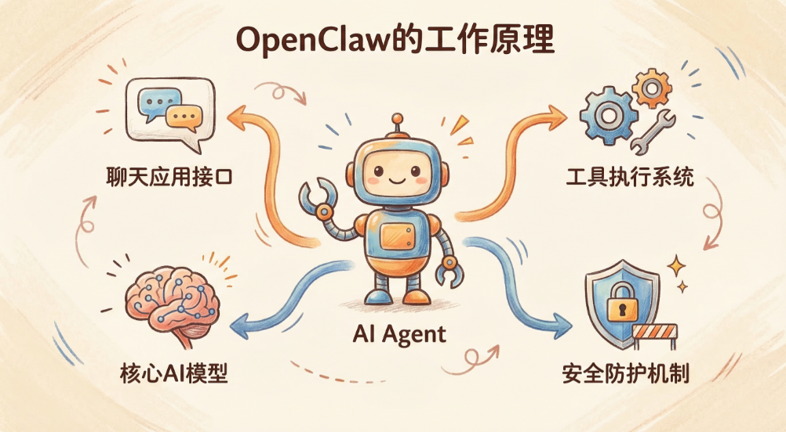

# Twinbox Beta 历程：从立项到发布的实践复盘

**关键词：** Twinbox、OpenClaw、Claude Code、邮件智能体、线程（thread）、Skill、Python、Go、CLI、vendor、onboarding、vibe coding。

## 一、背景与目标

这是一篇从 Twinbox 立项、开发到目前发布 Beta 的过程总结和经验分享。我们一开始的终极目标，是想在 AI 帮助下，把琐碎工作里的数据流整理成周报，减轻统计和撰写的负担，更完整、更稳地输出一周工作总结。其中，公司内部邮件收发是非常可观的数据源，能给工作信息提供参考。那怎么把这类传统数据交给 AI 用好？

## 二、业界方案与我们的切入点

无论是过往印象里还是实际调研，市面上已经有很多适配智能体生态的邮件类客户端或服务：Dify、OpenClaw 生态里的 Himalaya、谷歌 gog 邮箱 CLI、Anthropic 的 Email Agent SDK 等；

Anthropic 的邮件 Agent SDK 架构

OpenClaw 上发布的谷歌 gog 邮箱 CLI skill

我们也看了微信公众号、抖音上一些智能体开发案例。他们更多做的是流程化工单派发：比如有基于 Coze 的邮件智能体，用预设周报模板、多轮从邮件里抽数据，最后输出符合模板的总结。Himalaya 在 OpenClaw 里更多是 CLI：用户主动触发时读邮件、总结、抽今天或一周的邮件。

在这种技术背景下，我们想的是：既然要做，不是为了造轮子，要尽量用现成能力控制成本；但现有方案里，不少是「单轮、单次」处理。

要先想明白一件事：邮箱里是 10 封、100 封还是 1000 封，时间范围不同，处理方式不同，结果会差很多。我们现在用的往往不是通用智能体，而是单点或多智能体——像招一个邮件秘书：可以 24 小时待命，用 8 小时精力帮你把每天的事理清楚。而前面说的那些场景里，用户要频繁主动触发，很耗精力。我们就想：能不能做一个像虚拟邮件秘书、24 小时不休息、能力更强的邮件助手？有了这个念头，可以看我们最早的提交记录。

## 三、业务价值：漏斗、Copilot 与 LTC

以结果和业务价值为导向，智能体结合邮件，我们到底要什么？我觉得有几条。第一，它得是个漏斗，像智能筛选「更重要的事」；每个人角色不同，但可能都在同一个邮件组里。以我为例，每周将近两百封，在部署组、OPS、公共支撑组，还有很多周报抄送。若按几个重要维度切，我可能只盯第一维，或第二维的一半。

没有智能体之前，我们有 Foxmail 那种分组、过滤、关键词匹配，把邮件归档好，减轻注意力负担，让人聚焦某区域、某邮件组、某类关键词——HR、OA、工时等。有了智能体，这些工作就 Copilot 化了：不是要你手把手拖配置，而是讲清需求，它像秘书一样自动管邮件，不光分类，还能挖出以前纯客户端里不容易看到的动态和价值。

定时推送的「值得关注」

也就是说某个区域的项目交付活跃度、风险、待办，如果没有总监级的一对一汇报、没有大规模抽象总结，Foxmail 不会主动「送给你」；我们就让智能体来做这件事，为 LTC 提效，也挖潜在价值。

## 四、顶层设计：线程、上下文与 OpenClaw

> 以下一块内容在飞书原文中为嵌入组件，仓库内以文字保留；若需补图，请将导出文件放入 `images/` 并按 [images/README.md](./images/README.md) 中的序号命名。

基于这个目标做了顶层设计：应用层、业务层需求驱动。一是把邮件抽象成「线程」（打引号的线程）——按日常工作优先级，把大规模邮件按线程处理，而不是孤立的一封封、一组组、一堆关键词。

定制的周报格式

二是上下文感知的邮件智能体：前期根据操作习惯、岗位画像、已确认的事实（我关心什么、不关心什么、哪些事互相关联），

这些规则打包进智能体的 memory；

在已知事实之上，像漏斗一样抽出要的东西——抽象的数据流关系、潜在业务价值。技术选型上，一开始是围绕 OpenClaw 生态来做的。

OpenClaw 以及 Claude Code 对我们之前的智能体设计冲击很大。表面上是热度，本质是它把「智能体设计过于复杂」这件事简化了。开年后那一周，我大规模用了将近四个 OpenClaw 环境：云上、线下、厂商的、家里闲置机器，做批量爬虫类任务，一行代码没写，靠对话加外部爬虫 API，就拉了大量文件——整站图片、wiki 索引目录，性能好的时候半小时能爬下单模块。等于说原来的编排、工作流，被高度抽象进对话框。然后今年我们也想围绕它看看，智能体到底能做多深。

Claude Code 逆向分析后的架构绘制（搜集材料后使用 nano banana 绘制）

OpenClaw 这一侧，手边是 API、MCP、Skill、Token、命令行工具，以及 Web search、读写文档等集成插件。我们是用 Claude Code 开发 Twinbox；Claude Code 的 Skill 和 OpenClaw Skill 有相似也有差异，这点在项目也发了两版本 skill（因为 description 及调用方式差异）。Skill 设计上，只为一个岗位、一个人做一个智能体，收益小；只为 OpenClaw 做一个，也偏窄。我们希望兼顾不同人群、不同平台。

业界能看到 ClawHub、腾讯 SkillHub 等，几个月里 Skill 已经很多，但真正用好、产生价值的其实不多。商业化落地更明显的是在 Claude Code 里，开源闭源都有不少优秀 Skill：大家熟悉的 Superpower、awesome-claude-code、官方的 skill creator 等。我们不会去复刻一个 OpenClaw 专用 Skill 全家桶——很多是「一行代码不写，纯 vibe」里长出来的，商业价值、规模化降本也不清晰，还在蛮荒发展期。Claude Code 出来半年多了，大量 Skill 经万千开发者验证，真实有效，有的甚至是革命性的。我在这项目里用到的包括：Superpower 里的 Brainstorm、CC 官方的 skill-creator 生成器、一款投行背景作者做的「拷问我」grill-me Skill（连环追问计划或方案）、Improve Codebase Architecture 这类提架构的 Skill，还有我自己做的 teacher-CS：

主要在陌生领域做问答，用几种教学模型、苏格拉底式追问、双编码图文并茂之类，补知识盲区。正式开发主语言选 Python：对接 LLM、数据分析与编排效率高、轻量，做 prompt 注入也相对简洁；大模型生态在 Python 侧也强，批量任务、拉邮件、IMAP 大批量，都可以用 Python 替代一堆零散 Shell。

## 五、复盘：计划、测试、工具与部署

项目从开发到现在持续时间比预期长。一方面是实验心态、百分百从零到一（集成 Himalaya 等工具不算「从零」）；另一方面踩坑多。下面几块最值得拿出来聊：计划、测试、工具、部署与调试。

### 5.1 计划（plan）

计划（plan）列清楚非常重要——写代码有时半小时、一小时就完事，列计划和调试才是大头。我这一个月体感大约三成在「生成」，七成在计划和调试。难点之一是：怎么让大模型和你双向知道计划里缺什么、哪里不对、哪里其实不用做。大模型是人的镜子：你问得好它答得好，问得模糊它就懵或乱操作。开发的人要对业务和要做的工具足够熟——不是不懂前端就能光靠 Opus 4.6 变态模型做出好前端，不懂产品就能做出好产品。大模型像高级鹦鹉，会学人说话，并且说高级话，对不对还看互联网公共的训练数据质量；各家数据质量差不太远，现在更多卷参数、架构上限、领域级精调数据。为什么 Claude Code 好用，业内说法很多，实际体感 Opus 4.6 这类在不少场景仍然一骑绝尘；别的厂商也说在追赶甚至局部超越（比如 minimax2.5 / Cursor Composer 2 等），要具体任务上比。

除了「鹦鹉」，还有人的问题：信息搜集是否完整、是否精确（不是一味求全——Token 太多会干扰效率和精准度）。资料是否规范、标准：需要哪些开发文档、规划、语言风格、测试用例。我觉得测试用例重要性和 plan 同级，甚至更高；流行说法叫测试驱动开发（TDD），在 AI 辅助开发里，我会说测试往往要比「纯写实现」更下功夫。

即使用了大量 grill-me、Improve Codebase Architecture 这类 Skill，以及顶尖的 Codex、Opus 4.6 去优化 plan 和架构，仍踩坑。原因我总结几条：一是 plan 文档太散——周一段、一周三天一段、甚至一天多份 plan，彼此关联一开始没设计好，独立存在、互相覆盖交叉，项目管理就乱；且每次生成 plan 的模型能力、prompt 精度不一致，有时精雕细琢一小时，有时几句话糊弄过去。二是 plan 范围漂移：一旦 plan 写得过大、模块多、耦合强，生成准确率和调试成本都会上去；我们当时对不同层级 plan 的约束、单份 plan 覆盖的功能边界，细得不够。比如一句「帮我优化整个架构」，plan 几千字，从前端到后端到数据流全包，执行时还要再叠一层「不同 phase、不同 plan」的关联，让模型自己判断先执行哪一步，经常不准。

### 5.2 测试用例

测试用例这边，我们的智能体面向的是用户，用户用自然语言和 OpenClaw、Claude Code 或其它平台对话；传统硬编码测试和「对话式」验证有偏差——对话可以回滚、多轮纠错，测试用例往往是硬编码，送 JSON、送 Markdown、送 prompt，很多场景甚至没有走 LLM，直接硬编码路径，但智能体链路里是 LLM 加 Python，测试设计也应该对齐 OpenClaw TUI 或类似模式。另一个坑：大量测试是模型生成的，没有及时约束范围、编写逻辑和形式（例如统一用 OpenClaw TUI 风格测），后期就频繁让模型自产测试——模型若实现错了，可能生成「配合错误实现」的用例；若 plan 本身错了，也会生成错误用例，连带错误功能和编排。若当时能从功能和应用效果出发定义测试（例如对话应产生什么结果），再落到可执行的用例，会好很多。没约束好还带来 Token 成本、代码 chunk、模块漂移、过度优化、过度开发。

### 5.3 工具选择

工具选择：Claude Code、Codex、Cursor 时间比例大概 6:2:2；单价最贵的是前者。Codex 有 team 会员之类的小道消息，费用很「bug」、十几块量级。Cursor 是 auto 模型、自研 Composer 加第三方 API 组合。谁最好？整体我仍站 Claude Code。但它不是完美的：可视化调试、图片、多项目跳转、跨文件拖拽等人机细节弱一些；纯命令行熟手、开发熟练的话那就能用得非常强。若前后端串联、多端，Cursor 支持手机上看 agent 任务进度，有时睡觉起来发现跑完了。Codex 速度快、网络稳定时很爽，性价比高，上下文记忆、修 bug（尤其 5.4 high / xhigh 辅助下）能力也在网上讨论里常排前列。其它如 Gemini（模型狠话少），生图、抽象架构和业务价值也有亮点。若不谈费用和个人习惯，我会倾向 all in Claude Code——前面说的时间分配其实也是这个意思。

### 5.4 部署与调试

部署与调试：容易高估模型写代码、低估把 AI 从零生成的项目顺利部署上线的难度。前两天还看到 Karpathy 和业内文章，讲一个很大的 vibe coding 项目：生成代码顺，部署、上线、网络、Cloudflare 对接、按生成文档一步步走，却卡很久、反复改，最后作者亲自上手。我这边也类似：若不把部署形态约束死，用自然语言改部署文档，PIP、Python、Go 编译、提交、分阶段部署、后续人机联调，模型理解经常模糊，部署能力体感偏弱。调试很多其实是前面 plan、测试、工具没做好的后遗症；plan 不连贯、没有统一 roadmap，后面就会还债。

## 六、五阶段开发历程

若把开发划阶段，我会分成五段。第一段最小功能：历史邮件拉取、对接客户端、嵌入 LLM、邮件登录与配置、prompt 注入与粗糙总结模板；前期 Shell 多，后来往 Python 收。第二段编排：每日「脉搏」、日间推送与周报推送，多线程数据流抽象进日推和周推，大量 Python 编排。第三段模块化重构：Shell + Python 精简、性能优化，入口薄封装调 Python。第四段产品化对接：OpenClaw CLI 封装与对话调用，能返回周报、日间不同优先级事务，更细粒度关注某线程、某区域，结合历史周报做总结——到这步其实可以上线。第五段发布形态优化：固定 CLI 名（像产品约定好的命令名）、发布包里封装核心数据流与编排、不同 phase 的 runtime 可插拔，便于迭代升级与长期维护；同步做大量部署与调试优化，做了类似 OpenClaw onboarding 的引导式 TTY，把 Twinbox 装到服务器上，二阶段在对话里导入人格画像、岗位职责、用户习惯、周报与材料模板等；再用 Go 写薄 CLI 启动后台、调用 Python，完成命令封装。

## 七、与传统邮件 agent 的差异与产品亮点

和传统邮件 agent 的对比：工作单元不是单封邮件，而是「线程」——可以是某区域长期跟踪的一条线（版本发布、测试、资源申请、上线、运维风险、重大事故），也可以是培训通知、OA、HR、保密事项等抽象单元。线程怎么定，靠复杂编排：结合当周邮件数量分布、紧急程度，抽象候选线程，再叠用户画像和人工上下文（材料导入、习惯）。主送、抄送、邮件组等会有权重，贯穿编排各环节，做降权、升权或隐藏。输出侧：传统方案常要 UI、要回复、要手动触发；Twinbox 像孪生邮箱，把线程流落到服务端、可历史追踪、可动态降权（标不重要、已完成），用 JSON 等维护落盘，可输出单日紧急队列、待办待回复、分层材料，核心是周报；对某条线程还可继续追问、扩上下文。安全上，当前阶段偏只读展示与加工，草稿与发送走受控路径；很多传统方案是一次性自动化或单次对话、临时脚本，难长期维护、难持久化。上下文方面，传统多是会话级、单次任务或固定周报模板；我们是结构化、可追溯、可调模板。部署上，传统常是邮件客户端 + OpenClaw + 复杂 prompt/skill/临时脚本；我们是自托管，可私有化、可上云，也可在 Claude Code 里调封装好的 Skill，或到现场改接别的数据源。

其它亮点：功能可控——对话里能做的事，基本都能在本地 CLI 用命令和参数复现；CLI 里不全是硬编码流水线，可以是纯邮件处理，也可以是 LLM 加持的分析，并有 loading / syncing 等模式。

部署上有简易 handoff 向导（类似装显卡驱动那种一步步），填邮箱时能自动识别常见 IMAP/SMTP 等服务器信息，不必像老式客户端一行行手填；模型配置也可从 OpenClaw 一键导入，并支持 OpenAI 协议、Anthropic 协议等，检测与配置体验向 OpenClaw 看齐。琐碎步骤收进 onboarding；第四阶段一键打包后台重启、工具绑定 OpenClaw、RPC 与后台交互等。版本形态上，第五阶段花大约一周重构——Go 做薄 CLI 与调用封装，Python 接管 shell 做核心数据流与编排策略作为 vendor 包，部署逻辑优化等；

部署时 CLI 上机，vendor 压缩包装编排与脚本，后续升级迭代可整体替换安装。若以后智能体形态再变，也可以继续用「编排 + prompt + 升级包」的思路发到线上，我觉得这对同类智能体项目有参考价值。

## 八、结语与维护

周边技术栈、知识扫盲记录后续也会用飞书文档持续更新——技术迭代快，定期维护能缓解一点大家的技术焦虑。项目资源会放在集团代码仓库，欢迎各位访问试用和二开，一起共建。感谢支持~

本项目一阶段开发工作暂告一段落，后期架构功能暂不做大调整，欢迎各位进行共建，帮助该邮件智能体更好的发挥它的作用。现发布 v.0.1.0-beta 作为推广试用，文章已附带仓库地址，如有同事需要部署在自己的小龙虾🦞或类 claw 产品上，请联系 zjma12 进行支撑🙂。
