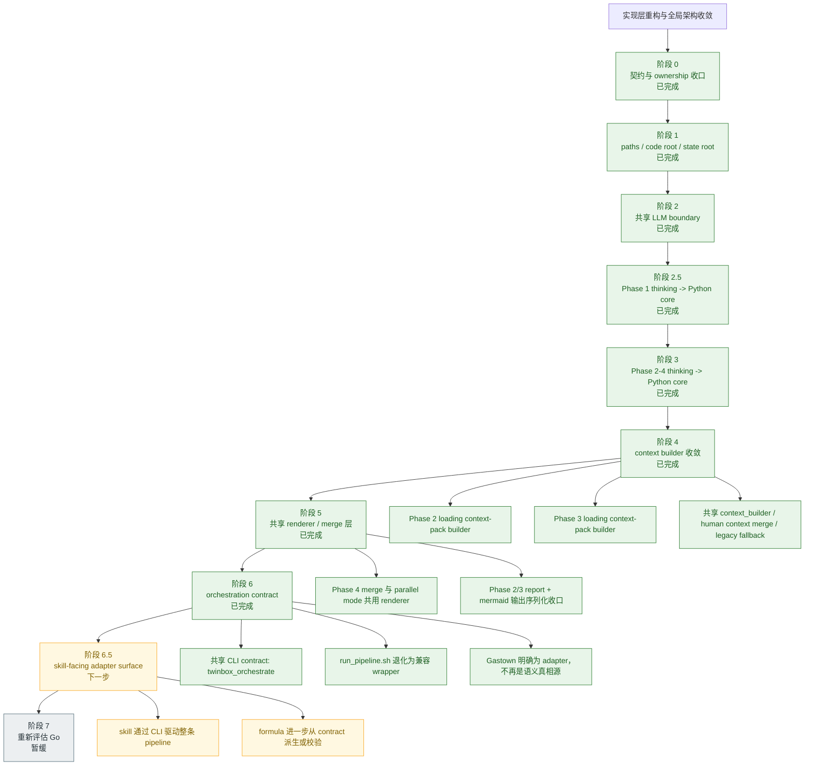

# 核心重构计划

日期：2026-03-20  
项目：twinbox

## 执行摘要

这轮优化不应被理解为“换语言”，而应被理解为“先把实现层的边界拉直”。

当前更合适的目标形态仍然是：

```text
bash entrypoints / gastown formulas
  -> python core modules
      -> transport adapters / artifact store / llm adapters
```

结论保持不变：

- `bash` 保留在入口、环境装配、薄编排、向后兼容层
- `Python` 接管可测试的核心实现层
- `Go` 暂缓到常驻 runtime / worker service / listener manager 真的出现时再评估

但执行顺序需要更保守，也更清晰。


## 当前待办（2026-03-25 更新）

基于上一轮实现收口后的状态快照，以下事项明确未完成，按优先级排列：

### 高优先级

#### TODO-1：阶段 6.5B — skill-facing adapter surface

- [ ] 将 `SKILL.md` 的 Suggested Tooling 从 `scripts/*.sh` 升级为 task-facing CLI（`twinbox queue list`、`twinbox digest daily` 等）
- [ ] 梳理 skill 调用路径，确保 skill 文档不再需要解释 phase 细节
- [ ] 评估 Gastown formula 是否可从 task-facing contract 派生或做一致性校验
- [ ] 补 CI/CD（`.github/workflows/`）：至少覆盖 Python 单测与 evaluation 回归门禁

完成标准：skill 文档只需引用 task-facing 命令；task-facing CLI 覆盖至少一条完整只读用户路径。

#### TODO-2：context_updated 事件触发局部重算

- [ ] `twinbox context import-material / upsert-fact / profile-set` 在写入后发出 `context_updated` 事件（可以先写入 `runtime/context/events/` 下的标记文件）
- [ ] `cmd_context_refresh` 从仅打印提示语改为真正触发 Phase 1 重算（调用 `twinbox orchestrate run phase1` 或等效路径）
- [ ] 明确局部重算的受影响对象范围：受影响的 `ThreadCard`、相关 `QueueView`、可能受影响的 `DigestView`

完成标准：执行 context 命令后，相关 phase artifacts 自动更新，无需手动触发。

### 中优先级

#### TODO-3：review approve/reject 与 action apply 命令

- [ ] 实现 `twinbox review approve <review-id>`
- [ ] 实现 `twinbox review reject <review-id>`
- [ ] 实现 `twinbox action apply <action-id>`（需要用户二次确认）

完成标准：review 和 action 命令树草案全部落地；apply 需有明确的确认机制。

#### TODO-4：评测框架 CI 集成（阶段 2 启动门槛）

- [ ] 将 `twinbox-eval-phase4` 接入 CI，确保每次提交自动运行
- [ ] 固化 baseline 报告，使其可版本化复用（存入 `tests/fixtures/baseline/`）
- [ ] 验证 `contract_pass_rate` 持续保持 100%，并设为 CI 硬性门禁

完成标准：阶段 1 评测稳定接入 CI；baseline 可复用；准备好启动阶段 2 提分工作。

### 低优先级

#### TODO-5：Gastown formula contract 校验

- [ ] Phase 4 fan-out/merge adapter 边界进一步收紧，避免 Gastown 专用语义外溢
- [ ] 评估 formula 与 task-facing contract 的一致性，必要时补校验脚本

完成标准：Gastown adapter 不再直接暴露 phase 内部语义给外部调用者。

---

## 当前聚焦与已收口事项（2026-03-23）

以下内容合并自原 `near-term-focus-areas.md`，作为主线计划当前阶段的补充收口。

## 旧 TODO 的处理结果
### 1. 并发场景

旧问题：明确当前阶段最有价值的并发场景。

当前结论：

- 这项不再是开放式 TODO，已有阶段性结论。
- 当前最有价值的并发不是“继续泛化更多 gastown 实验”，而是两类：
  - **产品运行层**：`daily` / `weekly` value surfaces 的定时预计算，以及 `context_updated` 触发的局部重算
  - **实现层**：围绕已验证的 `Phase 4` fan-out 模式并发生成 `daily-urgent`、`pending-replies`、`sla-risks`、`weekly-brief`
- 在 `queue / digest / context` contract 还未完全定型前，不建议继续扩大并发面。

文档依据：

- [gastown-integration.md](./gastown-integration.md)
- [core-refactor-plan.md](./core-refactor-plan.md)
- [architecture.md](../architecture.md)

处理状态：**已收口，不再保留为 markdown TODO。**

### 2. Witness / 崩溃恢复

旧问题：是否需要 Witness 做自动崩溃恢复。

当前结论：

- Witness 集成在 Gastown 侧已经完成，可作为 **健康监控与执行层运维能力**。
- 但当前产品级默认恢复策略不应依赖 Witness 自动恢复来兜底。
- 近阶段应采用：
  - **用户面**：展示最近一次成功 projection，并明确标记 `stale`
  - **系统面**：后台补算
  - **运维面**：必要时手动重跑；Witness 继续做监控和告警，而不是产品完整性的唯一保障

文档依据：

- [gastown-integration.md](./gastown-integration.md)
- [core-refactor-plan.md](./core-refactor-plan.md)
- [thread-state-runtime.md](../specs/thread-state-runtime.md)

处理状态：**已收口，不再保留为 markdown TODO。**

### 3. 多邮箱并行

旧问题：支持多邮箱并行并明确近期规划。

当前结论：

- 这项不适合作为当前近期待办。
- twinbox 当前路线仍以 **单邮箱实例上的 thread/workflow/value surface 收敛** 为主。
- `oss-v1-plan` 已明确：V1 不追求超出现有 `himalaya` 路径的 mailbox abstraction。
- 在 `task-facing CLI`、`context binding`、`queue/digest` contract、以及 cadence 运行策略稳定前，不应把多邮箱并行拉进近期主线。

文档依据：

- [oss-v1-plan.md](./oss-v1-plan.md)
- [core-refactor-plan.md](./core-refactor-plan.md)

处理状态：**明确延期，移出近期聚焦范围。**

### 4. Gastown 上游 formula 展开问题

旧问题：确认 workflow formula 的 `[[steps]]` 是否不会展开为 molecule DAG 节点，并决定是否继续跟踪上游。

当前结论：

- 这项已有验证记录和已知 workaround。
- 当前仓库侧结论是：把它视为 **上游/外部工具限制**，继续使用“polecat 直接读 formula TOML”的 workaround。
- 近期不在仓库内投入修复，只在它重新阻断可观测性或 adapter 生成时再重新打开。

文档依据：

- [phase4-parallel-issues.md](../reports/phase4-parallel-issues.md)
- [gastown-integration.md](./gastown-integration.md)

处理状态：**已收口，保留为外部依赖说明，不再保留为 markdown TODO。**

## 当前近期待聚焦事项

按当前规划、项目进展和最近一轮 cadence/context 设计收口，近阶段应优先推进以下方向。

### 焦点 1：task-facing CLI surface

目标：

- 在已有 `orchestration contract` 之上，补出面向任务的稳定命令面
- 把 `context / queue / thread / digest / action / review` 提升为一等对象
- 避免 skill、listener、未来 runtime 直接依赖 phase 文件细节

当前优先度：**最高**

主要依据：

- [core-refactor-plan.md](./core-refactor-plan.md)

### 焦点 2：context 命令面与绑定契约

目标：

- 为用户文本、文件材料、长期画像补齐显式 CLI 入口
- 默认命令面至少包含：
  - `twinbox context import-material`
  - `twinbox context upsert-fact`
  - `twinbox context profile-set`
  - `twinbox context refresh`
- 明确哪些更新只影响 ranking / queue membership，哪些需要 explicit user-confirmed facts 才能重标 thread-state

当前优先度：**最高**

主要依据：

- [core-refactor-plan.md](./core-refactor-plan.md)
- [architecture.md](/home/caapap/fun/twinbox/docs/architecture.md#L136)

### 焦点 3：cadence 运行策略

目标：

- 固化 `daily` / `weekly` 的预计算刷新策略
- 固化 `context_updated` 触发的局部重算路径
- 固化 `stale + background refresh` 的退化行为
- 把 `weekly-brief` 从 prose-only summary 明确成 layered projection

当前优先度：**高**

主要依据：

- [architecture.md](/home/caapap/fun/twinbox/docs/architecture.md#L274)
- [thread-state-runtime.md](/home/caapap/fun/twinbox/docs/specs/thread-state-runtime.md#L38)

### 焦点 4：对象 contract 收口

目标：

- 定义 `ThreadCard`、`QueueView`、`DigestView` / `WeeklyBrief` 的最小 schema
- 让 CLI、listener、review surface、未来 runtime 共享这些对象，而不是共享 phase 内部文件名
- 保持 explainability 为默认能力

当前优先度：**高**

主要依据：

- [core-refactor-plan.md](./core-refactor-plan.md)

### 焦点 5：Gastown adapter 继续收口，但不扩大范围

目标：

- 保持 Gastown 在 adapter 位置，不再让它成为 pipeline 语义真相源
- 继续使用已验证的 workflow / formula / workaround 组合
- 不把新的主线复杂度继续压到上游工具限制上

当前优先度：**中**

主要依据：

- [gastown-integration.md](./gastown-integration.md)
- [pipeline-orchestration-contract.md](../specs/pipeline-orchestration-contract.md)

## 测试准确率三阶段计划（已启动）

面向“输出正确率 + 回归稳定性并行提升”，当前采用渐进门槛策略：

- 阶段 1：先建立 Phase 4 只读评测基线和回归护栏，再进入提分
- 阶段 2：提升 Phase 4 `urgent/pending/weekly` 准确率，并强化 explainability 断言
- 阶段 3：把评测框架扩展到 Phase 1-3，并做跨阶段一致性与 cadence 回归

### 阶段 1 当前落地项（2026-03-23）

- 新增 `twinbox_core.evaluation`，支持 Phase 4 评测与基线回归门禁
- 评测报告 contract 固定包含：
  - `urgent_f1`
  - `pending_f1`
  - `weekly_action_hit_at_5`
  - `contract_pass_rate`
  - `golden_diff_count`
- 默认允许相对 baseline 最大回退 `1.0pp`，超过阈值返回非零退出码
- 新增 `twinbox-eval-phase4` CLI 入口与单元测试覆盖

阶段 2 启动门槛：

- 阶段 1 评测命令稳定接入 CI
- baseline 报告固定化并可复用
- `contract_pass_rate` 持续保持 `100%`

### 阶段 2 当前落地项（进行中）

- Phase 4 评测兼容 `weekly_brief.action_now` 分层结构，`weekly_action_hit_at_5` 优先按分层动作命中计算
- 新增 explainability 覆盖率统计：
  - `urgent_explainability`
  - `pending_explainability`
- 新增可选门禁参数 `--min-explainability`，用于在 CI 中开启解释质量下限断言

## 明确延期 / 暂不推进

以下事项当前不应占用近阶段主线注意力：

- 多邮箱并行
- 更广的 mailbox abstraction
- 继续扩写 Gastown 上游兼容层
- 在 queue / digest / context contract 未稳定前，继续扩大并发矩阵

## 使用方式

如果需要把这里的某个焦点变成可执行工作：

1. 先在 `bd` 中确认是否已有对应 issue。  
2. 若没有，再创建新的 `bd` issue，并把依赖关系挂清楚。  
3. 本文件只更新“焦点与决策”，不维护勾选状态。

## 当前状态快照（2026-03-20）

| 阶段 | 目标 | 当前状态 | 说明 |
|------|------|----------|------|
| 阶段 0 | authoritative artifact / state-report ownership 收口 | ✅ 已完成 | 已补 `validation-artifact-contract.md`，并把“运行时输入不再挂在 docs/validation”收口到 `runtime/context/` |
| 阶段 1 | `code root / state root` 与路径底座 | ✅ 已完成 | `twinbox_core.paths` 已接管根路径解析，Phase 1-4 都走 canonical state root |
| 阶段 2 | 统一 LLM boundary | ✅ 已完成 | `twinbox_core.llm` 与 `scripts/llm_common.sh` 已成为共享 transport / retry / JSON repair 边界 |
| 阶段 2.5 | Phase 1 thinking 迁入 Python core | ✅ 已完成 | `phase1_thinking.sh` 已缩成 shell 入口，核心在 `twinbox_core.phase1_intent` |
| 阶段 3 | Phase 2-4 thinking 迁入 Python core | ✅ 已完成 | `phase2/3/4` thinking、Phase 4 子任务与 merge 已迁入 Python core，shell 入口仅保留薄包装 |
| 阶段 4 | context builder 收敛 | ✅ 已完成 | `phase2_loading.sh` / `phase3_loading.sh` 已改成薄 shell 入口，共用 `twinbox_core.context_builder` |
| 阶段 5 | render / merge 收敛到共享 renderer | ✅ 已完成 | Phase 2/3/4 的 YAML / Markdown / Mermaid 序列化已收口到 `twinbox_core.renderer` |
| 阶段 6 | orchestration contract | ✅ 已完成 | `twinbox_core.orchestration`、`scripts/twinbox_orchestrate.sh` 与 `run_pipeline.sh` wrapper 已形成共享 CLI contract，Gastown 明确退到 adapter 位置 |
| 阶段 6.5A | task-facing CLI surface | ✅ 已完成 | context/queue/thread/digest/action/review 全部命令已实现，object contract 收口，27 个测试通过 |
| 阶段 6.5B | skill-facing adapter surface | 🚧 下一步 | SKILL.md 仍指向旧 scripts；Gastown formula 尚未从 contract 派生；无 CI/CD（见 TODO-1） |
| 阶段 7 | Go 重新评估 | ⏸ 暂缓 | 仍不在当前收益最高路径上 |

## 执行树（总览）

下面这棵执行树强调两件事：

- 先走“不会反复返工”的底座主干，再进入实现层迁移
- 当前已经走完的分支、下一步要接的分支、暂缓分支一眼可见



阅读顺序建议：

1. 先看主干：`阶段 0 -> 阶段 5` 是已经收口的稳定路径
2. 再看当前焦点：`阶段 6.5` 是下一批最该做的 adapter 收口分支
3. 最后看保留分支：`阶段 7` 仍只在 runtime / worker 常驻化后再讨论

## 自我批判性评估

### 这个方案里值得保留的创新

- 它没有把问题误诊成“shell 不好”，而是识别出真正的摩擦点在契约、状态根、LLM 边界和重复 builder
- 它试图把浅脚本收敛成深模块，这对测试性、可导航性、后续多 agent 集成都有长期价值
- 它保留现有 `scripts/*.sh` 与 gastown formula 入口，避免一次性重写执行面

### 这个方案当前高估了什么

- 高估了“先建 Python core”本身的价值；如果 authoritative artifact 还没定清楚，只是把漂移接口搬到新语言
- 高估了“目录形态设计”对短期收益的贡献；目录可以先最小落地，不需要一步到位铺满所有子模块
- 高估了“大块迁移 context builder”的时机；在路径语义、artifact owner、state/report 边界未收口前，迁得越快，返工越大

### 这个方案当前低估了什么

- 低估了 `attention-budget` 契约漂移对所有后续 phase 的放大效应
- 低估了 `Phase 1-3` 仍未完全共享 `code root / state root` 语义带来的多 worktree 风险
- 低估了“文档产物兼做运行输入”对稳定性的侵蚀；这会让重构很容易被 markdown 格式耦住

### 平衡创新和稳定性的收敛判断

因此，本方案不应以“先迁最多逻辑”为第一目标，而应以“先建立后续迁移不会反复推倒的底座”为第一目标。

收敛后的执行原则是：

1. 先收口契约，再开语言层迁移
2. 第一批代码只动共享底座，不动 phase 语义
3. 保持 shell 和 formula 入口稳定，只做内部替换
4. 每一阶段都必须有最小可验证输出，而不是只完成抽象设计

## 为什么不是现在就上 Go

Go 当然有价值，但它当前不是最优先的解。

Go 擅长：

- 强类型的长期维护
- 并发与常驻进程
- 单文件二进制分发
- service/runtime 产品化

而 twinbox 当前更痛的地方是：

- phase 间 artifact contract 漂移
- shell / inline Node 里堆了过多数据处理
- LLM 调用边界不统一
- 文档产物与运行时产物 ownership 混在一起
- docs 里的语义与实际脚本产物已经出现偏差

这些问题的第一阶段更像“把浅模块收成深模块”，不是“把脚本改写成高性能服务”。

`Python` 在这一阶段的收益更直接：

- 更容易表达数据模型和 schema 校验
- 更容易做 fixture test / contract test / golden test
- JSON / YAML / markdown / mermaid 处理都比 shell 自然
- 可以保留现有 `bash scripts/*.sh` 和 formula 入口，不破坏 Gastown 现状

## 推荐决策

如果这轮优化现在就要启动，推荐决策调整为：

1. 先确认 authoritative artifact 与 state/report ownership
2. 第一批实现只落 `Python core` 的共享底座，不先迁大块业务逻辑
3. 优先迁 `paths/state-root` 与共享 LLM 边界，再迁 `context builder`
4. `Go` 延后到 orchestration/runtime 真的需要常驻化时再讨论

这比“先选一门更强的语言”更重要。

## 渐进式执行顺序

### 阶段 0：先收紧契约，不先重写

目标：

- 明确每个 phase 的 authoritative artifact
- 决定 `attention-budget.yaml` 是否真的是主线契约
- 区分 state artifact 与 report artifact

输出：

- phase artifact contract 文档
- 状态产物与文档产物的 ownership 规则

说明：

这是零阶段，不是为了拖慢实现，而是为了避免把混乱从 bash 搬到 Python。

### 阶段 1：落共享路径与状态根底座

目标：

- 建 `python/pyproject.toml`
- 建 `twinbox_core.paths`
- 把 `code root / canonical root / state root` 解析迁到 Python
- 保持现有 shell 接口不变，让 shell 只做薄封装

优先迁移：

- `scripts/twinbox_paths.sh`
- `scripts/register_canonical_root.sh` 依赖的根路径解析
- 所有 Phase 4 现有脚本共享的状态根语义

完成标准：

- shell 不再自己实现复杂的路径判断
- linked worktree 与本地 checkout 使用同一套解析逻辑
- 至少有一组路径解析单测覆盖正常路径、worktree 路径与错误路径

### 阶段 2：收敛 LLM boundary

目标：

- 建 `twinbox_core.llm`
- 统一 provider 差异、retry、timeout、JSON repair
- 停止各 phase thinking 各自处理 transport / parse 差异

优先迁移：

- `scripts/llm_common.sh`
- `scripts/phase1_thinking.sh` 内自带的 transport / parse 流程

完成标准：

- phase thinking 不再各自处理 provider 差异
- malformed JSON、timeout、retry 可以围绕一个统一边界测试

### 阶段 3：迁 context builder

目标：

- 合并 `Phase 2/3` 的 envelope normalization
- 合并 human context merge
- 合并 legacy fallback
- 建共享 `context_builder`

优先对象：

- `scripts/phase2_loading.sh`
- `scripts/phase3_loading.sh`

完成标准：

- `Phase 2/3 loading` 只负责调用 Python module 并落盘
- 同一个“由 Phase 1 artifacts 派生 phase-ready context”的概念不再分裂在多个浅脚本里

### 阶段 4：迁 render / merge

目标：

- 拆出统一 renderer
- 让并行 fallback 与 merge-only 共享一份输出逻辑
- 把运行时状态与给人看的视图拆开

优先对象：

- `scripts/phase4_merge.sh`
- `scripts/phase4_thinking_parallel.sh` 中重复的 merge/render
- `Phase 2/3` 的 report + diagram 写入

完成标准：

- YAML / markdown / mermaid 序列化不再在多个脚本中复制
- 状态层测试不再被 markdown 视图格式绑死

### 阶段 5：收敛 orchestration contract

目标：

- pipeline dependency 不再只是“文件存在”
- phase 输入输出变成显式 contract
- Gastown formula 与本地 fallback 共用一个 orchestration surface

完成标准：

- phase 间依赖可以围绕显式 contract 断言
- 更高级的并发和失败恢复建立在稳定 contract 上，而不是脚本约定上

当前落地：

- `twinbox_core.orchestration` 成为 phase 编排 metadata 的共享导出面
- `scripts/twinbox_orchestrate.sh` 成为本地、skill、未来其他后端都可复用的稳定 CLI
- `scripts/run_pipeline.sh` 收缩为兼容 wrapper，不再自带另一套顺序逻辑
- `docs/specs/pipeline-orchestration-contract.md` 明确把 Gastown 放到 adapter 位置
### 阶段 6：skill-facing adapter surface

下一步重点：

- 让 skill 直接通过 CLI 消费 phase contract，而不需要理解公式细节
- 评估 Gastown formula 是否应从 contract 派生，或至少做一致性校验
- 收紧 Phase 4 fan-out / merge 的 adapter 边界，避免 Gastown 专用语义继续外溢

### 阶段 7：再评估 Go

只在以下条件成立时启动：

- listener / action runtime 要常驻运行
- 需要更强的 worker 隔离
- 需要长期稳定的并发任务执行层
- Python core 已经把 phase contract 稳定下来

如果这些前提未满足，上 Go 只会放大迁移面。

## 第一阶段现在就该做什么

如果今天只启动一批最小改动，应该只做这些：

1. 建 `python/pyproject.toml` 与 `src/twinbox_core/`
2. 迁 `twinbox_paths` 到 Python，并让 shell 只做薄封装
3. 为路径解析补一组最小单测

暂时不做：

- 直接迁 `phase2_loading` / `phase3_loading`
- 改写 `attention-budget` 读写流程
- 触碰 phase 业务语义或产物内容

## 全局架构摩擦点

语言层优化不应只盯着“脚本可读性”。当前至少有六个全局摩擦点需要一起考虑。

### 1. context-pack builder 重复

当前 `Phase 2` 和 `Phase 3` 的 loading 都在自己实现一份派生上下文逻辑：

- `normalizeEnvelope`
- sender/domain 统计
- thread key 归一化
- legacy fallback
- human context 合入

代表文件：

- `scripts/phase2_loading.sh`
- `scripts/phase3_loading.sh`

问题本质：

- 同一个“由 Phase 1 artifacts 派生 phase-ready context”概念，被拆成多个浅脚本
- 同样的逻辑以 inline Node 形式复制粘贴

影响：

- 修改输入契约时需要多处同步
- 测试只能围绕文件树和脚本执行搭建，成本高

### 2. LLM boundary 分裂

当前 LLM 调用边界不一致：

- `scripts/llm_common.sh` 提供公共 backend + retry + JSON repair
- `scripts/phase1_thinking.sh` 仍自带一套 transport / parse 流程
- prompt 组装、返回修复、provider 差异处理没有一个统一 contract

问题本质：

- 仓库没有一个 authoritative 的 “LLM request/response boundary”

影响：

- phase 间行为不一致
- 无法集中做 malformed JSON、timeout、retry、schema drift 测试

### 3. artifact ownership 混合

当前单个脚本经常同时负责：

- LLM 调用
- 结构化状态产物
- YAML 序列化
- markdown 报告
- mermaid 图表

代表文件：

- `scripts/phase2_thinking.sh`
- `scripts/phase3_thinking.sh`
- `scripts/phase4_merge.sh`

问题本质：

- “运行时状态”与“给人看的报告”没有边界

影响：

- 很难只测状态正确，不顺带把文档格式一并锁死
- 重构数据层时容易被 markdown 快照拖住

### 4. attention-budget 契约漂移

文档已经把 `attention-budget.yaml` 定义成阶段间核心契约，但脚本侧大多还没真正围绕它收敛。

问题本质：

- spec 里以 attention budget 为主线
- runtime 里更多还是靠“某几个文件存在”推进阶段依赖

影响：

- 跨 phase 测试无法围绕一个稳定工件断言
- 架构故事与实现路径在逐步背离

### 5. docs/runtime 耦合

当前 loader 会直接读取 `docs/validation/` 下的 markdown 作为输入的一部分。

问题本质：

- 文档目录既是报告面，也是运行输入面

影响：

- 文档格式调整可能破坏运行
- 测试 fixture 必须同时准备 runtime 数据和 markdown 文本

### 6. state root 模型只在 Phase 4 收敛

`Phase 4` 已经引入 `code root / state root` 分离，但 `Phase 1-3` 仍主要把 repo root 当一切的根。

问题本质：

- 多 worktree 语义在不同 phase 中不一致

影响：

- 本地串行和 Gastown worker 模式不是同一个状态模型
- 上游 phase 后续很可能重复踩一遍 Phase 4 刚处理过的问题

## 目标分层

目标不是“把所有 shell 脚本删掉”，而是把职责重分配。

### 1. Shell Layer

职责：

- 参数入口
- 环境装配
- 调用 Python 命令
- 保持与现有 formula / `gt sling` / 本地手工命令兼容

应该保留在 shell 的典型内容：

- `check_env`
- `render_himalaya_config`
- `phase4_gastown.sh`
- `run_pipeline.sh`

约束：

- 不承载复杂数据处理
- 不承载 artifact 序列化
- 不承载 LLM 协议细节

### 2. Python Core Layer

职责：

- phase 输入模型
- phase artifact contract
- context-pack builder
- thread normalization
- attention-budget 读写
- LLM request/response abstraction
- output renderer

这是最应该“加深模块”的层。

目标特征：

- 暴露小接口
- 把 JSON/YAML/markdown 细节封装在内部
- 支持 fixture-driven tests

### 3. Adapter Layer

职责：

- Himalaya / mailbox CLI 调用
- 文件系统 artifact store
- LLM provider adapter

这层要尽量薄，给 core 提供稳定依赖。

### 4. Future Runtime Layer

暂不实现，但为未来留接口：

- listener runner
- action instance materializer
- review / audit pipeline
- scheduler / daemon / worker service

这个阶段才值得认真评估是否引入 `Go`。

## 推荐目录形态

建议从当前仓库平滑演进到这种结构：

```text
scripts/
  run_pipeline.sh
  phase1_loading.sh
  phase1_thinking.sh
  phase4_gastown.sh

pyproject.toml
src/twinbox_core/
    paths.py
    artifacts/
      phase1.py
      phase2.py
      phase3.py
      phase4.py
      attention_budget.py
    context/
      mailbox_snapshot.py
      context_builder.py
      human_context.py
      thread_model.py
    llm/
      client.py
      schema.py
      repair.py
      prompts/
        phase1.py
        phase2.py
        phase3.py
        phase4.py
    render/
      reports.py
      mermaid.py
      yaml_outputs.py
    orchestration/
      phase_runner.py
      dependencies.py
      state_root.py
tests/
  fixtures/
  contract/
  integration/
```

说明：

- `scripts/` 不消失，只变薄
- `src/twinbox_core/` 是中编程层
- `tests/` 围绕 Python core 建立，而不是围绕 shell 文本

## 迁移原则

### 1. Replace, do not stack

不要在 bash 外再包一层 Python，但旧 shell 逻辑还继续存在。

应该是：

- shell 入口保留
- 核心逻辑迁出
- 旧的 inline 逻辑逐步删除

### 2. Contract before implementation

先定义 authoritative artifact，再迁语言层。

否则只是在新语言里继续复制漂移的接口。

### 3. State before report

先把运行时状态产物收敛，再考虑 markdown/diagram。

报告是视图，不应反过来决定核心模型。

### 4. Keep formulas stable

公式和 `gt sling` 入口尽量保持不变。

迁移优先做“内部替换”，避免同时改：

- 语言层
- 目录结构
- 公式行为
- phase 语义

### 5. Extend state-root model upward

`Phase 4` 的 `code root / state root` 分离不应该停在 Phase 4。

后续 `Phase 2/3` 若继续参与 worker fan-out，也应复用同一套状态根语义。

## 非目标

这轮语言层优化不应顺手做这些事：

- 全量重写成 Go
- 改变 Phase 1-4 的产品语义
- 现在就做 listener runtime
- 引入前端或服务化部署
- 为了“类型更强”而先大规模改目录

## 与现有文档的关系

- `docs/architecture.md` 定义目标架构与长期原则
- `docs/specs/validation-artifact-contract.md` 定义当前 authoritative runtime artifact 与 state/report 边界
- `docs/plans/validation-framework.md` 定义阶段漏斗与验证语义
- `docs/plans/gastown-integration.md` 定义 Gastown 编排现状
- 本文档只回答一个问题：当前仓库应如何优化语言层和中编程层，才能支撑后续架构收敛


## 补充议题：从外部项目学什么，但不做融合

这部分回答的是另一个更窄的问题：

- 不把外部项目当成 twinbox 的集成目标
- 不讨论登录、安全、token 治理
- 只抽取它们对 twinbox 有帮助的实现层经验

这里主要参考两类样本：

- `gogcli`：更偏本地 CLI + skill 驱动的任务命令面
- `mailclaw`：更偏远程邮件服务 + 本地 CLI 壳 + agent-first 交互

结论：

- twinbox 值得学习 `gogcli` 的，是它把复杂能力压缩成一组稳定、窄、可脚本化的任务命令
- twinbox 值得学习 `mailclaw` 的，是它把远程服务能力和本地 agent/CLI 交互面拆开，并采用轻量列表 / 深度读取的两段式读模型
- twinbox 当前已经有稳定的 `phase contract`，但对外仍偏“内部阶段视角”
- 下一步的优化重点，不应再只是“phase 怎么跑”，而应补出“用户和 agent 以什么任务形状调用 twinbox”

一句话收敛：

`phase` 仍是内部真相源，但外部交互面应逐步收敛成 `task-oriented CLI`。

## 新摩擦点：当前 CLI 面更像执行面，不像产品面

现有共享 CLI contract 已经把编排语义收口，这是必要步骤；但它主要解决的是：

- phase 依赖如何声明
- 本地 fallback 与 Gastown 如何共享入口
- shell / Python / formula 之间如何对齐

它还没有充分解决另一个问题：

- 用户真正想问的问题，不是“跑 phase 3”
- agent 真正需要的，也不是“理解所有 phase 细节”
- 外部最稳定的接口，通常不是 pipeline，而是少量高频任务命令

因此，当前 CLI 面存在一个结构性错位：

- 对实现者来说已经比以前清晰
- 对使用者来说仍然偏底层、偏编排、偏内部视角

这不会立刻阻断仓库运行，但会限制后续几件事：

- listener/action runtime 的接口自然性
- skill 或 agent 调用时的上下文负担
- review surface 的表达一致性
- “邮件 copilot 在做什么”这件事的产品可解释性

## 应吸收的第一类经验：CLI 交互形状

从 `gogcli` 可借鉴的核心不是某个子命令，而是下面这组接口规律：

### 1. 外部命令应该围绕任务，不围绕内部阶段

不应把内部 `phase` 直接暴露成用户心智模型。

更合理的分层是：

- 内部：`phase 1-4` 仍是推理和验证主线
- 外部：暴露为少量任务型命令

建议 twinbox 长期收敛出两层命令面：

1. orchestration commands
2. task commands

其中：

- orchestration commands 保留给开发、调试、批处理和兼容旧脚本
- task commands 面向用户、agent、未来 listener/action runtime

### 2. 命令必须默认可脚本化

`gogcli` 的一个优点是：文本输出是附加值，结构化输出才是稳定面。

`twinbox` 也应沿同一路线收敛：

- 面向人看的摘要仍然保留
- 但每个核心命令都应有明确的 `--json` 结构化输出
- 文本输出只是对同一状态对象的视图，不是唯一返回值

这与当前 `state before report` 的原则一致，不冲突。

### 3. 每个命令只做一件窄事

命令的目标不应是“大而全地完成一轮智能工作”，而应是：

- inspect 一个线程
- list 一个队列
- explain 一个判断
- materialize 一个 action card

这能减少几类问题：

- 上下文过载
- 命令语义漂移
- 返回结构不断膨胀
- 未来 action/runtime 不得不依赖黑盒命令

### 4. 命令名应表达业务动作，不表达内部实现

应该优先出现的词是：

- `triage`
- `summarize`
- `inspect`
- `explain`
- `queue`
- `digest`
- `draft`
- `review`

而不应优先出现的词是：

- `phase2`
- `phase3`
- `merge`
- `render`

这些后者仍然可以保留，但应退到开发者入口。

## 应吸收的第二类经验：邮件交互场景形状

`gogcli` 的另一个启发是：不要先定义“邮件自动化平台”，而要先定义“用户会反复提出的邮件工作问题”。

`twinbox` 当前已经有：

- thread-centric
- workflow state
- attention gate
- daily / pending / sla 风险输出

这说明核心推理方向是对的；但在“产品表面”上，还可以进一步抽象成更稳定的场景单元。

### 建议沉淀的五类一等场景

#### 1. 检索型场景

用户问题特征：

- 今天哪些线程该看
- 某项目最近有哪些卡点
- 某个发件人最近触发了哪些线程

对应命令面：

- `twinbox queue followups`
- `twinbox queue urgent`
- `twinbox queue pending`

#### 2. 理解型场景

用户问题特征：

- 这个线程当前是什么状态
- 谁在等谁
- 为什么被放进高优先级

对应命令面：

- `twinbox thread inspect <thread-id>`
- `twinbox thread explain <thread-id>`

这类命令应直接暴露：

- `state`
- `waiting_on`
- `confidence`
- `evidence_refs`
- `context_refs`

#### 3. 队列型场景

线程不是最终交互单元，队列才是用户真正消费的“工作面”。

建议把以下对象提升成一等产物：

- `urgent queue`
- `pending reply queue`
- `sla risk queue`
- `stale thread queue`
- `draft candidate queue`

这样可以把 `Phase 4` 的产物从“文件集合”进一步提升为“稳定任务面”。

#### 4. 建议型场景

用户常需要的不是“自动执行”，而是“先给我建议”。

建议 twinbox 明确把以下对象建成稳定输出：

- recommended action
- why now
- risk level
- required review fields
- suggested draft mode

这与未来 `action template / action instance` 层是连续的。

#### 5. Digest 型场景

Digest 不只是 Phase 4 的一个 markdown 文件，而应被视为稳定交互物。

建议把 digest 明确拆成两类：

- `daily digest`
- `weekly brief`

并让它们成为独立命令，而不是“跑完整条 pipeline 后附带生成的某个文件”。

## 来自 mailclaw 的补充启发与边界

如果说 `gogcli` 主要补的是“命令面应该长什么样”，那 `mailclaw` 补的是“服务层与命令面应该怎样分层”。

### 应学习的部分

#### 1. 服务能力与本地交互面分离

`mailclaw` 把远程收件 / 存储 / 检索能力放在服务端，把稳定的 agent 入口放在本地 CLI。

这对 twinbox 的启发是：

- 内部 phase / artifact / 推理核心是一层
- mailbox read adapter 或未来远程 runtime 可以是一层
- task-facing CLI 再作为上层稳定交互面

这会比“让 skill 直接理解 phase 文件”更稳。

#### 2. 轻量列表，必要时再深读

`mailclaw` 的设计明显区分了：

- list/search 层：先给 metadata
- detail/export 层：需要时再给完整正文

这和 twinbox 的 attention gate 是同方向的。

可吸收的点不是它的 API 路径，而是这条读路径原则：

- 默认先返回轻量 `ThreadCard` / `QueueView`
- 只有进入 focus 或 review 的线程才去拉更重的正文与解释细节

#### 3. agent-first 的本地命令面

`mailclaw` 不是让 skill 直接绑 HTTP，而是优先通过本地 CLI 提供稳定表面。

这再次强化了 twinbox 当前路线：

- skill、listener、未来 review runtime 最好都优先消费 `twinbox ...` 命令
- 不应直接依赖 phase 目录结构、临时文件名或底层 HTTP 细节

### 不应学习的部分

#### 1. message-first / inbox-first 的主表面

`mailclaw` 更像邮件基础设施，主对象是 `email` / `inbox`，自然导向的是：

- list emails
- get one email
- export email
- delete email

这不适合作为 twinbox 的主表面。twinbox 的差异化不在“邮件 CRUD”，而在：

- thread state
- workflow inference
- queue membership
- why-now explanation

#### 2. CRUD + search/filter 取代 queue/state

如果 twinbox 过度学习 `mailclaw` 的 API shape，很容易把自己做成“邮件检索平台”。

这会稀释真正重要的产品对象：

- `urgent queue`
- `pending queue`
- `thread explain`
- `action suggestion`

所以 `mailclaw` 该学的是分层和读模型，不是主对象命名。

#### 3. 过早把 mutation 变成一等接口

`mailclaw` 这种服务天然会出现 delete、manage、cleanup 一类动作。

但对 twinbox 来说，更高优先级的接口仍应是：

- `inspect`
- `explain`
- `summarize`
- `suggest`

而不是先做 mailbox 级 CRUD。

## 两个样本合并后的收敛判断

把 `gogcli` 和 `mailclaw` 放在一起看，能得到更清晰的分层结论：

- `gogcli` 提醒我们：外部命令面应窄、稳、任务导向、默认可脚本化
- `mailclaw` 提醒我们：服务能力、数据获取、agent 交互面应该拆层，并采用 list/detail 两段式读模型
- 两者都没有提供 twinbox 最关键的 thread/workflow/queue 语义，这仍然必须由 twinbox 自己保持

因此 twinbox 应吸收的不是某个项目的整体形状，而是组合后的架构原则：

- phase contract 作为内部真相源
- task-facing CLI 作为外部稳定表面
- list/detail 两段式读取作为成本控制与解释性增强手段
- queue/thread/digest/action 作为真正的产品对象

## 本轮 grill 收口后的默认决策

这轮围绕 cadence、queue、context 和解释性的追问，已经足够把几个历史上悬而未决的问题收口成默认方案。后续如无明确反例，应按以下决策实现。

### 1. cadence truth / projection

- `thread state` 是 cadence-independent truth
- `daily-urgent`、`pending-replies`、`weekly-brief` 都只是 cadence-specific projections
- 周视图不是“更短的日报”，而是默认三层结构：`必须今天/下周一前处理`、`仍待处理但不紧急`、`本周重要变化摘要`
- 不同节奏不要求给出完全相同的结果，但必须可以从同一套 thread truth 和 context facts 推导出来

### 2. queue semantics

- `urgent` 和 `pending` 不互斥，它们分别表达时间/风险维度与责任/动作维度
- 同一线程可以同时满足 `urgent + pending`、仅 `urgent`、仅 `pending`、或都不满足
- 历史上该处理但未闭环的线程不自动降级，而是通过 `carry_over` / `stuck` 等 aging 信号继续上浮
- 高风险但不明确等我动作的线程允许以 `monitor_only` 角色进入视图

### 3. scheduling and refresh

- 默认体验是预计算而不是临时现算
- `daily` 与 `weekly` surface 应由定时任务预先刷新
- 用户手动动作或 `context_updated` 事件可触发局部重算
- 如果定时任务失败，系统应先展示上次成功结果并显式标记 `stale`，同时后台补算

### 4. context binding

- 用户文本、文件材料、长期用户画像都可以绑定到状态推断和视图投影
- 绑定入口必须经过 normalized context facts 或 profile config，而不是直接修改 thread snapshots
- 长期画像默认允许影响 `ranking`、`queue membership` 和 `presentation`
- 只有 explicit user-confirmed facts 才允许直接重标 thread-state 结论，例如 `cc_only`、`waiting_on_me`、`monitor_only`

### 5. CLI defaults for context

- 除 `orchestrate / queue / thread / digest / action / review` 外，应补一组 `context` 命令
- 默认命令面应至少包含：`twinbox context import-material`、`twinbox context upsert-fact`、`twinbox context profile-set`、`twinbox context refresh`
- 这些命令的职责不是绕开 phase，而是产出 `context_updated` 并驱动受影响对象重算

### 6. recompute strategy

- 默认采用“受影响对象局部重算 + 夜间全量校正”的双层策略
- 局部重算目标包括受影响的 `ThreadCard`、相关 `QueueView`、以及可能受影响的 `DigestView`
- 夜间全量刷新用于修正漂移、补齐漏算、回收过期 context 和 stale ranking

### 7. object contract defaults

- `ThreadCard` 应至少暴露：`thread_id`、`state`、`waiting_on`、`last_activity_at`、`confidence`、`evidence_refs`、`context_refs`、`why`
- `QueueView` 应至少暴露：`queue_type`、`items`、`rank_reason`、`review_required`、`generated_at`、`stale`
- `WeeklyBrief` 不应只是 markdown 文本；它至少应有稳定层次：`action_now`、`backlog`、`important_changes`

## 对现有架构的具体优化建议

### 优化 1：在现有 orchestration CLI 之上增加 task-facing CLI

不是替换 `scripts/twinbox_orchestrate.sh`，而是在其之上补出一层更窄的命令面。

建议未来形成如下分工：

- `twinbox orchestrate ...`
- `twinbox context ...`
- `twinbox queue ...`
- `twinbox thread ...`
- `twinbox digest ...`
- `twinbox action ...`
- `twinbox review ...`

语义分层：

- `orchestrate` 面向实现层和 phase 驱动
- `context/queue/thread/digest/action/review` 面向产品层和任务调用

### 优化 2：把 phase 产物重新映射成外部可调用对象

当前 runtime 已有丰富产物，但对象名还偏文件和 phase。

建议逐步建立以下公共对象模型：

- `ThreadCard`
- `QueueView`
- `DigestView`
- `ActionCard`
- `ReviewItem`

这些对象不是替代 phase artifact，而是它们的稳定投影视图。

作用：

- 减少外部调用者直接依赖 phase 内部文件名
- 让 listener/action/runtime 可以围绕稳定对象编程
- 降低 artifact contract 调整对产品表面的冲击

### 优化 3：把 explainability 变成默认接口，不再只是文档副产物

`twinbox` 的架构里已经强调 evidence 和 confidence，但这套解释性目前更多存在于：

- phase 产物
- validation 报告
- 架构原则描述

未来应把它变成默认命令能力：

- `thread inspect` 默认带 evidence
- `thread explain` 明确回答 why
- `queue list` 支持返回 rank reason

如果这层不被产品化，后续 listener/action runtime 很容易退化成“能跑但不好解释”。

### 优化 4：把“读、判、建议、执行”拆成显式命令阶段

建议未来 task-facing CLI 沿下面四类动作组织：

- `inspect`
- `classify`
- `suggest`
- `apply`

这套切分的意义在于：

- 把只读与变更分开
- 让 Phase Gate 更自然映射到命令能力
- 给未来审计和 review surface 留清晰插槽

### 优化 5：把 queue 视为一等产品面，而不是 Phase 4 的视图文件

这点最值得立即吸收。

当前 twinbox 的价值主张里已经有：

- reduce missed high-priority follow-ups
- compress long threads into user-visible queues

那就应该进一步在实现上承认：

- queue 不是导出格式
- queue 是核心产品对象

这意味着后续代码与 contract 应更多围绕：

- queue membership
- ranking reason
- exit criteria
- review affordance

而不是只围绕 `daily-urgent.yaml` 这类文件存在与否。

## 建议的命令树草案

这不是要立刻全部实现，而是作为未来命令面收敛方向。

```text
twinbox
  orchestrate
    contract
    run
    status
  context
    import-material
    upsert-fact
    profile-set
    refresh
  queue
    list
    show
    explain
  thread
    inspect
    summarize
    explain
  digest
    daily
    weekly
  action
    suggest
    materialize
    apply
  review
    list
    show
    approve
    reject
```

建议理解方式：

- `orchestrate` 保留现有 phase contract 心智
- 其他命令提供 task-facing 表面
- 未来 skill 或 listener 优先消费 task-facing 命令，而不是直接触碰 phase 细节

## 建议的最小返回 contract

task-facing 命令不应各自返回完全不同的结构；至少应共享一层公共字段。

建议最小公共字段：

- `status`
- `entity_type`
- `entity_id`
- `summary`
- `phase_gate`
- `confidence`
- `evidence_refs`
- `context_refs`
- `recommended_actions`

队列类命令可再扩展：

- `queue_type`
- `items`
- `rank_reason`
- `review_required`

线程类命令可再扩展：

- `thread_id`
- `state`
- `waiting_on`
- `last_activity_at`

Digest 类命令可再扩展：

- `digest_type`
- `sections`
- `generated_at`

## 自我批判：这条优化路线最容易犯的错

### 1. 高估“命令面重构”对当前真实价值的帮助

如果当前用户价值还主要来自 Phase 1-4 的 read-only 产物，那么过早设计一棵漂亮 CLI 树，可能只是把包装做得更精致。

真正的问题仍可能是：

- 线程状态推断是否足够准
- queue 排序是否真有用
- evidence 是否足够可信

所以 CLI 面优化不能替代推理质量优化。

### 2. 把“任务命令”做成另一套影子架构

这是最大的结构风险。

如果 task-facing CLI 不直接建立在 phase artifact 和 core object 之上，而是又引入一套平行数据变换，就会出现：

- phase 一套真相
- task command 一套真相
- report 又是一套真相

这会把仓库重新带回多语义源状态。

因此必须坚持：

- task-facing 命令是投影视图
- 不是第二套推理管线

### 3. 低估命令数量膨胀

任务导向设计很容易失控成“每个想法一个子命令”。

结果会是：

- 命令树越来越深
- 文档成本上升
- agent 选择命令的复杂度反而增加

所以命令树必须强约束在少量一等对象上：

- thread
- queue
- digest
- action
- review

### 4. 低估 queue 治理与 aging 规则的长期风险

把 queue 设成一等对象是对的，但本轮 grill 已经把最核心的语义收口：

- `urgent` 和 `pending` 不互斥
- `carry_over` / `stuck` 用于表达 aging，而不是简单降级
- 周视图默认采用 `action_now / backlog / important_changes` 三层结构
- 长期画像允许影响 ranking 与 queue membership，但不应无痕改写 thread truth

因此，后续真正要持续验证的风险不再是“概念没定义”，而是：

- ranking 阈值会不会漂移
- queue caps 是不是过紧或过松
- aging 触发阈值会不会制造噪音
- inclusion / exclusion reason 是否足够可解释

如果这些治理项没做好，CLI 再漂亮也会逐步失真。

### 5. 忽视“解释接口”会反噬后续执行接口

如果只补 `suggest` / `apply`，不补 `inspect` / `explain`，未来 action runtime 会越来越像黑盒。

这和 twinbox 的 value-first、evidence-first 原则相冲突。

## 收敛判断：这部分应该怎样进入现有路线图

这轮补充不改变本文主结论：

- phase contract 仍是内部主线
- Python core 仍是当前最优收敛层
- Go 仍不在当前最高收益路径

但它改变了下一阶段的重点排序：

1. 在 `阶段 6.5 skill-facing adapter surface` 之后，不应直接只想“怎么给 skill 调”
2. 应先明确一层 `task-facing CLI surface`
3. skill、listener、review runtime 都应优先建立在这层任务命令面上，并通过 `context` 命令接入用户文本、材料与画像更新

因此，建议把后续步骤改写成：

### 阶段 6.5A：task-facing CLI surface

目标：

- 在不破坏 orchestration contract 的前提下，补出面向任务的命令面
- 把 context / queue / thread / digest / action / review 提升为一等对象
- 让 explainability 成为命令默认能力

完成标准：

- 至少定义一版命令树草案
- 至少定义一版共享 JSON output contract
- 明确 task commands 与 phase artifacts 的映射关系

### 阶段 6.5B：skill-facing adapter surface

目标：

- 让 skill 或未来 agent runtime 优先调用 task-facing CLI
- orchestration CLI 继续保留给调试、批处理、兼容与底层驱动

完成标准：

- skill 文档不再需要解释 phase 细节
- task-facing CLI 足以覆盖至少一条完整 read-only 用户路径

## 建议的最小落地顺序

如果只做一轮小而稳的补充，建议顺序是：

1. 在文档里先定义 task-facing 命令树和对象模型
2. 先挑一个最成熟的只读对象落地，优先是 `queue`
3. 用现有 Phase 4 artifacts 投影出 `QueueView`，不要新建平行推理
4. 再补 `thread inspect/explain`
5. 最后才考虑 `action suggest/materialize`

不建议的顺序：

- 先做 `apply`
- 先扩一大棵命令树
- 先引入新的 runtime service
- 先为每个 phase 单独设计 task commands

## 当前建议

如果现在继续推进架构优化，最值得做的不是“再讨论要不要融合某个外部工具”，而是：

1. 承认 `twinbox_orchestrate` 解决的是编排面，不是产品面
2. 明确 twinbox 下一层稳定边界应是 `task-facing CLI`
3. 把 `context`、`queue`、`thread`、`digest` 这几个邮件交互对象先产品化
4. 让 `context_updated`、定时预计算、局部重算与夜间全量校正形成一致运行策略
5. 坚持 task 命令只做 phase artifacts 的稳定投影，不做第二套推理管线
