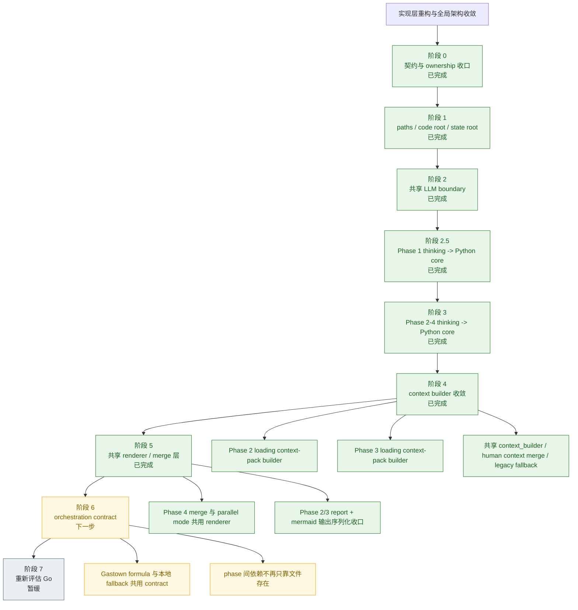

# 实现层重构与全局架构收敛计划

日期：2026-03-20  
项目：twinbox

## 执行摘要

这轮优化不应被理解为“换语言”，而应被理解为“先把实现层的边界拉直”。

当前更合适的目标形态仍然是：

```text
bash entrypoints / gastown formulas
  -> python core modules
      -> transport adapters / artifact store / llm adapters
```

结论保持不变：

- `bash` 保留在入口、环境装配、薄编排、向后兼容层
- `Python` 接管可测试的核心实现层
- `Go` 暂缓到常驻 runtime / worker service / listener manager 真的出现时再评估

但执行顺序需要更保守，也更清晰。

## 当前状态快照（2026-03-20）

| 阶段 | 目标 | 当前状态 | 说明 |
|------|------|----------|------|
| 阶段 0 | authoritative artifact / state-report ownership 收口 | ✅ 已完成 | 已补 `validation-artifact-contract.md`，并把“运行时输入不再挂在 docs/validation”收口到 `runtime/context/` |
| 阶段 1 | `code root / state root` 与路径底座 | ✅ 已完成 | `twinbox_core.paths` 已接管根路径解析，Phase 1-4 都走 canonical state root |
| 阶段 2 | 统一 LLM boundary | ✅ 已完成 | `twinbox_core.llm` 与 `scripts/llm_common.sh` 已成为共享 transport / retry / JSON repair 边界 |
| 阶段 2.5 | Phase 1 thinking 迁入 Python core | ✅ 已完成 | `phase1_thinking.sh` 已缩成 shell 入口，核心在 `twinbox_core.phase1_intent` |
| 阶段 3 | Phase 2-4 thinking 迁入 Python core | ✅ 已完成 | `phase2/3/4` thinking、Phase 4 子任务与 merge 已迁入 Python core，shell 入口仅保留薄包装 |
| 阶段 4 | context builder 收敛 | ✅ 已完成 | `phase2_loading.sh` / `phase3_loading.sh` 已改成薄 shell 入口，共用 `twinbox_core.context_builder` |
| 阶段 5 | render / merge 收敛到共享 renderer | ✅ 已完成 | Phase 2/3/4 的 YAML / Markdown / Mermaid 序列化已收口到 `twinbox_core.renderer` |
| 阶段 6 | orchestration contract | 🚧 下一步 | pipeline 依赖仍主要基于脚本和文件约定，Gastown 与本地 fallback 还没有共享 contract surface |
| 阶段 7 | Go 重新评估 | ⏸ 暂缓 | 仍不在当前收益最高路径上 |

## 执行树（总览）

下面这棵执行树强调两件事：

- 先走“不会反复返工”的底座主干，再进入实现层迁移
- 当前已经走完的分支、下一步要接的分支、暂缓分支一眼可见



阅读顺序建议：

1. 先看主干：`阶段 0 -> 阶段 5` 是已经收口的稳定路径
2. 再看当前焦点：`阶段 6` 是下一批最该做、且返工风险最低的分支
3. 最后看保留分支：`阶段 7` 仍只在 runtime / worker 常驻化后再讨论

## 自我批判性评估

### 这个方案里值得保留的创新

- 它没有把问题误诊成“shell 不好”，而是识别出真正的摩擦点在契约、状态根、LLM 边界和重复 builder
- 它试图把浅脚本收敛成深模块，这对测试性、可导航性、后续多 agent 集成都有长期价值
- 它保留现有 `scripts/*.sh` 与 gastown formula 入口，避免一次性重写执行面

### 这个方案当前高估了什么

- 高估了“先建 Python core”本身的价值；如果 authoritative artifact 还没定清楚，只是把漂移接口搬到新语言
- 高估了“目录形态设计”对短期收益的贡献；目录可以先最小落地，不需要一步到位铺满所有子模块
- 高估了“大块迁移 context builder”的时机；在路径语义、artifact owner、state/report 边界未收口前，迁得越快，返工越大

### 这个方案当前低估了什么

- 低估了 `attention-budget` 契约漂移对所有后续 phase 的放大效应
- 低估了 `Phase 1-3` 仍未完全共享 `code root / state root` 语义带来的多 worktree 风险
- 低估了“文档产物兼做运行输入”对稳定性的侵蚀；这会让重构很容易被 markdown 格式耦住

### 平衡创新和稳定性的收敛判断

因此，本方案不应以“先迁最多逻辑”为第一目标，而应以“先建立后续迁移不会反复推倒的底座”为第一目标。

收敛后的执行原则是：

1. 先收口契约，再开语言层迁移
2. 第一批代码只动共享底座，不动 phase 语义
3. 保持 shell 和 formula 入口稳定，只做内部替换
4. 每一阶段都必须有最小可验证输出，而不是只完成抽象设计

## 为什么不是现在就上 Go

Go 当然有价值，但它当前不是最优先的解。

Go 擅长：

- 强类型的长期维护
- 并发与常驻进程
- 单文件二进制分发
- service/runtime 产品化

而 twinbox 当前更痛的地方是：

- phase 间 artifact contract 漂移
- shell / inline Node 里堆了过多数据处理
- LLM 调用边界不统一
- 文档产物与运行时产物 ownership 混在一起
- docs 里的语义与实际脚本产物已经出现偏差

这些问题的第一阶段更像“把浅模块收成深模块”，不是“把脚本改写成高性能服务”。

`Python` 在这一阶段的收益更直接：

- 更容易表达数据模型和 schema 校验
- 更容易做 fixture test / contract test / golden test
- JSON / YAML / markdown / mermaid 处理都比 shell 自然
- 可以保留现有 `bash scripts/*.sh` 和 formula 入口，不破坏 Gastown 现状

## 推荐决策

如果这轮优化现在就要启动，推荐决策调整为：

1. 先确认 authoritative artifact 与 state/report ownership
2. 第一批实现只落 `Python core` 的共享底座，不先迁大块业务逻辑
3. 优先迁 `paths/state-root` 与共享 LLM 边界，再迁 `context builder`
4. `Go` 延后到 orchestration/runtime 真的需要常驻化时再讨论

这比“先选一门更强的语言”更重要。

## 渐进式执行顺序

### 阶段 0：先收紧契约，不先重写

目标：

- 明确每个 phase 的 authoritative artifact
- 决定 `attention-budget.yaml` 是否真的是主线契约
- 区分 state artifact 与 report artifact

输出：

- phase artifact contract 文档
- 状态产物与文档产物的 ownership 规则

说明：

这是零阶段，不是为了拖慢实现，而是为了避免把混乱从 bash 搬到 Python。

### 阶段 1：落共享路径与状态根底座

目标：

- 建 `python/pyproject.toml`
- 建 `twinbox_core.paths`
- 把 `code root / canonical root / state root` 解析迁到 Python
- 保持现有 shell 接口不变，让 shell 只做薄封装

优先迁移：

- `scripts/twinbox_paths.sh`
- `scripts/register_canonical_root.sh` 依赖的根路径解析
- 所有 Phase 4 现有脚本共享的状态根语义

完成标准：

- shell 不再自己实现复杂的路径判断
- linked worktree 与本地 checkout 使用同一套解析逻辑
- 至少有一组路径解析单测覆盖正常路径、worktree 路径与错误路径

### 阶段 2：收敛 LLM boundary

目标：

- 建 `twinbox_core.llm`
- 统一 provider 差异、retry、timeout、JSON repair
- 停止各 phase thinking 各自处理 transport / parse 差异

优先迁移：

- `scripts/llm_common.sh`
- `scripts/phase1_thinking.sh` 内自带的 transport / parse 流程

完成标准：

- phase thinking 不再各自处理 provider 差异
- malformed JSON、timeout、retry 可以围绕一个统一边界测试

### 阶段 3：迁 context builder

目标：

- 合并 `Phase 2/3` 的 envelope normalization
- 合并 human context merge
- 合并 legacy fallback
- 建共享 `context_builder`

优先对象：

- `scripts/phase2_loading.sh`
- `scripts/phase3_loading.sh`

完成标准：

- `Phase 2/3 loading` 只负责调用 Python module 并落盘
- 同一个“由 Phase 1 artifacts 派生 phase-ready context”的概念不再分裂在多个浅脚本里

### 阶段 4：迁 render / merge

目标：

- 拆出统一 renderer
- 让并行 fallback 与 merge-only 共享一份输出逻辑
- 把运行时状态与给人看的视图拆开

优先对象：

- `scripts/phase4_merge.sh`
- `scripts/phase4_thinking_parallel.sh` 中重复的 merge/render
- `Phase 2/3` 的 report + diagram 写入

完成标准：

- YAML / markdown / mermaid 序列化不再在多个脚本中复制
- 状态层测试不再被 markdown 视图格式绑死

### 阶段 5：收敛 orchestration contract

目标：

- pipeline dependency 不再只是“文件存在”
- phase 输入输出变成显式 contract
- Gastown formula 与本地 fallback 共用一个 orchestration surface

完成标准：

- phase 间依赖可以围绕显式 contract 断言
- 更高级的并发和失败恢复建立在稳定 contract 上，而不是脚本约定上

### 阶段 6：再评估 Go

只在以下条件成立时启动：

- listener / action runtime 要常驻运行
- 需要更强的 worker 隔离
- 需要长期稳定的并发任务执行层
- Python core 已经把 phase contract 稳定下来

如果这些前提未满足，上 Go 只会放大迁移面。

## 第一阶段现在就该做什么

如果今天只启动一批最小改动，应该只做这些：

1. 建 `python/pyproject.toml` 与 `src/twinbox_core/`
2. 迁 `twinbox_paths` 到 Python，并让 shell 只做薄封装
3. 为路径解析补一组最小单测

暂时不做：

- 直接迁 `phase2_loading` / `phase3_loading`
- 改写 `attention-budget` 读写流程
- 触碰 phase 业务语义或产物内容

## 全局架构摩擦点

语言层优化不应只盯着“脚本可读性”。当前至少有六个全局摩擦点需要一起考虑。

### 1. context-pack builder 重复

当前 `Phase 2` 和 `Phase 3` 的 loading 都在自己实现一份派生上下文逻辑：

- `normalizeEnvelope`
- sender/domain 统计
- thread key 归一化
- legacy fallback
- human context 合入

代表文件：

- `scripts/phase2_loading.sh`
- `scripts/phase3_loading.sh`

问题本质：

- 同一个“由 Phase 1 artifacts 派生 phase-ready context”概念，被拆成多个浅脚本
- 同样的逻辑以 inline Node 形式复制粘贴

影响：

- 修改输入契约时需要多处同步
- 测试只能围绕文件树和脚本执行搭建，成本高

### 2. LLM boundary 分裂

当前 LLM 调用边界不一致：

- `scripts/llm_common.sh` 提供公共 backend + retry + JSON repair
- `scripts/phase1_thinking.sh` 仍自带一套 transport / parse 流程
- prompt 组装、返回修复、provider 差异处理没有一个统一 contract

问题本质：

- 仓库没有一个 authoritative 的 “LLM request/response boundary”

影响：

- phase 间行为不一致
- 无法集中做 malformed JSON、timeout、retry、schema drift 测试

### 3. artifact ownership 混合

当前单个脚本经常同时负责：

- LLM 调用
- 结构化状态产物
- YAML 序列化
- markdown 报告
- mermaid 图表

代表文件：

- `scripts/phase2_thinking.sh`
- `scripts/phase3_thinking.sh`
- `scripts/phase4_merge.sh`

问题本质：

- “运行时状态”与“给人看的报告”没有边界

影响：

- 很难只测状态正确，不顺带把文档格式一并锁死
- 重构数据层时容易被 markdown 快照拖住

### 4. attention-budget 契约漂移

文档已经把 `attention-budget.yaml` 定义成阶段间核心契约，但脚本侧大多还没真正围绕它收敛。

问题本质：

- spec 里以 attention budget 为主线
- runtime 里更多还是靠“某几个文件存在”推进阶段依赖

影响：

- 跨 phase 测试无法围绕一个稳定工件断言
- 架构故事与实现路径在逐步背离

### 5. docs/runtime 耦合

当前 loader 会直接读取 `docs/validation/` 下的 markdown 作为输入的一部分。

问题本质：

- 文档目录既是报告面，也是运行输入面

影响：

- 文档格式调整可能破坏运行
- 测试 fixture 必须同时准备 runtime 数据和 markdown 文本

### 6. state root 模型只在 Phase 4 收敛

`Phase 4` 已经引入 `code root / state root` 分离，但 `Phase 1-3` 仍主要把 repo root 当一切的根。

问题本质：

- 多 worktree 语义在不同 phase 中不一致

影响：

- 本地串行和 Gastown worker 模式不是同一个状态模型
- 上游 phase 后续很可能重复踩一遍 Phase 4 刚处理过的问题

## 目标分层

目标不是“把所有 shell 脚本删掉”，而是把职责重分配。

### 1. Shell Layer

职责：

- 参数入口
- 环境装配
- 调用 Python 命令
- 保持与现有 formula / `gt sling` / 本地手工命令兼容

应该保留在 shell 的典型内容：

- `check_env`
- `render_himalaya_config`
- `phase4_gastown.sh`
- `run_pipeline.sh`

约束：

- 不承载复杂数据处理
- 不承载 artifact 序列化
- 不承载 LLM 协议细节

### 2. Python Core Layer

职责：

- phase 输入模型
- phase artifact contract
- context-pack builder
- thread normalization
- attention-budget 读写
- LLM request/response abstraction
- output renderer

这是最应该“加深模块”的层。

目标特征：

- 暴露小接口
- 把 JSON/YAML/markdown 细节封装在内部
- 支持 fixture-driven tests

### 3. Adapter Layer

职责：

- Himalaya / mailbox CLI 调用
- 文件系统 artifact store
- LLM provider adapter

这层要尽量薄，给 core 提供稳定依赖。

### 4. Future Runtime Layer

暂不实现，但为未来留接口：

- listener runner
- action instance materializer
- review / audit pipeline
- scheduler / daemon / worker service

这个阶段才值得认真评估是否引入 `Go`。

## 推荐目录形态

建议从当前仓库平滑演进到这种结构：

```text
scripts/
  run_pipeline.sh
  phase1_loading.sh
  phase1_thinking.sh
  phase4_gastown.sh

python/
  pyproject.toml
  src/twinbox_core/
    paths.py
    artifacts/
      phase1.py
      phase2.py
      phase3.py
      phase4.py
      attention_budget.py
    context/
      mailbox_snapshot.py
      context_builder.py
      human_context.py
      thread_model.py
    llm/
      client.py
      schema.py
      repair.py
      prompts/
        phase1.py
        phase2.py
        phase3.py
        phase4.py
    render/
      reports.py
      mermaid.py
      yaml_outputs.py
    orchestration/
      phase_runner.py
      dependencies.py
      state_root.py
tests/
  fixtures/
  contract/
  integration/
```

说明：

- `scripts/` 不消失，只变薄
- `python/` 是中编程层
- `tests/` 围绕 Python core 建立，而不是围绕 shell 文本

## 迁移原则

### 1. Replace, do not stack

不要在 bash 外再包一层 Python，但旧 shell 逻辑还继续存在。

应该是：

- shell 入口保留
- 核心逻辑迁出
- 旧的 inline 逻辑逐步删除

### 2. Contract before implementation

先定义 authoritative artifact，再迁语言层。

否则只是在新语言里继续复制漂移的接口。

### 3. State before report

先把运行时状态产物收敛，再考虑 markdown/diagram。

报告是视图，不应反过来决定核心模型。

### 4. Keep formulas stable

公式和 `gt sling` 入口尽量保持不变。

迁移优先做“内部替换”，避免同时改：

- 语言层
- 目录结构
- 公式行为
- phase 语义

### 5. Extend state-root model upward

`Phase 4` 的 `code root / state root` 分离不应该停在 Phase 4。

后续 `Phase 2/3` 若继续参与 worker fan-out，也应复用同一套状态根语义。

## 非目标

这轮语言层优化不应顺手做这些事：

- 全量重写成 Go
- 改变 Phase 1-4 的产品语义
- 现在就做 listener runtime
- 引入前端或服务化部署
- 为了“类型更强”而先大规模改目录

## 与现有文档的关系

- `docs/architecture.md` 定义目标架构与长期原则
- `docs/specs/validation-artifact-contract.md` 定义当前 authoritative runtime artifact 与 state/report 边界
- `docs/plans/progressive-validation-framework.md` 定义阶段漏斗与验证语义
- `docs/plans/gastown-multi-agent-integration.md` 定义 Gastown 编排现状
- 本文档只回答一个问题：当前仓库应如何优化语言层和中编程层，才能支撑后续架构收敛
