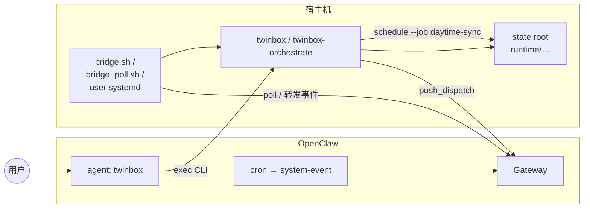

# Twinbox × OpenClaw 部署模型

> **本文面向理解设计**：三层分工、数据流、交付形态选型、部署前决策清单。
> 操作步骤见 [openclaw-skill/DEPLOY.md](../../openclaw-skill/DEPLOY.md)。
> 权威架构表述见 [architecture.md](./architecture.md)；编排边界见 [orchestration.md](./orchestration.md)。

---

## 1. 两层初始化（设计依据）

架构文档将入口分为两类，**不能互相替代**：

- **用户态初始化**：邮箱探测、画像、材料、路由规则、推送订阅等，通过**对话式渐进流程**完成，写入标准化 context / profile / rule / subscription 状态（同一 **state root**）。
- **宿主态部署**：OpenClaw skill 文件同步、Gateway reload、`skills.entries.twinbox.env`、可选 bridge / poller / systemd，属于**宿主执行面**，不能假设仅靠渠道消息框自动闭环。

因此：**操作文档 §3 前几步是「接线」；§3.8 起是「在已接线的 agent 里引导用户完成配置」**。

---

## 2. 三层分工（执行面）

| 层次 | 做什么 | 谁触发 | 典型入口 |
|------|--------|--------|----------|
| **宿主态接线** | OpenClaw 安装、Twinbox CLI、`code-root` / `state-root`、安装根 SKILL.md、`skills.entries.twinbox.env`、Gateway 重启、可选 bridge/timer | 运维 / 你在 shell | 操作文档 §3.1–§3.5、§3.9 |
| **用户态对话引导** | 在 `twinbox` agent 会话中，由模型按 SKILL.md 调用 CLI，分阶段完成邮箱、画像、材料、路由、推送订阅 | 用户与 agent 多轮对话 | `twinbox onboarding start \| status \| next --json`，辅以 `mailbox detect`、`task mailbox-status` 等 |
| **后台刷新与推送** | 长耗时 phase 流水线**不占用**聊天 turn；由宿主机调度驱动 `twinbox-orchestrate schedule --job …`；`daytime-sync` 成功且存在启用订阅时可触发推送分发 | systemd timer、或 OpenClaw `cron` → 宿主消费 | [orchestration.md](./orchestration.md)（`daytime-sync`、`push_dispatch`、`bridge` / `bridge-poll`） |

---

## 3. 端到端数据流（简图）

要点：

- **对话引导路径**：`用户 ↔ twinbox agent →（工具/exec）twinbox … → state root`。
- **后台路径**：OpenClaw 没有「直接在宿主跑 twinbox」的一等入口；宿主侧需显式用 `bridge` 或 `bridge-poll` 再调用 `twinbox-orchestrate schedule`。
- **`push_dispatch`**：`daytime-sync` 成功且存在启用订阅时，编排层触发推送分发（`openclaw sessions send`），结果写入 `runtime/audit/schedule-runs.jsonl`。与「用户在聊天里订阅」（`twinbox push subscribe SESSION_ID`）是前后衔接关系。

---

## 4. 按时间顺序：「对话」与「后台」衔接

1. **接线完成前**：不要指望在聊天里完成 `cp SKILL.md`、`openclaw.json` 编辑或 systemd 安装。
2. **接线完成后**：在 `twinbox` agent、且 skill 已注入当前会话后，走 onboarding 流程（`onboarding start` → 多轮对话 → `onboarding next` 直到 `completed`）。
3. **需要定时刷新时**：启用宿主调度（bridge + systemd timer），使 `daytime-sync` 等 job 按钟点运行。
4. **日常只读查询**：在 `twinbox` agent 用显式 `twinbox task …` 或插件工具，不要把长 `twinbox-orchestrate run` 塞进普通聊天 turn。

---

## 5. 常见误解

- 对话引导**不能**代替宿主接线（无法仅靠聊天写入 `~/.openclaw/openclaw.json` 或替你执行 `cp SKILL.md`）。
- 一旦托管侧 env 与 skill 就绪，**推荐**把 Twinbox 用户配置主路径放在 OpenClaw 对话里走 onboarding，而非要求用户 SSH 手改文件。
- `openclaw skills info twinbox` 显示 `Ready` **不等于**当前会话 prompt 已包含 `twinbox`（见 [TROUBLESHOOT.md §1](../../openclaw-skill/TROUBLESHOOT.md)）。

---

## 6. 部署前决策清单

| # | 问题 | 若选「是」通常意味着 |
|---|------|----------------------|
| 1 | 是否需要**日内多次**刷新 Phase 4 产物？ | 必须落实宿主调度（§3.9），不能只依赖用户手动在聊天里跑 orchestrate。 |
| 2 | 推送是否要**稳定到达**某一 OpenClaw session？ | 对话阶段完成 `push subscribe` + 后台 `daytime-sync` 成功；核对 [orchestration.md](./orchestration.md) 与审计日志。 |
| 3 | 团队是否多人使用同一 state root？ | 共享单一 `state root`；调度去重见 orchestration 中 `schedule.lock` 与 `activity-pulse` 说明。 |
| 4 | 是否允许依赖 OpenClaw**自动消费** skill schedule metadata？ | 当前仍属**待验/未见正面证据**；生产路径以 **bridge + 显式 cron** 为准。 |

---

## 7. Skill 交付形态（选型）

| 方式 | 适用 | twinbox 现状 |
|------|------|--------------|
| Markdown `SKILL.md` + exec | 迭代快；默认路径 | **默认** |
| 插件 `registerTool` | 稳定 schema、确定性任务 | **按需**（见操作文档 §3.5） |

- **方案 A：直接使用仓库根**：适合自托管与快速迭代；根 SKILL.md 即 manifest。
- **方案 B：从 `openclaw-skill/` 导出独立包**：适合版本化发布；需额外维护导出流程（仓库内尚未定型）。

---

**文档版本**：本文为设计模型；操作主路径见 [openclaw-skill/DEPLOY.md](../../openclaw-skill/DEPLOY.md)。
