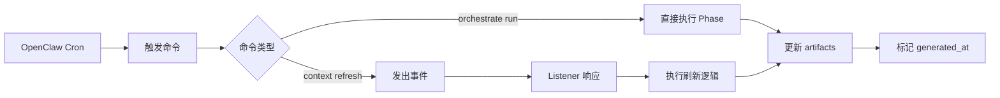

# OpenClaw Scheduling Integration

日期：2026-03-23
状态：Draft

## 执行摘要

本文档定义 twinbox 如何与 OpenClaw 的定时调度功能集成，实现 cadence 运行策略中定义的预计算刷新。

**核心原则**：

- 使用 OpenClaw 原生的 cron 调度能力
- 配置集中在 SKILL.md 的 metadata 中
- 保持命令接口简单，便于手动触发和调试
- 支持事件驱动的 listener 扩展

---

## OpenClaw Cron 配置

### 1. SKILL.md 元数据扩展

在 `SKILL.md` 中添加 `schedules` 配置：

```yaml
---
name: email-himalaya-assistant
description: Thread-centric email copilot for OpenClaw
metadata:
  openclaw:
    requires:
      env:
        - IMAP_HOST
        - IMAP_PORT
        - IMAP_LOGIN
        - IMAP_PASS
        - SMTP_HOST
        - SMTP_PORT
        - SMTP_LOGIN
        - SMTP_PASS
    primaryEnv: IMAP_LOGIN
    login:
      mode: password-env
      runtimeRequiredEnv:
        - IMAP_HOST
        - IMAP_PORT
        - IMAP_LOGIN
        - IMAP_PASS
        - SMTP_HOST
        - SMTP_PORT
        - SMTP_LOGIN
        - SMTP_PASS
        - MAIL_ADDRESS
      optionalDefaults:
        MAIL_ACCOUNT_NAME: myTwinbox
        MAIL_DISPLAY_NAME: "{MAIL_ACCOUNT_NAME}"
        IMAP_ENCRYPTION: tls
        SMTP_ENCRYPTION: tls
      stages:
        - unconfigured
        - validated
        - mailbox-connected
      preflightCommand: "twinbox mailbox preflight --json"
    schedules:
      - name: daily-refresh
        cron: "30 8 * * *"
        command: "twinbox orchestrate run phase4"
        description: "每日 8:30 刷新队列和摘要"
        enabled: true
      - name: weekly-refresh
        cron: "30 17 * * 5"
        command: "twinbox orchestrate run phase4"
        description: "每周五 17:30 刷新周报"
        enabled: true
      - name: nightly-full-refresh
        cron: "0 2 * * *"
        command: "twinbox orchestrate run phase1 phase2 phase3 phase4"
        description: "夜间全量校正，修正漂移"
        enabled: true
---
```

登录预检契约说明：

- `requires.env`：OpenClaw 表单最小登录集
- `login.runtimeRequiredEnv`：twinbox 实际运行与只读 preflight 所需字段
- `login.optionalDefaults`：OpenClaw 未显式收集时由 twinbox 自动补全
- `login.preflightCommand`：OpenClaw 在收集字段后调用的稳定 JSON 接口

### 2. Cron 表达式说明

| Schedule | Cron | 说明 |
|----------|------|------|
| daily-refresh | `30 8 * * *` | 每天早上 8:30 |
| weekly-refresh | `30 17 * * 5` | 每周五下午 17:30 |
| nightly-full-refresh | `0 2 * * *` | 每天凌晨 2:00 |

**注意**：
- Cron 表达式使用服务器本地时区
- OpenClaw 会在指定时间触发命令
- 命令在 skill 的工作目录中执行

---

## 命令接口设计

### 1. 刷新命令

**Phase 4 局部刷新**（快速）：
```bash
twinbox orchestrate run phase4
```

**全量刷新**（完整）：
```bash
twinbox orchestrate run phase1 phase2 phase3 phase4
```

**带事件触发的刷新**（未来）：
```bash
twinbox context refresh --trigger daily_digest_time
```

### 2. 命令特性

- **幂等性**：多次运行产生相同结果
- **原子性**：要么成功，要么失败，不留中间状态
- **可观测性**：输出 generated_at 时间戳，便于检测 stale
- **失败安全**：失败时保留上次成功的结果

---

## 事件驱动扩展

### 1. Listener 事件类型

当前定义的定时相关事件（`agent/custom_scripts/types.ts`）：

```typescript
export type ListenerEventType =
  | "daily_digest_time"      // 每日摘要时间
  | "context_updated"        // 上下文更新
  | "thread_entered_state"   // 线程状态变化
  | ...
```

### 2. 事件触发流程



### 3. Listener 实现示例（未来）

```typescript
// agent/custom_scripts/listeners/daily-refresh-listener.ts
export const dailyRefreshListener: ListenerDefinition = {
  id: "daily-refresh",
  name: "Daily Queue Refresh",
  eventTypes: ["daily_digest_time"],
  enabledByDefault: true,
  minimumPhase: "phase-4",
  riskLevel: "low",
  inputRequirements: [],
  outputTypes: ["queue_refresh"]
};

export async function handleDailyRefresh(ctx: ListenerContext): Promise<void> {
  // 1. 检查是否需要刷新（stale 检测）
  // 2. 执行 Phase 4 刷新
  // 3. 更新 generated_at
  // 4. 发出审计记录
}
```

---

## 失败处理和重试

### 1. OpenClaw 层面

OpenClaw 应该提供：
- 命令执行超时（建议 10 分钟）
- 失败重试（建议 3 次，间隔 5 分钟）
- 失败通知（邮件或日志）

### 2. Twinbox 层面

Twinbox 命令应该：
- 返回非零退出码表示失败
- 输出错误信息到 stderr
- 保留上次成功的 artifacts（不删除）

### 3. 重试策略

```yaml
schedules:
  - name: daily-refresh
    cron: "30 8 * * *"
    command: "twinbox orchestrate run phase4"
    retry:
      max_attempts: 3
      interval: 300  # 5 分钟
      backoff: exponential
```

---

## Stale 检测和告警

### 1. Stale 检测

每次查询时检测 `generated_at` 是否超过阈值：

```python
def _is_stale(generated_at_str: str, max_age_hours: int = 24) -> bool:
    generated = datetime.fromisoformat(generated_at_str)
    now = datetime.now(generated.tzinfo)
    age_hours = (now - generated).total_seconds() / 3600
    return age_hours > max_age_hours
```

### 2. 告警机制（未来）

当检测到 stale 时：
- 在 CLI 输出中显示 `[STALE]` 标记
- 记录到审计日志
- 可选：发送通知到 OpenClaw

---

## 部署和配置

### 1. Skill 部署时

OpenClaw 读取 `SKILL.md` 的 `metadata.openclaw.schedules`：
1. 解析 cron 表达式
2. 注册定时任务到调度器
3. 验证命令可执行性

### 2. 环境变量

确保以下环境变量已设置：
- `TWINBOX_CANONICAL_ROOT`：twinbox 工作目录
- `IMAP_*` / `SMTP_*`：邮箱凭证

### 3. 权限要求

- 读写 `runtime/` 目录
- 执行 `twinbox` 命令
- 访问 IMAP/SMTP 服务

---

## 手动触发和调试

### 1. 手动触发

用户可以随时手动触发刷新：

```bash
# 快速刷新
twinbox orchestrate run phase4

# 全量刷新
twinbox orchestrate run phase1 phase2 phase3 phase4

# 查看队列状态
twinbox queue list
```

### 2. 调试命令

```bash
# 检查 stale 状态
twinbox queue show urgent --json | jq '.stale'

# 查看最后刷新时间
twinbox queue show urgent --json | jq '.generated_at'

# 查看 orchestration 状态
twinbox orchestrate status
```

---

## 兼容性和迁移

### 1. 非 OpenClaw 环境

如果不在 OpenClaw 环境中，可以使用：

**系统 cron**：
```cron
30 8 * * * cd /path/to/twinbox && twinbox orchestrate run phase4
30 17 * * 5 cd /path/to/twinbox && twinbox orchestrate run phase4
0 2 * * * cd /path/to/twinbox && twinbox orchestrate run phase1 phase2 phase3 phase4
```

**systemd timer**：
```ini
[Unit]
Description=Twinbox Daily Refresh

[Timer]
OnCalendar=*-*-* 08:30:00
Persistent=true

[Install]
WantedBy=timers.target
```

### 2. 从手动到自动的迁移

1. 阶段 1：手动触发，验证功能
2. 阶段 2：启用 daily-refresh，观察稳定性
3. 阶段 3：启用 weekly-refresh 和 nightly-full-refresh
4. 阶段 4：启用 listener 事件驱动（未来）

---

## 实现检查清单

- [ ] 更新 SKILL.md 添加 schedules 配置
- [ ] 验证 OpenClaw 能解析 schedules 元数据
- [ ] 测试 cron 触发命令执行
- [ ] 实现失败重试逻辑
- [ ] 添加 stale 告警机制
- [ ] 编写部署文档
- [ ] 实现 listener 事件驱动（未来）

---

## 参考文档

- [cadence-runtime-strategy.md](./cadence.md) - Cadence 运行策略
- [SKILL.md](../../SKILL.md) - OpenClaw skill 定义
- [agent/README.md](../../agent/README.md) - Agent runtime 骨架
- [agent/custom_scripts/types.ts](../../agent/custom_scripts/types.ts) - Listener 事件类型
