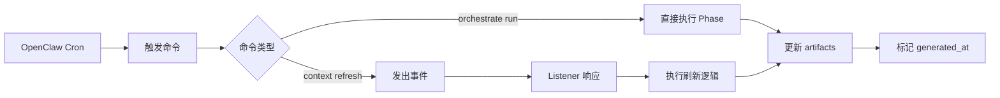

# OpenClaw Scheduling Integration

日期：2026-03-23
状态：Draft

## 执行摘要

本文档定义 twinbox 如何与 OpenClaw 的定时调度功能集成，实现 cadence 运行策略中定义的预计算刷新。

注意：截至 2026-03-26，本机 OpenClaw 仍没有“自动消费 skill schedule metadata 并注册 job”的实测证据。当前已跑通的最小闭环是 `openclaw cron -> system-event -> 宿主 bridge/poller -> twinbox-orchestrate schedule --job ...`。因此本文档目前应读作“Twinbox 默认 schedule 配置 + bridge cron 集成说明”，不是平台已完全接通的事实说明。

**核心原则**：

- `config/schedules.yaml` 是 Twinbox 默认 schedule 配置的 source of truth
- 当前运行闭环优先走 OpenClaw Gateway `cron` + `system-event` + 宿主 bridge
- 保持命令接口简单，便于手动触发和调试
- listener / event-driven 扩展仍属于后续演进面

### 0. 2026-03-26 复核结论

本机再次做了两层复核：

1. 真实执行 `openclaw cron list --all --json`，Gateway 里只看到一个 Twinbox 相关 cron job：`twinbox-daily-refresh`
2. 该 job 的 payload 是 `systemEvent`，文本为 `{"kind":"twinbox.schedule","job":"daytime-sync","event_source":"openclaw.system-event"}`
3. `weekly-refresh` / `nightly-full-refresh` 并没有因为 skill metadata 而自动出现
4. 该现存 job 与 `src/twinbox_core/schedule_override.py` 里的 `platform_name` / `scheduled_job` 绑定完全一致，说明它来自 Twinbox 的主动 bridge cron 同步逻辑，不是平台自动从 skill metadata 导入
5. 在本机 OpenClaw 安装包中未检索到 schedule metadata 的消费实现；当前可见的是通用 cron store / cron CLI 能力

因此，当前结论应视为：

- skill schedule metadata 仍未见平台消费证据
- 平台原生自动导入 cron job 仍未证实
- 生产可依赖路径仍是 Twinbox 主动维护 bridge cron job

---

## Twinbox 默认 Schedule 与桥接配置

### 1. Twinbox 默认 Schedule 配置

Twinbox 默认 schedule 现在定义在 [`config/schedules.yaml`](../../config/schedules.yaml)：

```yaml
timezone: Asia/Shanghai
schedules:
  - name: daily-refresh
    cron: "30 8 * * *"
    command: "twinbox-orchestrate run --phase 4"
    description: "每日 8:30 刷新队列和摘要"
  - name: weekly-refresh
    cron: "30 17 * * 5"
    command: "twinbox-orchestrate run --phase 4"
    description: "每周五 17:30 刷新周报"
  - name: nightly-full-refresh
    cron: "0 2 * * *"
    command: "twinbox-orchestrate run"
    description: "夜间全量校正，修正漂移"
```

登录预检契约说明：

- `SKILL.md` 的 `metadata.openclaw.requires.env`：OpenClaw 表单最小登录集
- `SKILL.md` 的 `metadata.openclaw.login.runtimeRequiredEnv`：twinbox 实际运行与只读 preflight 所需字段
- `SKILL.md` 的 `metadata.openclaw.login.optionalDefaults`：OpenClaw 未显式收集时由 twinbox 自动补全
- `SKILL.md` 的 `metadata.openclaw.login.preflightCommand`：OpenClaw 在收集字段后调用的稳定 JSON 接口

### 2. Cron 表达式说明

| Schedule | Cron | 说明 |
|----------|------|------|
| daily-refresh | `30 8 * * *` | 每天早上 8:30 |
| weekly-refresh | `30 17 * * 5` | 每周五下午 17:30 |
| nightly-full-refresh | `0 2 * * *` | 每天凌晨 2:00 |

**注意**：
- Cron 表达式使用服务器本地时区
- 在当前已验证路径里，真正执行命令的是 Twinbox 维护的 bridge cron job，而不是 skill metadata 自动导入

---

## 命令接口设计

### 1. 刷新命令

**Phase 4 局部刷新**（快速）：
```bash
twinbox-orchestrate run --phase 4
```

**全量刷新**（完整）：
```bash
twinbox-orchestrate run
```

**带事件触发的刷新**（未来）：
```bash
twinbox context refresh --trigger daily_digest_time
```

### 2. 命令特性

- **幂等性**：多次运行产生相同结果
- **原子性**：要么成功，要么失败，不留中间状态
- **可观测性**：输出 generated_at 时间戳，便于检测 stale
- **失败安全**：失败时保留上次成功的结果

---

## 事件驱动扩展

### 1. Listener 事件类型

当前定义的定时相关事件（见 [runtime.md](./runtime.md) 的 event model）：

```typescript
export type ListenerEventType =
  | "daily_digest_time"      // 每日摘要时间
  | "context_updated"        // 上下文更新
  | "thread_entered_state"   // 线程状态变化
  | ...
```

### 2. 事件触发流程



### 3. Listener 实现示例（未来）

```typescript
// Illustrative contract sketch only.
export const dailyRefreshListener: ListenerDefinition = {
  id: "daily-refresh",
  name: "Daily Queue Refresh",
  eventTypes: ["daily_digest_time"],
  enabledByDefault: true,
  minimumPhase: "phase-4",
  riskLevel: "low",
  inputRequirements: [],
  outputTypes: ["queue_refresh"]
};

export async function handleDailyRefresh(ctx: ListenerContext): Promise<void> {
  // 1. 检查是否需要刷新（stale 检测）
  // 2. 执行 Phase 4 刷新
  // 3. 更新 generated_at
  // 4. 发出审计记录
}
```

---

## 失败处理和重试

### 1. OpenClaw 层面

OpenClaw 应该提供：
- 命令执行超时（建议 10 分钟）
- 失败重试（建议 3 次，间隔 5 分钟）
- 失败通知（邮件或日志）

### 2. Twinbox 层面

Twinbox 命令应该：
- 返回非零退出码表示失败
- 输出错误信息到 stderr
- 保留上次成功的 artifacts（不删除）

### 3. 重试策略

```yaml
schedules:
  - name: daily-refresh
    cron: "30 8 * * *"
    command: "twinbox-orchestrate run --phase 4"
    retry:
      max_attempts: 3
      interval: 300  # 5 分钟
      backoff: exponential
```

---

## Stale 检测和告警

### 1. Stale 检测

每次查询时检测 `generated_at` 是否超过阈值：

```python
def _is_stale(generated_at_str: str, max_age_hours: int = 24) -> bool:
    generated = datetime.fromisoformat(generated_at_str)
    now = datetime.now(generated.tzinfo)
    age_hours = (now - generated).total_seconds() / 3600
    return age_hours > max_age_hours
```

### 2. 告警机制（未来）

当检测到 stale 时：
- 在 CLI 输出中显示 `[STALE]` 标记
- 记录到审计日志
- 可选：发送通知到 OpenClaw

---

## 部署和配置

### 1. Skill 部署时

当前可确认的是：
1. Twinbox 当前默认 schedule 定义来自 `config/schedules.yaml`
2. `twinbox schedule list/update/reset` 与 OpenClaw bridge cron 同步都以该配置为默认值来源
3. 当前本机实测未见平台自动把 skill metadata 注册为 cron job；至少在 2026-03-26 的 `cron list` 里，删除 bridge job 后它们不会自动重建

当前已实测的最小闭环是：
1. 用 `openclaw cron` 创建 `system-event` job
2. 宿主 poller 消费 Gateway `cron.runs`
3. 由 `twinbox-orchestrate bridge` / `schedule --job ...` 执行对应刷新
4. 当执行的是 `daytime-sync` 且存在启用订阅时，Twinbox 会在刷新成功后自动调用 push dispatcher，通过 `openclaw sessions send` 向已订阅 session 分发摘要；分发结果会写入 `schedule` 返回载荷和 `runtime/audit/schedule-runs.jsonl` 的 `push_dispatch` 字段，分发异常不会让整个调度 job 失败

### 2. 环境变量

确保以下环境变量已设置：
- `TWINBOX_CODE_ROOT` / `TWINBOX_STATE_ROOT`：Twinbox 代码根与状态根
- `TWINBOX_CANONICAL_ROOT`：legacy alias，仅兼容旧路径
- `IMAP_*` / `SMTP_*`：邮箱凭证

### 3. 权限要求

- 读写 `runtime/` 目录
- 执行 `twinbox` 命令
- 访问 IMAP/SMTP 服务

---

## 手动触发和调试

### 1. 手动触发

用户可以随时手动触发刷新：

```bash
# 快速刷新
twinbox-orchestrate run --phase 4

# 全量刷新
twinbox-orchestrate run

# 查看队列状态
twinbox queue list
```

### 2. 调试命令

```bash
# 检查 stale 状态
twinbox queue show urgent --json | jq '.stale'

# 查看最后刷新时间
twinbox queue show urgent --json | jq '.generated_at'

# 查看 orchestration roots / contract
twinbox-orchestrate roots
twinbox-orchestrate contract --phase 4
```

---

## 兼容性和迁移

### 1. 非 OpenClaw 环境

如果不在 OpenClaw 环境中，可以使用：

**系统 cron**：
```cron
30 8 * * * cd /path/to/twinbox && twinbox-orchestrate run --phase 4
30 17 * * 5 cd /path/to/twinbox && twinbox-orchestrate run --phase 4
0 2 * * * cd /path/to/twinbox && twinbox-orchestrate run
```

**systemd timer**：
```ini
[Unit]
Description=Twinbox Daily Refresh

[Timer]
OnCalendar=*-*-* 08:30:00
Persistent=true

[Install]
WantedBy=timers.target
```

### 2. 从手动到自动的迁移

1. 阶段 1：手动触发，验证功能
2. 阶段 2：启用 daily-refresh，观察稳定性
3. 阶段 3：启用 weekly-refresh 和 nightly-full-refresh
4. 阶段 4：启用 listener 事件驱动（未来）

---

## 实现检查清单

- [x] 将 Twinbox 默认 schedule 配置独立到 `config/schedules.yaml`
- [ ] 验证 OpenClaw 能解析 skill schedule metadata 并自动导入 job（截至 2026-03-26，本机复核仍未得到正面证据）
- [x] 测试 `openclaw cron -> system-event -> host bridge` 触发命令执行
- [ ] 实现失败重试逻辑
- [ ] 添加 stale 告警机制
- [x] 编写部署文档
- [ ] 实现 listener 事件驱动（未来）

---

## 参考文档

- [cadence-runtime-strategy.md](./cadence.md) - Cadence 运行策略
- [SKILL.md](../../SKILL.md) - OpenClaw skill 定义
- [runtime.md](./runtime.md) - Runtime contract 与 listener/action 边界
