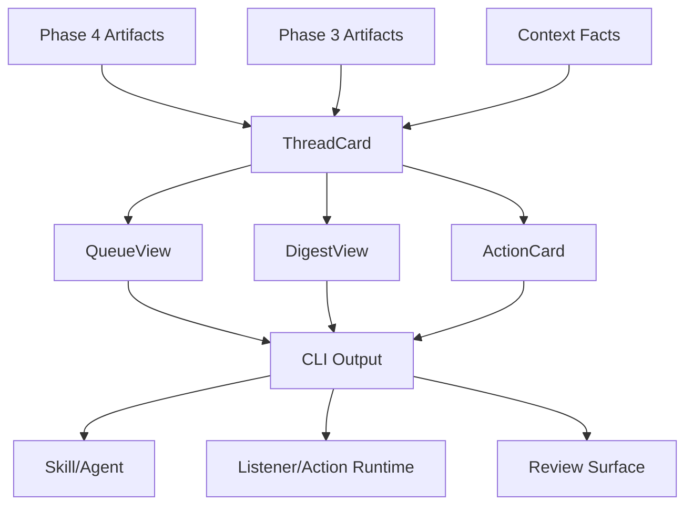

# Object Contract Specification

日期：2026-03-23
状态：Draft

## 执行摘要

本规范定义 twinbox task-facing CLI 的核心对象模型，确保 CLI、listener、review surface 和未来 runtime 共享一致的数据结构。

**核心原则**：

- 对象是 phase artifacts 的稳定投影，不是第二套数据源
- explainability 是默认能力，每个对象都包含 evidence 和 confidence
- 对象支持序列化为 JSON，便于脚本化和 API 集成
- 保持最小 schema，避免过度设计

## 核心对象

### ThreadCard

线程状态的轻量投影，用于队列显示和快速检视。

**字段定义**：

| 字段 | 类型 | 必需 | 说明 |
|------|------|------|------|
| `thread_id` | string | ✓ | 线程唯一标识符 |
| `state` | string | ✓ | 线程状态：`waiting_on_me` \| `waiting_on_them` \| `monitor_only` \| `cc_only` \| `closed` |
| `waiting_on` | string | ✓ | 等待对象：`me` \| `them` \| `external` \| `none` |
| `last_activity_at` | string \| null | ✓ | 最后活动时间（ISO 8601 格式） |
| `confidence` | float | ✓ | 状态推断置信度（0.0-1.0） |
| `evidence_refs` | list[string] | ✓ | 证据引用列表（envelope IDs） |
| `context_refs` | list[string] | ✓ | 上下文引用列表（context fact IDs） |
| `why` | string | ✓ | 简短解释（1-2 句话） |

**JSON 示例**：

```json
{
  "thread_id": "thread-abc123",
  "state": "waiting_on_me",
  "waiting_on": "me",
  "last_activity_at": "2026-03-23T10:30:00Z",
  "confidence": 0.85,
  "evidence_refs": ["envelope-5", "envelope-8"],
  "context_refs": ["escalation-policy"],
  "why": "Customer escalation, no response in 48h"
}
```

**实现位置**：`src/twinbox_core/task_cli.py::ThreadCard`

---

### QueueView

队列的稳定视图，包含排序后的线程列表和元数据。

**字段定义**：

| 字段 | 类型 | 必需 | 说明 |
|------|------|------|------|
| `queue_type` | string | ✓ | 队列类型：`urgent` \| `pending` \| `sla_risk` \| `stale` |
| `items` | list[ThreadCard] | ✓ | 线程卡片列表 |
| `rank_reason` | string | ✓ | 排序原因说明 |
| `review_required` | bool | ✓ | 是否需要人工审核 |
| `generated_at` | string | ✓ | 生成时间（ISO 8601 格式） |
| `stale` | bool | ✓ | 是否过期（超过 24 小时） |

**JSON 示例**：

```json
{
  "queue_type": "urgent",
  "items": [
    {
      "thread_id": "thread-abc123",
      "state": "waiting_on_me",
      ...
    }
  ],
  "rank_reason": "Sorted by urgency score and SLA risk",
  "review_required": false,
  "generated_at": "2026-03-23T09:00:00Z",
  "stale": false
}
```

**实现位置**：`src/twinbox_core/task_cli.py::QueueView`

---

### DigestView

摘要的结构化视图，支持 daily 和 weekly 两种类型。

**字段定义**：

| 字段 | 类型 | 必需 | 说明 |
|------|------|------|------|
| `digest_type` | string | ✓ | 摘要类型：`daily` \| `weekly` |
| `sections` | dict[string, any] | ✓ | 分节内容（结构因类型而异） |
| `generated_at` | string | ✓ | 生成时间（ISO 8601 格式） |
| `stale` | bool | ✓ | 是否过期 |

**Daily Digest sections**：

```yaml
urgent:
  items: list[ThreadCard]
pending:
  items: list[ThreadCard]
sla_risks:
  items: list[ThreadCard]
```

**Weekly Digest sections**：

```yaml
action_now: list[ThreadCard]  # 必须今天/下周一前处理
backlog: list[ThreadCard]      # 仍待处理但不紧急
important_changes: string      # 本周重要变化摘要
```

**JSON 示例（Weekly）**：

```json
{
  "digest_type": "weekly",
  "sections": {
    "action_now": [
      {
        "thread_id": "thread-abc123",
        "state": "waiting_on_me",
        ...
      }
    ],
    "backlog": [
      {
        "thread_id": "thread-def456",
        ...
      }
    ],
    "important_changes": "3 new escalations, 5 threads closed, 2 threads moved to monitor_only"
  },
  "generated_at": "2026-03-23T09:00:00Z",
  "stale": false
}
```

**实现位置**：`src/twinbox_core/task_cli.py::DigestView`

---

### ActionCard

动作建议（后续实现）。

**字段定义**：

| 字段 | 类型 | 必需 | 说明 |
|------|------|------|------|
| `action_id` | string | ✓ | 动作唯一标识符 |
| `thread_id` | string | ✓ | 关联线程 ID |
| `action_type` | string | ✓ | 动作类型：`reply` \| `forward` \| `archive` \| `flag` |
| `why_now` | string | ✓ | 为什么现在需要执行 |
| `risk_level` | string | ✓ | 风险等级：`low` \| `medium` \| `high` |
| `required_review_fields` | list[string] | ✓ | 需要审核的字段 |
| `suggested_draft_mode` | string \| null | ✓ | 建议的草稿模式 |

**实现位置**：`src/twinbox_core/task_cli.py::ActionCard`

---

## Explainability 默认能力

所有核心对象都应包含 explainability 字段：

- **evidence_refs**: 指向支持推断的证据（envelope IDs, message IDs）
- **context_refs**: 指向相关上下文（context fact IDs, profile keys）
- **confidence**: 推断置信度（0.0-1.0）
- **why**: 简短解释（1-2 句话）

这些字段不是可选附加，而是默认能力。

---

## 序列化规范

所有对象必须支持：

1. **to_dict()** 方法：转换为 Python dict
2. **JSON 序列化**：通过 `json.dumps()` 输出
3. **YAML 序列化**：通过 `yaml.dump()` 输出（可选）

示例：

```python
@dataclass(frozen=True)
class ThreadCard:
    thread_id: str
    state: str
    # ... other fields

    def to_dict(self) -> dict[str, Any]:
        return {
            "thread_id": self.thread_id,
            "state": self.state,
            # ... other fields
        }
```

---

## 对象关系



**关键原则**：

- ThreadCard 是最小单元，其他对象都包含 ThreadCard 列表
- 所有对象都从 Phase artifacts 投影而来，不是独立数据源
- CLI 输出这些对象，skill/agent/runtime 消费这些对象

---

## 实现检查清单

- [x] ThreadCard 定义和实现
- [x] QueueView 定义和实现
- [x] DigestView 定义和实现
- [x] ActionCard 定义和实现
- [x] ReviewItem 定义和实现
- [x] to_dict() 序列化方法
- [ ] JSON schema 验证（可选）
- [x] 单元测试覆盖

---

## 参考文档

- [task-facing-cli.md](./task-facing-cli.md) - CLI 命令规范
- [architecture.md](../architecture.md) - 整体架构
- [core-refactor-plan.md](../plans/core-refactor-plan.md) - 重构计划
