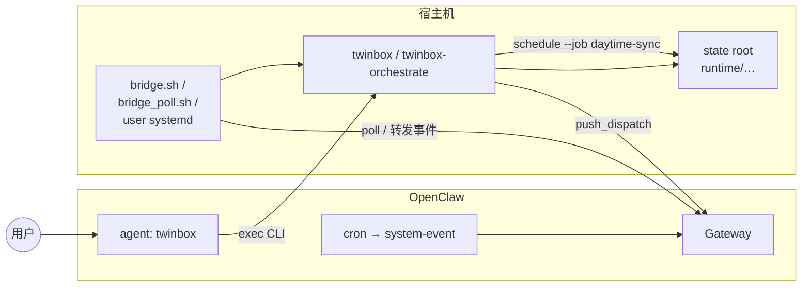

# Twinbox × OpenClaw 部署指南

本文档说明 **Twinbox 在 OpenClaw 托管环境下的部署与集成**：前置条件、安装顺序、配置要点、可选插件、验证清单、排障与回滚。与仓库根 [SKILL.md](../SKILL.md) 分工为：**SKILL.md 面向 agent 行为与契约；本文面向运维与集成。**

---

## 文档地图

| 你想做的事 | 阅读章节 |
|------------|----------|
| 理解「聊天里配 Twinbox」和「后台跑 phase」怎么分工 | **§2** |
| 按顺序从零接好 Twinbox × OpenClaw（含 Gateway 会话级 smoke） | **§3**（**§3.6.1**） |
| 升级 skill / CLI / 插件后怎么热更新 | **§4** |
| 模型总不执行 CLI，要确定性工具 | **§5** |
| `skills.entries.twinbox.env` 与 session 快照为何不一致 | **§7** |
| 专用 agent、cron、`system-event`、bridge 脚本怎么组合 | **§6** |
| 排障、回滚、已知未闭环项 | **§9**–**§11**、**附录 B** |
| OpenClaw 官方文档入口与 twinbox 映射 | **附录 A** |

---

## 1. 适用范围与路径约定

### 1.1 适用范围

- **覆盖**：Twinbox 作为 OpenClaw **托管 Markdown skill**（及可选 **插件工具**）的安装路径、`openclaw.json` 配置、roots 初始化、验证与常见误判。
- **不覆盖**：OpenClaw 本体的安装与升级（以 [docs.openclaw.ai](https://docs.openclaw.ai) 与你选用的发行方式为准）；Claude Code / Opencode 本地 `.claude/` skill。

目录说明 [README.md](./README.md) 中的策略与 smoke 摘要仍有效。

### 1.2 路径约定

- 文中 `bash scripts/...` 默认在 **Twinbox 仓库根目录** 执行。
- 若你当前在 `openclaw-skill/` 下，请使用 `bash ../scripts/...`。

---

## 2. 部署模型：宿主接线、对话引导与后台执行

本节把设计写清楚，再进入 **§3** 的操作步骤。权威架构表述见 [docs/ref/architecture.md](../docs/ref/architecture.md)（「支持的初始化模式」与共享 state root）；编排与推送边界见 [docs/ref/orchestration.md](../docs/ref/orchestration.md)。

### 2.1 架构上两层初始化（设计依据）

架构文档将入口分为两类，**不能互相替代**：

- **用户态初始化**：邮箱探测、画像、材料、路由规则、推送订阅等，可通过 **对话式渐进流程** 完成，最终写入 Twinbox 的标准化 context / profile / rule / subscription 状态（同一 **state root**）。
- **宿主态部署**：OpenClaw skill 文件同步、Gateway reload、`skills.entries.twinbox.env`、可选 **bridge / poller / systemd**，属于 **宿主执行面**，不能假设仅靠渠道消息框就能自动闭环。

因此：**§3 前几步是「接线」；§3.8 起是「在已接线的 agent 里引导用户完成配置」**。

### 2.2 三层分工（执行面）

| 层次 | 做什么 | 谁触发 | 典型入口 |
|------|--------|--------|----------|
| **宿主态接线** | OpenClaw 安装、Twinbox CLI、`code-root` / `state-root`、安装根 [SKILL.md](../SKILL.md)、`skills.entries.twinbox.env`、Gateway 重启、可选 bridge/timer | 运维 / 你在 shell | **§3.1–§3.5**、**§3.9** |
| **用户态对话引导** | 在 **`twinbox` agent** 会话中，由模型按 [SKILL.md](../SKILL.md) 调用 CLI，分阶段完成邮箱、画像、材料、路由、推送订阅 | 用户与 agent 多轮对话 | `twinbox onboarding start \| status \| next --json`，辅以 `mailbox detect`、`task mailbox-status` 等；契约见 [docs/ref/cli.md](../docs/ref/cli.md) |
| **后台刷新与推送** | 长耗时 phase 流水线 **不占用** 聊天 turn；由 **宿主机调度** 驱动 `twinbox-orchestrate schedule --job …`；`daytime-sync` 成功且存在启用订阅时可触发推送分发 | systemd timer、或 OpenClaw `cron` → 宿主消费 | [docs/ref/orchestration.md](../docs/ref/orchestration.md)（`daytime-sync`、`push_dispatch`、`bridge` / `bridge-poll`） |

**实现记录**：对话式 onboarding 阶段机与 `onboarding next` 推进、以及 `daytime-sync` 后触发订阅推送等，见仓库提交 `93e50b5`、`07b13b4` 及后续相关改动。

### 2.3 端到端数据流（简图）



要点：

- **对话引导**路径：`用户 ↔ twinbox agent →（工具/exec）twinbox … → state root`。状态文件例如 `runtime/onboarding-state.json` 等以 CLI 文档为准。
- **后台路径**：OpenClaw **没有**「直接在宿主跑 twinbox」的一等入口；宿主侧需 **显式** 用 `bridge`（拿到事件文本）或 `bridge-poll`（轮询 `cron.list` / `cron.runs`）再调用 `twinbox-orchestrate schedule`。详见 orchestration 文档「宿主调度桥接」与 **§6.4** 脚本清单。
- **`push_dispatch`**：`daytime-sync` 成功且存在启用订阅时，编排层可触发一次推送分发（如 `openclaw sessions send`），结果写入 schedule 载荷与 `runtime/audit/schedule-runs.jsonl`。这与 **用户在聊天里订阅**（`twinbox push subscribe SESSION_ID`）是 **前后衔接**：先对话里写好订阅元数据，再由后台 job 在满足条件时投递。

### 2.4 部署流程中「对话」与「后台」的衔接（按时间顺序）

1. **接线完成前**：不要指望在聊天里完成 `cp SKILL.md`、`openclaw.json` 编辑或 systemd 安装——见 **§3.1–§3.5**。
2. **接线完成后**：在 **`twinbox` agent**、且 skill 已注入当前会话（**§7**）后，走 **§3.8**：`onboarding start` → 多轮对话 → 各阶段结束后 `onboarding next`，直到 `current_stage` 为 `completed`。
3. **需要日内队列/推送新鲜度时**：再启用 **§3.9** + **§6.4**，使 `daytime-sync` 等 job 在宿主侧按钟点运行；推送是否出现取决于 orchestration 的 `push_dispatch` 条件与订阅状态。
4. **日常只读查询**：仍在 **`twinbox` agent** 用显式 `twinbox task …`（或 **§5** 插件），不要把长 `twinbox-orchestrate run` 塞进普通聊天 turn。

### 2.5 常见误解

- 对话引导 **不能** 代替宿主接线（例如无法仅靠聊天写入 `~/.openclaw/openclaw.json` 或替你执行 `cp SKILL.md`）。
- 一旦托管侧 env 与 skill 就绪，**推荐**把 Twinbox **用户配置主路径**放在 OpenClaw 对话里走 onboarding，而不是要求用户只 SSH 手改 profile/规则文件。
- `openclaw skills info twinbox` 显示 `Ready` **不等于** 当前会话 prompt 已包含 `twinbox`；见 **§7**。

### 2.6 部署前决策清单（逐项确认）

以下用于对齐预期，避免「以为全是托管自动跑」或「以为聊天能装 systemd」：

| # | 问题 | 若选「是」通常意味着 |
|---|------|----------------------|
| 1 | 是否需要 **日内多次** 刷新 Phase 4 产物？ | 必须落实 **§3.9** 宿主调度或等价的 `schedule` 调用面，不能只依赖用户手动在聊天里跑 orchestrate。 |
| 2 | 推送是否要 **稳定到达** 某一 OpenClaw session？ | 对话阶段完成 `push subscribe` + 后台 `daytime-sync` 成功；核对 [docs/ref/orchestration.md](../docs/ref/orchestration.md) 与审计日志。 |
| 3 | 团队是否多人使用同一 state root？ | 共享 **单一** `state root`；调度去重见 orchestration 中 `schedule.lock` 与 `activity-pulse` 说明。 |
| 4 | 是否允许依赖 OpenClaw **自动消费** skill schedule metadata？ | 当前仍属 **待验/未见正面证据**；生产路径以 **bridge + 显式 cron** 为准，见 **§11**。 |

---

## 3. 从零部署（主路径）

**推荐整体顺序**：**§3.1–§3.5（宿主接线）** → **§3.6–§3.7（验证与专用 agent）** → **§3.8（在 Claw 里跑 onboarding）** → 需要定时刷新时再 **§3.9（bridge/timer）**。

任一步失败先 **§9** 排障；未完成宿主接线时，不要假设 skill 已注入或 onboarding 能代替 env。

### 3.1 前置：OpenClaw 可用

- 已安装并可执行 `openclaw`（示例：`npm install -g openclaw@latest`）。
- 至少能完成：`openclaw config validate`、按需启动 Gateway（以你环境为准）。

### 3.2 安装 Twinbox CLI

- 在仓库根按项目惯例安装 editable / 包，使宿主机上 `twinbox`、`twinbox-orchestrate` 可执行。

### 3.3 邮箱连通与首次 phase（门槛）

在接 OpenClaw 托管之前，必须有一种方式让 **宿主上的** `twinbox` 能读齐邮箱配置并跑通预检，二选一或组合：

- **A. 先配 `state root/.env`（或等价 process env）**，在仓库根或已 init 的 roots 下执行，直到 `twinbox mailbox preflight --json` 成功。
- **B. 仅依赖托管**：把完整 IMAP/SMTP 等写入 **`skills.entries.twinbox.env`**（§3.5）并重启 Gateway 后，在 **`twinbox` agent** 里执行 `twinbox task mailbox-status --json` / `twinbox mailbox preflight --json` 确认（仍要求 Gateway run 已注入 env，见 **§7**）。

至少手动跑通一次完整产物链（可在宿主 shell，不必在聊天里）：

```bash
twinbox-orchestrate run --phase 4
```

若本地 CLI 与 phase 未跑通，不要宣称托管侧已可用。

**说明**：画像、材料、路由规则、推送订阅等 **渐进配置** 的主路径是 **§3.8** 的 `onboarding`，不是本节的手改文件。

### 3.4 初始化 code root / state root（强烈建议）

避免从 `~/.openclaw/workspace` 执行命令时把 workspace 误当作 state root、去读错误的 `.env`。

在 **仓库根**：

```bash
bash scripts/install_openclaw_twinbox_init.sh
```

作用概要：

- 写入 `~/.config/twinbox/code-root`、`state-root`（及兼容的 `canonical-root`）。
- 默认会从 workspace 视角尝试验证 `twinbox mailbox preflight --json` 链路（以脚本实现为准）。

**路径注意**：验证阶段会 `cd` 到 **`$OPENCLAW_WORKSPACE`**（未设置时默认为 `~/.openclaw/workspace`）。若你在 `openclaw.json` 里给 **`twinbox` agent** 单独配置了 `workspace`（常见为 `~/.openclaw/workspaces/twinbox`），那是 **会话工作区**，与上述验证目录 **可以不同**。只要 `~/.config/twinbox/code-root` 指向 Twinbox 仓库根，CLI 仍会解析到正确 state root；若默认 workspace 目录不存在，验证会失败——可创建该目录，或改用 `bash scripts/install_openclaw_twinbox_init.sh --no-verify`，随后在 code root 下手工执行 `twinbox mailbox preflight --json`。

语义：

- **`skills.entries.twinbox.env`**：OpenClaw agent run 侧的一等邮箱配置源（见 **§7**）。
- **`state root/.env`**：本地开发与自托管 fallback。
- 不推荐依赖「当前 shell cwd 碰巧是仓库根」。

### 3.5 安装托管 skill 文件

Manifest 的单一事实源是仓库根 [SKILL.md](../SKILL.md)。部署前核对其中 `metadata.openclaw`（如 `requires.env`、`login`）。Twinbox 默认 schedule 现定义在 [`config/schedules.yaml`](../config/schedules.yaml)；平台是否自动消费 skill schedule metadata 见 **§11**。

安装到 OpenClaw skills 目录，例如：

```bash
cp /path/to/twinbox/SKILL.md ~/.openclaw/skills/twinbox/SKILL.md
```

（路径按你的克隆位置替换。）

在 `~/.openclaw/openclaw.json` 中启用 twinbox，并写入 **完整** 邮箱相关 env（字段需与 [SKILL.md](../SKILL.md) 中 `metadata.openclaw.requires.env` 一致），示例结构：

```json
{
  "skills": {
    "entries": {
      "twinbox": {
        "enabled": true,
        "env": {
          "IMAP_HOST": "...",
          "IMAP_PORT": "...",
          "IMAP_LOGIN": "...",
          "IMAP_PASS": "...",
          "SMTP_HOST": "...",
          "SMTP_PORT": "...",
          "SMTP_LOGIN": "...",
          "SMTP_PASS": "...",
          "MAIL_ADDRESS": "..."
        }
      }
    }
  }
}
```

**安全**：`~/.openclaw/openclaw.json` 中的 `skills.entries.*.env`、Gateway `token` 等为敏感信息，**勿提交到 git**；若文件曾泄露，应轮换邮箱凭据与 Gateway token。

然后 **重启 Gateway**，并用 **新会话** 起 agent turn，再检查该会话的 `systemPromptReport.skills.entries` 或 `skillsSnapshot`（见 **§7**）。

### 3.6 最小验证（宿主）

```bash
openclaw config validate
openclaw skills info twinbox
openclaw tui
```

本仓库曾实测：`openclaw skills info twinbox` 显示 `Ready` **不等于** 当前会话 prompt 已包含 `twinbox`；**env 未注入 run 时 skill 会在 run 级被过滤**（**§7**）。

### 3.6.1 Gateway 与会话级 smoke（`openclaw agent`）

在 Gateway 已运行（`openclaw gateway status` 中 **RPC probe** 为 ok）时，可用 **单次 agent turn** 验证 `twinbox` agent 侧 skill / 工具是否注入：

```bash
openclaw agent --agent twinbox --message "Acknowledge if twinbox skill is available." --json --timeout 120
```

在输出 JSON 的 `result.meta.systemPromptReport` 中核对：

- `sessionKey` 一般为 `agent:twinbox:main`（以你配置为准）。
- `skills.entries` 中应出现 **`twinbox`**。
- `workspaceDir` 对应该 agent 在 `agents.list` 里配置的 **专用 workspace**（可与默认 `~/.openclaw/workspace` 不同，与 **§3.4** 中 init 脚本使用的目录也可不同）。

**平台行为**：部分版本上 `openclaw agent --json` 的 `result.payloads` 可能为空，非 JSON 模式终端可能只打印 `completed`；这 **不表示** turn 失败。若要阅读助手正文，用 `openclaw tui` 或渠道侧历史；**要以机器可读输出验收 Twinbox 时，仍以宿主 shell 的 `twinbox … --json` 为准**（见 **§3.8**）。

`openclaw gateway status` 可能附带 systemd PATH、Node 来源等维护性建议（如 `openclaw doctor`）；与 Twinbox 无关时可择期处理。

### 3.7 推荐使用方式

- 为 Twinbox 使用 **专用 `twinbox` agent**；通用聊天用 `main`。
- 常见只读任务优先 **显式** `twinbox task ...`（或 **§5** 插件），减少对「模型自己选命令」的依赖。
- **skill / env 变更后**：开 **新 session** 验证，勿复用可能冻结旧 `skillsSnapshot` 的会话。

### 3.8 在 OpenClaw 里完成对话引导（推荐）

在 **`twinbox` agent**、且已确认 skill 进入当前会话 prompt（**§7**）后：

**可观测性（推荐）**：需要 **可靠 JSON** 验收或排障时，在宿主终端执行（依赖 **§3.4** 已写入的 `code-root`）：

```bash
cd "$(tr -d '\n' < ~/.config/twinbox/code-root)"
twinbox onboarding status --json
```

在 TUI / 聊天里仍可由模型按 [SKILL.md](../SKILL.md) 调用相同 CLI；以 **shell 输出** 为准，避免依赖模型是否完整粘贴 JSON。

1. 让 agent 执行 `twinbox onboarding start --json`，按返回的 `prompt` 与用户多轮对话收集信息；需要探测服务器时可配合 `twinbox mailbox detect EMAIL --json`（见 [docs/ref/cli.md](../docs/ref/cli.md)）。
2. 阶段完成后执行 `twinbox onboarding next --json`，重复直到 `current_stage` 为 `completed`；中途可用 `twinbox onboarding status --json` 查看进度。
3. 阶段顺序与语义以 CLI 文档与 `runtime/onboarding-state.json` 为准：`mailbox_login` → `profile_setup` → `material_import` → `routing_rules` → `push_subscription`。

推送订阅（`twinbox push subscribe SESSION_ID --json` 等）与 **后台** `daytime-sync` 的配合关系见 **§2.3–§2.4** 与 [docs/ref/orchestration.md](../docs/ref/orchestration.md)。

### 3.9 可选：调度与宿主桥接

若需 `OpenClaw cron → system-event → 宿主机 → twinbox-orchestrate`，见 **§6.4** 与目录内 `twinbox-openclaw-bridge.service` / `.timer`、`scripts/install_openclaw_bridge_user_units.sh`。

---

## 4. 维护与升级

与 [AGENTS.md](../AGENTS.md) 保持一致：

1. 修改了 CLI 行为、根 [SKILL.md](../SKILL.md) 或 OpenClaw Tool / `register-twinbox-tools.mjs` 时，同步更新 [SKILL.md](../SKILL.md)（及 `.agents/skills/twinbox/SKILL.md` 等副本，若仓库内维护）。
2. 将 skill 部署到本机 OpenClaw：  
   `cp SKILL.md ~/.openclaw/skills/twinbox/SKILL.md`
3. 使 Gateway 重新加载：  
   `openclaw gateway restart`（或你环境中的等价操作）。

变更后按 **§3.6–§3.8**（含 **§3.6.1** 可选）用新会话做一次 smoke：至少 `skills info`、一条 `task` 或 `onboarding status --json`（宿主 shell），以及按需一次 `openclaw agent --agent twinbox … --json` 看 `systemPromptReport`。

---

## 5. 可选：`plugin-twinbox-task`

当托管 agent 经常停在「Read `~/.openclaw/skills/twinbox/SKILL.md`」而不执行 CLI 时，可在 OpenClaw 侧注册 **确定性工具**，直接 `spawn` 宿主上的 `twinbox task … --json`。

| 项 | 说明 |
|----|------|
| 位置 | [plugin-twinbox-task/](./plugin-twinbox-task/) |
| 入口 | [index.mjs](./plugin-twinbox-task/index.mjs)、[register-twinbox-tools.mjs](./plugin-twinbox-task/register-twinbox-tools.mjs) |
| 清单 | [openclaw.plugin.json](./plugin-twinbox-task/openclaw.plugin.json) |
| 配置 | `twinboxBin`：可执行名或绝对路径；`cwd`：Twinbox **code root**，默认回落 `TWINBOX_CODE_ROOT` 或 `~/.config/twinbox/code-root` |
| 测试 | `node --test openclaw-skill/plugin-twinbox-task/register-twinbox-tools.test.mjs`（在仓库根或按包脚本执行） |

插件与 Markdown skill **可并存**：skill 负责契约与文档；插件负责高频、只读、需稳定 schema 的调用面。安装方式以 OpenClaw 当前插件文档为准（参见 **附录 A** 插件链接）。

---

## 6. Session、agent、多渠道与宿主桥接

### 6.1 Session 策略

- **`main`**：通用对话。
- **`twinbox`**：邮件、队列、产物、preflight、`twinbox task` 相关。
- **`system-event` / cron**：只驱动宿主 bridge，不把系统任务写进人工聊天 session。

原因：`session` 会冻结 `skillsSnapshot`；混合上下文下模型未必稳定命中 Twinbox。

### 6.2 多渠道时的边界

- **全局 truth**：单一 `state root`；`daytime-sync` / `nightly-full` / `friday-weekly` 只应有一套调度写产物。
- **订阅 / 投递**：哪些渠道收推送应收口到配置或状态文件，由 bridge / notify 读取，而非分散在各 session 记忆。
- **交互**：任意 session 可读同一 state；主动拉取优先 `twinbox task` / 插件工具。

### 6.3 为何有时只看到「Read SKILL.md」

用户问「最新邮件」时，模型可能只读 `SKILL.md` 而不执行 CLI。**更稳**的映射是显式 `twinbox task latest-mail --json` 等（或 **§5**）。详见 [SKILL.md](../SKILL.md) 中的 task 入口说明。

### 6.4 宿主桥接与 systemd 样例

- `scripts/twinbox_openclaw_bridge.sh`：已有 `system-event` 文本时转发。
- `scripts/twinbox_openclaw_bridge_poll.sh`：轮询 Gateway `cron.list` / `cron.runs` 消费 Twinbox 相关 `systemEvent`。
- 样例单元：[twinbox-openclaw-bridge.service](./twinbox-openclaw-bridge.service)、[twinbox-openclaw-bridge.timer](./twinbox-openclaw-bridge.timer)、[twinbox-openclaw-bridge.env.example](./twinbox-openclaw-bridge.env.example)；安装脚本：`scripts/install_openclaw_bridge_user_units.sh`。

推荐组合（与历史实测一致）：`openclaw gateway install --force` 后安装用户态 timer/service。

与 **§2** 的关系：**§2** 说明「为何要 bridge/poll」；**§6.4** 给出具体脚本与单元文件路径。

---

## 7. 配置详解：env 与会话快照

### 7.1 两层 env 不可互换

- **`state root/.env`**：Twinbox CLI 自身解析配置。
- **`skills.entries.twinbox.env`**：OpenClaw 在 **agent run** 中注入给 skill 的环境；缺省时 skill 可能被过滤，即使磁盘上已安装 `SKILL.md`。

### 7.2 本机曾观测（2026-03-25）

- 写入 `skills.entries.twinbox.env` **之前**：`twinbox` 虽 `Ready`，`agent:main:main` 与新建 `agent:twinbox:main` 可能都 **未** 在 prompt 中出现 `twinbox`。
- 写入 env、重启 Gateway、清理旧 `agent:twinbox:main` 快照后：新会话的 `systemPromptReport.skills.entries` 可出现 `twinbox`。

操作建议：改 env 后 **重启 Gateway → 新会话 → 再查快照**。

### 7.3 `preflightCommand` 与对话层

`openclaw skills info twinbox` 与「agent 在自然语言里真的执行了 `twinbox mailbox preflight`」**不是**同一回事；不要将模型口头结论当作 preflight 结果。

---

## 8. Skill 交付形态（选型）

### 8.1 方案 A：直接使用仓库根

适合自托管与快速迭代；根 [SKILL.md](../SKILL.md) 即 manifest。注意仓库体积大，`.claude/`、测试与文档会一同存在。

### 8.2 方案 B：从 `openclaw-skill/` 导出独立包

适合版本化发布与清晰交付边界；需额外维护导出流程（仓库内尚未定型为单一 build）。

---

## 9. 排障：「缺少 env」类回复

### 9.1 成因 A：未真实执行 preflight

模型可能仅根据 `requires.env` **描述**「缺字段」，而非执行 `twinbox mailbox preflight --json`。以 CLI 在宿主上直接跑的结果为准。

### 9.2 成因 B：state root 漂移到 workspace

未配置 `~/.config/twinbox/state-root` 等时，在 workspace cwd 下可能回落到 `~/.openclaw/workspace/.env`。请执行 **§3.4** 并核对 **§7**。

### 9.3 `openclaw skills info` 前缀告警

若出现 `[skills] Skipping skill path that resolves outside its configured root.`，多为 **其他** skill 的路径越出 OpenClaw 配置的 skill 根目录，**未必**与 twinbox 有关。以 `openclaw skills info twinbox` 是否 `Ready`、以及 **`openclaw agent … --json` 中 `systemPromptReport.skills.entries` 是否含 `twinbox`** 为准。

### 9.4 Gateway 未运行或 RPC 失败

`openclaw gateway status` 中 **RPC probe** 非 ok 时，`openclaw agent` 无法完成 turn。先按输出中的 systemd / 端口 / `openclaw doctor` 建议处理。

### 9.5 `openclaw agent --json` 看不到助手正文

见 **§3.6.1**：`result.payloads` 可能为空。验收 Twinbox 逻辑请使用宿主 **`twinbox … --json`**。

---

## 10. 回滚与恢复

1. **配置**：保留备份的 `openclaw.json`、skills 目录与 Twinbox `state root`；回滚时恢复 **已知良好** 版本。
2. **会话状态**：避免把含陈旧 `skillsSnapshot` 的 `sessions/` 直接当作「恢复即上线」；必要时删特定 agent session 或新建会话验证。
3. **技能文件**：回滚 [SKILL.md](../SKILL.md) 后重复 **§4** 的复制与 Gateway 重启。

---

## 11. 成熟度与当前判断

### 11.1 已有基础

- 根 [SKILL.md](../SKILL.md) 含 `metadata.openclaw`。
- `twinbox mailbox preflight --json`、`twinbox-orchestrate`、调度契约文档（[docs/ref/scheduling.md](../docs/ref/scheduling.md)、[docs/ref/runtime.md](../docs/ref/runtime.md)）已形成。

### 11.2 仍未闭环或未验证（摘录）

- 平台是否自动消费 skill schedule metadata。
- OpenClaw cron / heartbeat 与 Twinbox phase 刷新的完整责任边界。
- listener / action / review 在托管环境中的运行方式。
- 部署后日志、通知、失败重试、stale fallback 的归属。

### 11.3 当前建议（摘要）

- 不把方案写成「完整托管已结束」；以 **manifest + CLI + bridge** 为实，托管调度与平台预检消费为待验项。
- 优先：**§3** / **§4** 的稳定部署面；宿主 **poller + bridge** 闭环；再验证 `preflightCommand` 与 skill schedule metadata 的真实消费或明确其为非平台路径。

更细的排期与历史实测段落见 **附录 B** 检查清单中的勾选与备注。

---

## 附录 A：OpenClaw 官方文档与 twinbox 映射

本节汇总 [docs.openclaw.ai](https://docs.openclaw.ai) 入口与本仓库契约的对应关系。权威顺序：**官方当前文档 > 本目录 [README.md](./README.md) 与本文实测 > 社区镜像**。

### A.1 官方文档索引与精读清单

| 主题 | URL | 与 twinbox 的关系 |
|------|-----|-------------------|
| 全站索引（机器可读） | [llms.txt](https://docs.openclaw.ai/llms.txt) | 快速定位 skill / gateway / plugin / automation |
| 编写 Skill | [Creating Skills](https://docs.openclaw.ai/tools/creating-skills) | `name` / `description`、`openclaw agent` 冒烟 |
| 加载与优先级 | [Skills](https://docs.openclaw.ai/tools/skills) | `/skills` → `~/.openclaw/skills`；`metadata` 单行 JSON；session 快照 |
| 配置模式 | [Skills Config](https://docs.openclaw.ai/tools/skills-config) | `skills.entries.twinbox.env`；sandbox 不继承宿主 env |
| CLI | [skills](https://docs.openclaw.ai/cli/skills.md) / [cron](https://docs.openclaw.ai/cli/cron.md) / [gateway](https://docs.openclaw.ai/cli/gateway.md) | 安装、定时、Gateway 运维 |
| HTTP 调工具 | [Tools Invoke API](https://docs.openclaw.ai/gateway/tools-invoke-http-api) | Bearer `POST /tools/invoke`；默认拒绝列表含 `cron` |
| 定时 | [Cron Jobs](https://docs.openclaw.ai/automation/cron-jobs) | `~/.openclaw/cron/`；`system-event` 等 |
| Cron vs Heartbeat | [Cron vs Heartbeat](https://docs.openclaw.ai/automation/cron-vs-heartbeat) | 精确时刻 vs 批量巡检 |
| 频道 Poll | [Polls](https://docs.openclaw.ai/automation/poll) | IM 投票，非宿主机轮询 |
| Hooks | [Hooks](https://docs.openclaw.ai/automation/hooks.md) | 事件扩展；twinbox 当前以 cron + bridge 为主 |
| 沙箱与策略 | [Sandboxing](https://docs.openclaw.ai/gateway/sandboxing.md) 等 | 与 Phase 1–4 只读一致评估 |
| 插件 | [Building Plugins](https://docs.openclaw.ai/plugins/building-plugins.md) 等 | 见本文 §5 |

### A.2 OpenClaw 能力 ↔ twinbox 模块

| OpenClaw 能力 | twinbox 侧落点 |
|---------------|----------------|
| `skills.entries.<name>.env` | 邮箱与宿主 env；§7 |
| `metadata.openclaw.requires.env` / `login.preflightCommand` | [SKILL.md](../SKILL.md)、[docs/ref/cli.md](../docs/ref/cli.md) |
| `config/schedules.yaml` + Twinbox bridge cron sync | 当前默认 schedule 来源与平台同步路径；[docs/ref/scheduling.md](../docs/ref/scheduling.md) |
| Gateway `cron` + `system-event` | [scripts/twinbox_openclaw_bridge.sh](../scripts/twinbox_openclaw_bridge.sh)、poller、[openclaw_bridge.py](../src/twinbox_core/openclaw_bridge.py) |
| `openclaw skills list` / `info` | 部署验证；≠ 当前 session 已注入 |
| 插件 `registerTool()` | §5；缓解「只读 SKILL」 |

### A.3 Markdown skill 与插件

| 方式 | 适用 | twinbox 现状 |
|------|------|--------------|
| Markdown `SKILL.md` + exec | 迭代快 | **默认** |
| 插件 `registerTool` | 稳定 schema、确定性任务 | **按需**，§5 |

### A.4 ClawHub / 社区样例（结构参考）

第三方 skill 视为不可信代码，仅借鉴文档结构：如 [Ai Provider Bridge](https://clawhub.com/skills/ai-provider-bridge)、[summarize](https://clawhub.ai/skills/summarize)、[agent-zero-bridge](https://playbooks.com/skills/openclaw/skills/agent-zero-bridge)。

---

## 附录 B：验证检查清单

以下勾选以仓库内 native + Twinbox smoke 为参考；未勾选表示待验证或待补证据。

### B.1 部署前（宿主 / Twinbox）

- [x] `twinbox mailbox preflight --json` 本地成功
- [x] `twinbox-orchestrate run --phase 4` 本地成功
- [x] 根 [SKILL.md](../SKILL.md) 元数据与实现一致
- [x] schedule 相关命令使用 `twinbox-orchestrate`
- [x] OpenClaw 侧能拿到 Twinbox 所需 env（含 `skills.entries.twinbox.env`）
- [x] `~/.config/twinbox/code-root` / `state-root` 已初始化
- [x] `~/.openclaw/openclaw.json` 模型与 secret 已就绪

### B.2 托管接入

- [x] `openclaw agent --agent twinbox … --json` 中 `systemPromptReport.skills.entries` 含 `twinbox`（2026-03-26 本机复验）
- [x] OpenClaw 能读取 skill manifest
- [x] `openclaw skills info twinbox` 展示 `requires.env`
- [ ] 平台是否自动收集 / 透传 env
- [ ] OpenClaw 是否调用 `preflightCommand`；失败时是否呈现 `missing_env` / `actionable_hint`
- [x] preflight 成功后宿主可进入 phase 验证
- [x] `openclaw skills info twinbox` 显示 `Ready`
- [x] 根 SKILL 已提供 `twinbox task ...` 入口
- [x] 显式探针可触发 `twinbox task`（不等于自然话术已稳定）

**验证记录（摘录）**：2026-03-25 起，本机曾用 `openclaw agent --agent twinbox` 对 `latest-mail`、`todo`、`progress` 等做探针；曾暴露 `mailbox-status` 参数问题（已修复为 `account_override`）。自然话术与空 `assistant.content`、isolated cron session 行为等仍属平台与路由层待观察项，**不应**将单次探针等同于产品级 SLA。

### B.3 调度与桥接

- [x] Gateway 健康检查与 `system-event` smoke
- [x] `cron` 创建 / debug `systemEvent` job
- [x] 宿主机 poller：`scripts/twinbox_openclaw_bridge_poll.sh`
- [x] 用户态 timer 样例安装与 `daytime-sync` 触发（以你环境日志为准）
- [ ] skill schedule metadata 是否被平台解析
- [ ] 失败重试 / 告警 / stale 恢复责任
- [x] 已确认 `daytime-sync` 与 Phase 4 overlay 等行为边界（见调度文档）

### B.4 上线后

- [x] 至少一次日内 schedule smoke
- [ ] weekly refresh 至少成功一次
- [x] phase4 产物可被 queue / digest 消费
- [x] 至少一次 chat-visible 定时推送类 smoke（独立 cron session）
- [ ] preflight 错误对终端用户可见
- [ ] stale 队列识别与恢复
- [x] 无自动发送 / 破坏性邮箱操作

---

**文档版本说明**：本文由 `openclaw-skill/DEPLOY.md` 演进而来；**操作主路径以 §3 为准**，**分工与数据流以 §2 为准**。
